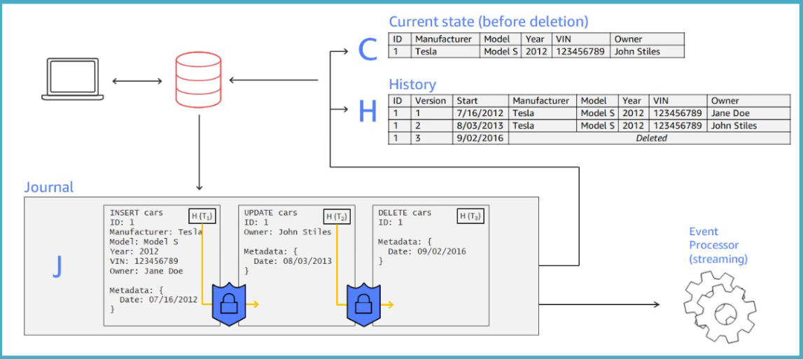

# Amazon Quantum Ledger Database (QLDB): A Transparent and Immutable Ledger Database 📜

Amazon Quantum Ledger Database (QLDB) is a **fully managed, serverless ledger database** that provides a **transparent, immutable**, and **cryptographically verifiable transaction log**. It is purpose-built to help organizations easily build ledger-like applications that maintain a complete and trustworthy history of changes to their data.

---

## 🌟 **What is a Ledger Database?**

A ledger database is designed to record and track the history of transactions, ensuring the integrity and accuracy of the data over time. Many industries require ledger functionality for maintaining reliable records.

### Examples of Ledger Use Cases

- **Banking & Finance**: Recording credits, debits, and transaction histories.
- **E-Commerce**: Maintaining order history and tracking.
- **Transportation**: Tracking shipments and deliveries.
- **Government**: Recording vehicle ownership history.
- **HR & Payroll**: Tracking payments and benefits.

---

## 🔑 **What is Amazon QLDB?**

QLDB is a **purpose-built ledger database** that simplifies building applications requiring ledger functionality.

### Key Features

- **Immutable History**:
  - Data cannot be altered, updated, or deleted once recorded.
- **Cryptographically Verifiable**:
  - Ensures the integrity of data using cryptographic hashing.
- **Fully Managed and Serverless**:
  - No need to manage infrastructure or worry about scaling.
- **ACID Transactions**:
  - Guarantees consistency, isolation, and durability for transactional operations.

---

  

---

## 🛠 **Core Components of Amazon QLDB**

1. **The Journal**:

   - An **append-only transactional log** that forms the core of QLDB.
   - Stores application data and metadata in a **hash-chained structure** to ensure immutability.
   - Used to determine:
     - The **current state** of the data.
     - The **entire history** of changes to the data.
   - Data from the journal can be **streamed** or **exported** for analysis.

2. **Amazon Ion Data Model**:

   - QLDB uses **Amazon Ion**, a document-oriented data model that supports:
     - **Structured**, **semi-structured**, and **nested data**.

3. **PartiQL Query Language**:
   - An **SQL-compatible query language** that simplifies interacting with data in QLDB.
   - Allows developers to leverage familiar SQL syntax for querying documents.

---

## 🔒 **Security in QLDB**

1. **Encryption at Rest**:

   - All data is encrypted using AWS Key Management Service (**KMS**).

2. **Encryption in Transit**:
   - Supports only **HTTPS connections**, ensuring secure communication between the client and the database.

---

## 🚀 **Why Use Amazon QLDB?**

1. **Simplifies Ledger Application Development**:
   - Reduces the complexity of building and maintaining ledger-like applications.
2. **Immutable and Transparent**:
   - Ensures historical accuracy and integrity of data, critical for audit trails and compliance.
3. **Scalable and Durable**:
   - Automatically scales as demand increases and replicates data across multiple **Availability Zones** for high availability.

---

## 📚 **Common Use Cases**

1. **Financial Applications**:

   - Record and maintain immutable transaction histories for banking or insurance systems.

2. **E-Commerce**:

   - Track orders, payments, and returns with complete visibility into transaction histories.

3. **Supply Chain Management**:

   - Log the movement of goods, ensuring traceability and transparency.

4. **Government Systems**:

   - Manage registries like vehicle ownership or property records.

5. **Human Resources**:
   - Maintain accurate payroll, benefits, and employee records.

---

## 🛡️ **How QLDB Maintains Trust**

1. **Immutable Journal**:

   - The journal is append-only, ensuring no changes can be made to historical records.

2. **Cryptographic Hashing**:

   - Each journal entry is hashed and chained to the previous entry, enabling cryptographic verification of the data's integrity.

3. **Transparent Access**:
   - Provides a complete history of data changes, accessible for audits or compliance reporting.

---

  

---

## ✅ **Conclusion**

Amazon QLDB is a revolutionary service for organizations that require **immutable, trustworthy, and transparent data recording**. With features like **cryptographic verification**, **serverless scalability**, and support for SQL-compatible queries, QLDB simplifies building ledger-based applications for various industries. Whether for financial transactions, supply chain tracking, or compliance reporting, QLDB provides a robust foundation for securely managing and analyzing historical data.
