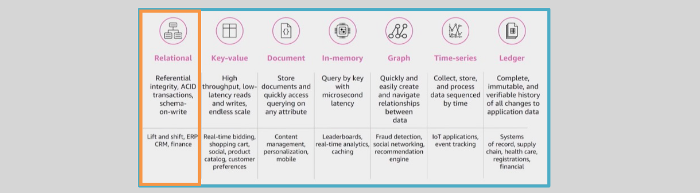

# 💻 **AWS RDS**

**Amazon Relational Database Service (RDS)** is a fully managed database service that makes it easier to set up, operate, and scale relational databases in the cloud. It supports multiple database engines, including **MySQL**, **PostgreSQL**, **Oracle**, **SQL Server**, and **Amazon Aurora**.

---

    

---

## 📂 **Amazon Relational Database Service (RDS)**

**AWS RDS** is a **fully managed relational database** service that supports popular database engines and helps you avoid the complexities of database management. With RDS, AWS handles tasks like database setup, patching, backups, and scaling, so you can focus on building applications.

### ✅ **Supported Database Engines**

- **MySQL**
- **MariaDB**
- **PostgreSQL**
- **Oracle**
- **Microsoft SQL Server**
- **Amazon Aurora** (AWS’s high-performance database engine)

### 🤔 **RDS Deployment Options**

RDS databases can be deployed in different configurations based on your needs:

1. **Standalone Mode**: A single database instance.
2. **Multi-AZ Mode**: A primary database with a standby instance in a different availability zone (AZ) for high availability.
3. **Cluster Mode**: For databases like Amazon Aurora, where the data is distributed across multiple instances for scalability.

### 🔒 **RDS Security**

- **Security Groups**: You can attach security groups to your RDS databases to control inbound and outbound traffic.
- **Private Subnets**: It’s a best practice to launch RDS databases inside **private subnets** in a **VPC**, ensuring they are not directly accessible from the internet.

### 🚫 **Access Restrictions**

- **Managed Service**: With RDS, you **don’t have root or OS-level access** to the database. AWS manages the underlying infrastructure and system configuration.
- If you need **more control** over the operating system or database instance, you should consider using **EC2** instances with a self-managed database.

## 🎯 **Key Benefits of AWS RDS**

1. **Fully Managed**: No need to worry about database setup, patching, backups, or scaling.
2. **Scalability**: Easily scale your database instance up or down based on demand.
3. **High Availability**: With **Multi-AZ deployments**, RDS automatically replicates data to a standby instance for fault tolerance.
4. **Security**: Integrates with **AWS Identity and Access Management (IAM)**, **encryption at rest**, and **encryption in transit** for secure database access.
5. **Automated Backups**: Automatically takes daily backups and supports point-in-time recovery.
