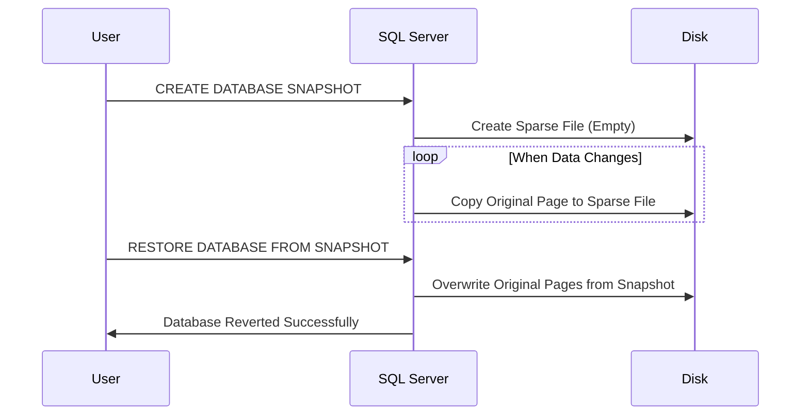
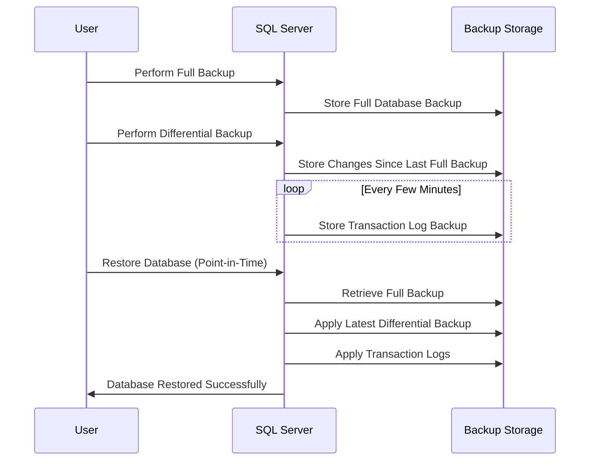

# 🌱 Root: Difference Between Taking a Snapshot and Backup for Microsoft SQL Server

When working with **Microsoft SQL Server**, you have two main ways to protect your data:

- **Snapshots** 📸
- **Backups** 💾

Both serve different purposes, but they work differently! Let's break them down in detail.

---

## 📸 Database Snapshot

A **database snapshot** in SQL Server is a **read-only** copy of your database at a specific moment. It does **not** replace backups!

### 🔑 Key Features

- ✅ **Read-only** – You cannot modify it.  
- ✅ **Quick creation** – Uses **copy-on-write** mechanism.  
- ✅ **Not a full copy** – Only stores changes made **after** the snapshot is created.  
- ✅ **Fast restore** – You can **revert** to a snapshot instantly.

### 🔄 How It Works

- **1️⃣** The snapshot is created using **a sparse file** that starts empty.
- **2️⃣** When a page (8 KB data block) in the original database **changes**, the old version of that page is **copied** to the snapshot.
- **3️⃣** The snapshot **only stores changed pages**—unchanged data is read from the original database.
- **4️⃣** If you **restore** the database from a snapshot, SQL Server **overwrites** the current data pages with the ones stored in the snapshot.

### 🛠 Mermaid Sequence Diagram



### 📌 Example: Create a Snapshot

```sql
CREATE DATABASE MyDB_Snapshot
ON
( NAME = MyDB_Data,
   FILENAME = 'C:\Snapshots\MyDB.ss' )
AS SNAPSHOT OF MyDB;
```

### 📌 Example: Restore from a Snapshot

```sql
RESTORE DATABASE MyDB FROM DATABASE_SNAPSHOT = 'MyDB_Snapshot';
```

---

## 💾 Database Backup

A **backup** is a **full copy** of the database that can be stored and restored at any time.

### 🔑 Key Features

- ✅ **Full, Differential, and Transaction Log backups**.  
- ✅ **Stored separately** from the database files.  
- ✅ **Can restore to a different server**.  
- ✅ **Supports point-in-time recovery** with transaction logs.

### 🔄 How It Works

- **1️⃣** A **Full Backup** copies the entire database (all data & schema).
- **2️⃣** A **Differential Backup** only copies changes made since the last **full backup**.
- **3️⃣** A **Transaction Log Backup** captures all transactions since the last **log backup**, allowing **point-in-time recovery**.
- **4️⃣** During **restore**, SQL Server first restores the **full backup**, then the **differential**, and finally applies **transaction logs** to get the exact state at a given time.

### 🛠 Mermaid Sequence Diagram



### 📌 Example: Full Backup

```sql
BACKUP DATABASE MyDB
TO DISK = 'C:\Backups\MyDB_Full.bak'
WITH FORMAT;
```

### 📌 Example: Differential Backup

```sql
BACKUP DATABASE MyDB
TO DISK = 'C:\Backups\MyDB_Diff.bak'
WITH DIFFERENTIAL;
```

### 📌 Example: Transaction Log Backup

```sql
BACKUP LOG MyDB
TO DISK = 'C:\Backups\MyDB_Log.trn';
```

### 📌 Example: Restore a Database to a Specific Time

```sql
RESTORE DATABASE MyDB FROM DISK = 'C:\Backups\MyDB_Full.bak' WITH NORECOVERY;
RESTORE DATABASE MyDB FROM DISK = 'C:\Backups\MyDB_Diff.bak' WITH NORECOVERY;
RESTORE LOG MyDB FROM DISK = 'C:\Backups\MyDB_Log.trn'
WITH STOPAT = '2025-03-05 10:00:00', RECOVERY;
```

---

## 🔍 Key Differences

| Feature                | **Snapshot 📸**      | **Backup 💾**      |
| ---------------------- | -------------------- | ------------------ |
| **Purpose**            | Quick rollback       | Disaster recovery  |
| **Storage**            | Inside the same disk | External file      |
| **Size**               | Only changed pages   | Full database copy |
| **Retention**          | Temporary            | Long-term          |
| **Performance Impact** | Minimal              | Uses disk I/O      |
| **Restore Time**       | Instant              | Takes time         |

---

Yes! **A SQL Server database snapshot only contains changed data pages from the actual database’s disk files.** It does **not** store a full copy of the database.

Now, let’s address your questions:

---

## ❓ If I Restore a Snapshot, Can I Go Back?

🚫 **No!** Restoring from a snapshot **overwrites the live database** with the old pages stored in the snapshot.  
🚫 **You cannot undo** a snapshot restore. Once restored, you cannot revert back to the newer state.

### 📌 Example: If You Restore a Snapshot

- **1️⃣** You take a snapshot at **10:00 AM**.
- **2️⃣** You make changes to the database at **11:00 AM**.
- **3️⃣** You restore the snapshot.
- **4️⃣** The database goes back to **10:00 AM state** – all changes after **10:00 AM are lost forever**!

---

## ❓ What If I Need a Full Copy of the Database on an External Disk?

🚫 **Snapshots DO NOT work for that!**  
✅ You must use a **Backup** instead.

### 📸 **Snapshot vs. Backup for Full Copy Needs**

| Requirement                     | **Snapshot** 📸 | **Backup** 💾 |
| ------------------------------- | --------------- | ------------- |
| **Full Copy of Database**       | ❌ No           | ✅ Yes        |
| **Stored on External Disk**     | ❌ No           | ✅ Yes        |
| **Used for Disaster Recovery**  | ❌ No           | ✅ Yes        |
| **Can Restore to a New Server** | ❌ No           | ✅ Yes        |

👉 **If you want a full database copy at a specific time and store it externally, you must use a** backup.

---

## 🏁 Summary

🚀 **Snapshots**:

- ✅ Quick rollback within the same database (stores changed pages only).
- ❌ Cannot be stored externally or moved.
- ❌ If restored, you **CANNOT go back** to the newer state.

🚀 **Backups**:

- ✅ Full copy of the database.
- ✅ Can be stored on **external disks** and restored to another server.
- ✅ **Safer for long-term storage** and disaster recovery.

💡 **If you need a full copy, use a backup. If you need a quick rollback, use a snapshot.**
