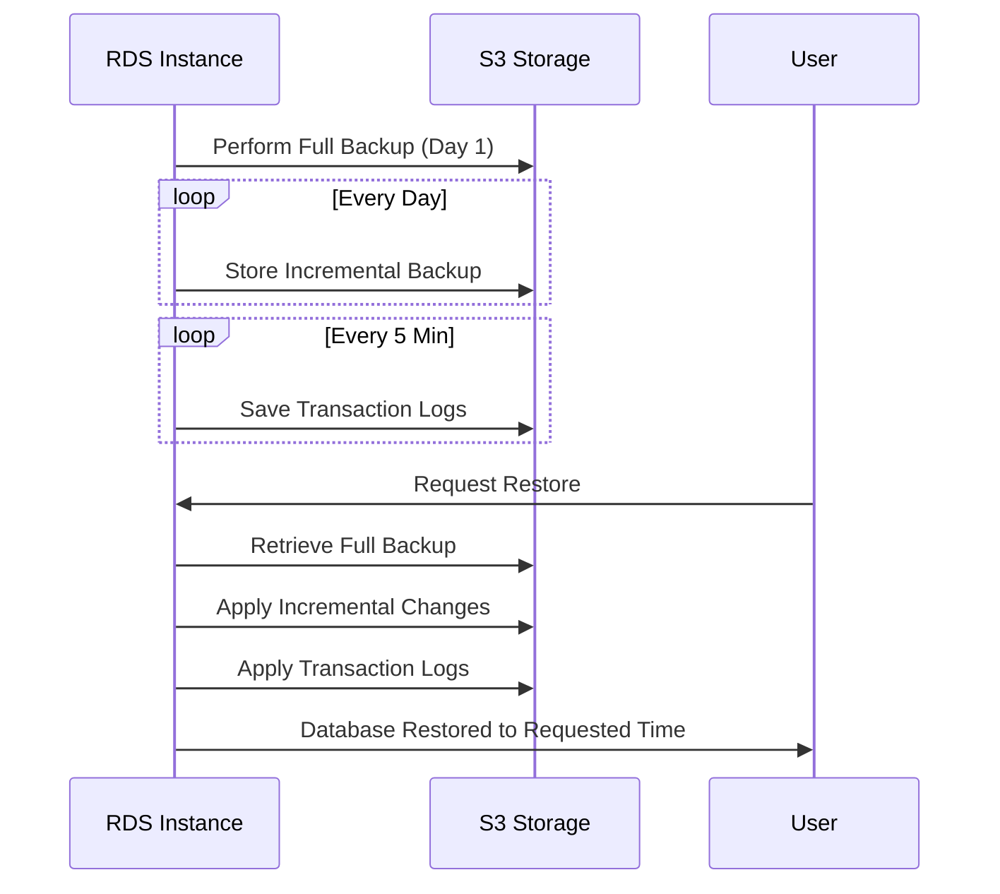
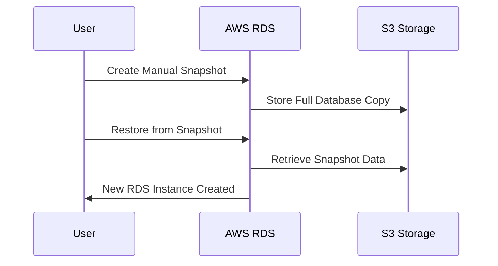
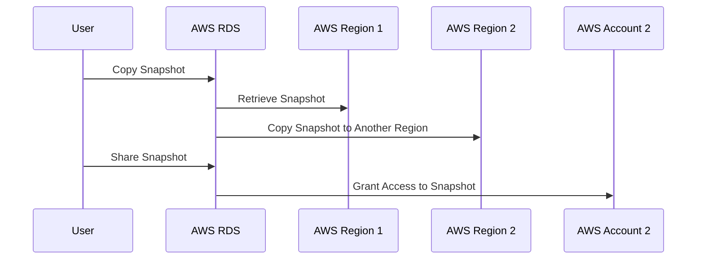

# 🌱 Root: RDS Backup and Snapshot 📂

Amazon **RDS (Relational Database Service)** provides multiple ways to back up and restore your database instances. These include **automated backups** and **manual snapshots**, each serving different purposes. Below, we’ll break them down in detail, explaining **how they work, when to use them, and best practices**.

---

## 🔄 **1. Automated Backups (Point-in-Time Recovery)**

### 📌 **What Are Automated Backups?**

**Automated backups** are **daily backups** of your entire RDS database that AWS manages for you. They allow you to **restore your database to any point in time** within a defined retention period (up to 35 days).

### ✅ **Key Features**

- **First Backup:** AWS takes a **full database backup** when automated backups are first enabled.
- **Incremental Backups:** After the first backup, AWS stores only **changes made since the last backup** (incremental).
- **Transaction Logs:** Captured **every 5 minutes**, allowing you to restore to a specific second.
- **Storage Location:** Backups are stored in **Amazon S3**.
- **Retention Period:** You can configure the retention period (default: **7 days**, max: **35 days**).
- **Multi-AZ Deployments:** Backups are taken from the **standby instance** to reduce performance impact.

---

### 💰 **Pricing**

- **Free backup storage:** AWS provides **free storage equal to the size of your DB instance**. If your instance is 100GB, you get **100GB of free backup storage**.
- **Extra backup storage:** If you exceed the free limit, **additional storage incurs charges** based on **Amazon S3 pricing**.
- **Point-in-Time Recovery (PITR) costs:** Transaction log storage incurs a small fee per GB/month.
- **Restoration costs:** Restoring a backup is **free**, but the new RDS instance incurs standard RDS pricing.

> 💡 if you delete your db instance, the automatic backup are deleted also, unless you copied it to your s3 bucket.

---

### 🔄 **How Automated Backups Work**

- **1️⃣** **Full backup** is taken when backups are first enabled.
- **2️⃣** **Daily incremental backups** store only changes.
- **3️⃣** **Transaction logs are captured every 5 minutes.**
- **4️⃣** AWS keeps backups **within the retention period** and **automatically deletes older ones**.
- **5️⃣** You can **restore to any second** within the retention period.

---

### 🛠 **Mermaid Diagram: Automated Backup Process**



---

### 📌 **Restoring from Automated Backups**

AWS allows **Point-in-Time Recovery** (PITR), meaning you can restore your DB to an **exact second** within the retention period.  
✅ **Example Use Case:** Your database got corrupted at **3:15 PM**, and you want to restore it to **3:14 PM**.

### 🛠 **Example: Restore Database from Automated Backup**

```sh
aws rds restore-db-instance-to-point-in-time \
    --source-db-instance-identifier mydbinstance \
    --target-db-instance-identifier mydbinstance-restored \
    --restore-time "2025-03-05T15:14:00Z"
```

---

## 📸 **2. Manual Snapshots (User-Controlled Backups)**

### 📌 **What Are Manual Snapshots?**

A **manual snapshot** is a **user-initiated** full backup of an RDS instance at a specific time. Unlike automated backups, **manual snapshots are NOT deleted automatically** and persist until you delete them.

### ✅ **Key Features**

- **Created manually** at any time.
- **Stored in Amazon S3** like automated backups.
- **Not automatically deleted** (you must delete them manually).
- **Only restored to the exact time they were taken** (unlike automated backups, which allow PITR).

### 💰 **Pricing**

- **Storage costs:** Manual snapshots are stored in **Amazon S3** and incur charges based on **Amazon S3 pricing per GB/month**.
- **Retention costs:** Since manual snapshots **are not automatically deleted**, they can accumulate costs if not managed properly.
- **Restoration costs:** Restoring a snapshot is **free**, but the new RDS instance will incur standard RDS pricing.

---

### 🔄 **How Manual Snapshots Work**

- **1️⃣** You **manually trigger** a snapshot via AWS Console, CLI, or API.
- **2️⃣** AWS **creates a full backup** and stores it in **Amazon S3**.
- **3️⃣** The snapshot **remains until you delete it**.
- **4️⃣** To restore, AWS **creates a new RDS instance** from the snapshot.

---

### 🛠 **Mermaid Diagram: Manual Snapshot Process**



---

### 🛠 **Example: Create and Restore a Manual Snapshot**

```sh
# Create a Manual Snapshot
aws rds create-db-snapshot \
    --db-instance-identifier mydbinstance \
    --db-snapshot-identifier mydbsnapshot

# Restore from a Manual Snapshot
aws rds restore-db-instance-from-db-snapshot \
    --db-instance-identifier mydbinstance-restored \
    --db-snapshot-identifier mydbsnapshot
```

---

## 🤔 **Automated Snapshots in RDS?**

### **What’s the Confusion?**

✔ **Automated backups** happen **daily** and allow **point-in-time recovery (PITR)**.  
✔ **Snapshots** are typically **manual** and do **not** support PITR.  
✔ **But AWS also refers to "automated snapshots"** when talking about **the full backup** that happens as part of automated backups.

---

### **🔄 What Are Automated Snapshots in RDS?**

When you enable **automated backups** in RDS, AWS **automatically takes a full storage-level snapshot** of your database **once per day**. This is sometimes referred to as an **"automated snapshot."**

### ✅ **Key Points About Automated Snapshots**

- **They are NOT manually triggered** – AWS takes them **automatically**.
- **They work with PITR** – AWS also stores transaction logs every **5 minutes**, which allows point-in-time recovery.
- **Retention is configurable** – You can store automated snapshots for up to **35 days**.
- **Deleted when the DB is deleted** – Unless you copy them manually.

💡 **AWS automated snapshots are part of the automated backup system and are NOT the same as manually created snapshots.**

## 🔄 **3. Copying and Sharing RDS Snapshots**

### 📌 **Why Copy a Snapshot?**

- **Cross-Region Disaster Recovery** – Copy to another AWS region.
- **Compliance & Security** – Keep multiple copies of backups.
- **Sharing with Other AWS Accounts** – Grant access to snapshots to other AWS accounts.

---

### 🛠 **Mermaid Diagram: Copying and Sharing a Snapshot**



---

### 🛠 **Example: Copy and Share a Snapshot**

```sh
# Copy Snapshot to Another Region
aws rds copy-db-snapshot \
    --source-db-snapshot-identifier arn:aws:rds:us-east-1:123456789012:snapshot:mydbsnapshot \
    --target-db-snapshot-identifier mydbsnapshot-copy \
    --destination-region us-west-1

# Share Snapshot with Another AWS Account
aws rds modify-db-snapshot-attribute \
    --db-snapshot-identifier mydbsnapshot \
    --attribute-name restore \
    --values-to-add 987654321012
```

---

## 🔍 **Key Differences: Automated Backup vs. Manual Snapshot**

| Feature                         | **Automated Backup 🔄**   | **Manual Snapshot 📸**    |
| ------------------------------- | ------------------------- | ------------------------- |
| **Trigger**                     | Automatic (Daily)         | Manual (User Initiated)   |
| **Type**                        | Full + Incremental        | Full Only                 |
| **Point-in-Time Recovery**      | ✅ Yes (to the second)    | ❌ No                     |
| **Retention**                   | Up to 35 days             | Until deleted manually    |
| **Storage Location**            | Amazon S3                 | Amazon S3                 |
| **Shared with Other Accounts?** | ❌ No                     | ✅ Yes                    |
| **Copied Across Regions?**      | ✅ Yes                    | ✅ Yes                    |
| **Restoration**                 | Creates a new DB instance | Creates a new DB instance |

---

## 🏁 **Summary**

🚀 **Automated Backups:**

- ✅ Good for **daily backups** and **point-in-time recovery**.
- ✅ AWS manages them automatically.
- ✅ Retained **for up to 35 days** and deleted afterward.

🚀 **Manual Snapshots:**

- ✅ Good for **long-term storage** and **sharing with other accounts**.
- ✅ User-initiated and **must be deleted manually**.
- ✅ Can be copied across regions for **disaster recovery**.

💡 **Use automated backups for point-in-time recovery and disaster recovery. Use manual snapshots for long-term storage and controlled backups.**
