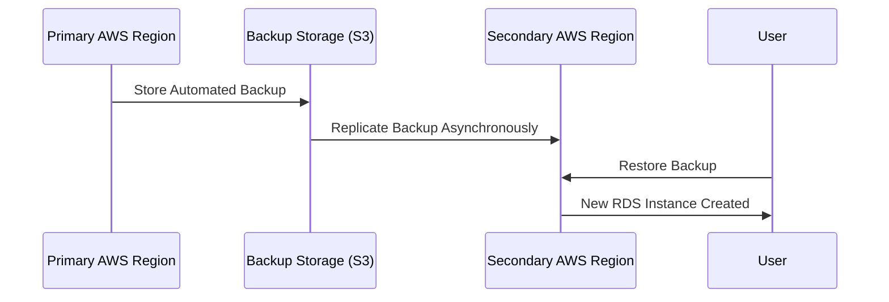

# **Amazon RDS – Cross-Region Automated Backups 🌍**

## 🚀 **What Are Cross-Region Automated Backups?**

**Cross-Region Automated Backups** in Amazon RDS allow **automatic replication of database backups to a different AWS region** for **disaster recovery (DR), compliance, and high availability**.

---

## **🛠 How Cross-Region Automated Backups Work?**

- **1️⃣** AWS **takes an automated backup** in the **primary region** (full backup + transaction logs).  
- **2️⃣** The backup is **asynchronously replicated** to the **target AWS region**.  
- **3️⃣** If needed, you can **restore the backup** in the new region and **launch an RDS instance**.  
- **4️⃣** The **new DB instance** runs independently in the secondary region.

📌 **Note:** Unlike Multi-AZ deployments, cross-region backups do **not automatically fail over**. You must **manually restore** and relaunch the database in the secondary region.

---

## 🟢 **Key Features of Cross-Region Automated Backups**

| Feature                              | Description                                                                                  |
| ------------------------------------ | -------------------------------------------------------------------------------------------- |
| **Automated Replication** 🔄         | AWS automatically copies **daily backups & transaction logs** to another region.             |
| **Supported Databases** 🗄️           | Works with **Amazon RDS for MySQL, PostgreSQL, MariaDB, and SQL Server**.                    |
| **Point-in-Time Recovery (PITR)** ⏳ | Supports **PITR** just like standard automated backups.                                      |
| **Retention Period** 🗂️              | Backup retention in the target region is **the same as the primary region (up to 35 days)**. |
| **Encryption Support** 🔒            | Encrypted backups remain encrypted when replicated to another region.                        |

---

## 🔄 **How to Enable Cross-Region Automated Backups?**

You can enable **Cross-Region Automated Backups** via the **AWS Management Console, CLI, or SDK**.

### 🛠 **Using AWS Console**

- **1️⃣** Open **Amazon RDS Console**.  
- **2️⃣** Navigate to **Databases** → Select your **DB instance**.  
- **3️⃣** Choose **Modify** → Enable **Cross-Region Automated Backups**.  
- **4️⃣** Select the **Target AWS Region** where backups should be replicated.  
- **5️⃣** Save changes and **apply immediately or during the next maintenance window**.

### 🧪 **Using AWS CLI**

```sh
aws rds modify-db-instance \
    --db-instance-identifier mydbinstance \
    --backup-retention-period 7 \
    --enable-cross-region-automated-backups \
    --destination-region us-west-2
```

---

## **🛠 Mermaid Diagram: Cross-Region Automated Backups**



---

## 🔍 **Cross-Region Automated Backups vs. Read Replicas**

| Feature                            | **Cross-Region Automated Backups 🌍**  | **Cross-Region Read Replica 🚀**    |
| ---------------------------------- | -------------------------------------- | ----------------------------------- |
| **Purpose**                        | Disaster recovery (Backup & Restore)   | Performance & failover              |
| **Automatic Failover?**            | ❌ No, manual restore needed           | ✅ Yes, automatic failover possible |
| **Point-in-Time Recovery (PITR)?** | ✅ Yes                                 | ❌ No                               |
| **Data Replication**               | Periodic (Backups)                     | Near real-time (Replication)        |
| **Supported Databases**            | MySQL, PostgreSQL, MariaDB, SQL Server | MySQL, PostgreSQL, MariaDB          |

💡 **Choose Cross-Region Automated Backups for disaster recovery** and **Cross-Region Read Replicas for performance & high availability**.

---

## 💰 **Pricing for Cross-Region Automated Backups**

💲 **Key cost factors:**

- **Backup Storage Cost** 📂 → Charged based on **backup size** in the secondary region.
- **Data Transfer Cost** 🌍 → **Replication incurs inter-region data transfer fees**.
- **Restore Cost** 💾 → No charge for restoring, but a **new RDS instance incurs standard costs**.

---

## 🏁 **Final Summary**

✔ **Cross-Region Automated Backups** ensure **disaster recovery** by **replicating RDS backups to another AWS region**.  
✔ **Supports PITR** and **manual restoration** for recovery in case of region failure.  
✔ **Not the same as Cross-Region Read Replicas**, which provide real-time replication & automatic failover.  
✔ **Costs depend on backup storage, replication traffic, and restore operations**.

💡 **Use this feature if you need reliable disaster recovery for your RDS databases across AWS regions!** 🚀
