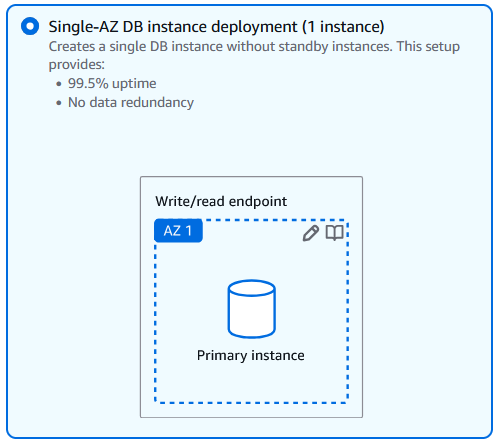
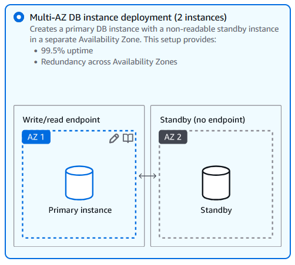
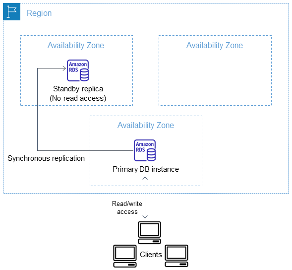
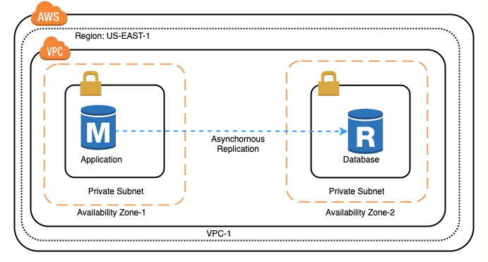

# ☁️ **Amazon RDS Deployment Options & Scaling** ⚖️

Amazon **RDS (Relational Database Service)** provides multiple deployment options tailored for **availability, performance, and scalability**. Choosing the right deployment method depends on your workload's **redundancy, failover, and read capacity** needs. Below is a breakdown of **deployment options and their supported database engines**.

---

## 💪 **1. Single-AZ Deployment**

    

A **Single-AZ (Availability Zone) deployment** consists of a single DB instance within one AZ. This setup provides **99.5% uptime** but lacks data redundancy, making it suitable for **development or non-critical applications**.

### ✅ **Key Features**

- Minimal cost, **best for testing and development**.
- **No data redundancy**—if the instance fails, manual recovery is needed.
- Suitable for **low-priority workloads** that don’t require high availability.

### 🔗 **Supported Engines:**

✔ **Amazon Aurora (MySQL-Compatible)**  
✔ **Amazon Aurora (PostgreSQL-Compatible)**  
✔ **MySQL**  
✔ **PostgreSQL**  
✔ **MariaDB**  
✔ **Oracle**  
✔ **Microsoft SQL Server**  
✔ **IBM Db2**

---

## 🌍 **2. Multi-AZ DB Instance Deployment**

    

A **Multi-AZ DB instance deployment** provides **high availability** by maintaining a **standby replica** in a different AZ. Amazon RDS automatically provisions and maintains this standby, offering **seamless failover**.

[reference](https://docs.aws.amazon.com/AmazonRDS/latest/UserGuide/Concepts.MultiAZSingleStandby.html)

### ✅ **Key Features**

- **Automatic failover** to standby during outages.
- **99.95% uptime**, improving resilience for production workloads.
- **Standby instance is NOT readable**, only used for failover.

    

### 🔗 **Supported Engines:**

✔ **Amazon Aurora (MySQL-Compatible)**  
✔ **Amazon Aurora (PostgreSQL-Compatible)**  
✔ **MySQL**  
✔ **PostgreSQL**  
✔ **MariaDB**  
✔ **Oracle**  
✔ **Microsoft SQL Server**  
✔ **IBM Db2**

---

## 🚀 **3. Multi-AZ DB Cluster Deployment**

    

A **Multi-AZ DB cluster** includes a **primary DB instance with two readable standby instances** across different AZs. This setup improves **commit latency, failover time, and read capacity**.

[references](https://docs.aws.amazon.com/AmazonRDS/latest/UserGuide/multi-az-db-clusters-concepts.html)

### ✅ **Key Features**

- **Faster failover** (under 35 seconds).
- **Two read-enabled standby instances**, reducing read traffic on primary DB.
- **Ideal for high-availability applications** requiring fast disaster recovery.

    

### 🔗 **Supported Engines:**

✔ **MySQL**  
✔ **PostgreSQL**

---

## ⚡ **4. Amazon Aurora Clusters**

Amazon **Aurora**, designed for **MySQL and PostgreSQL**, replicates data across multiple AZs **automatically** and supports **up to 15 read replicas**.

### ✅ **Key Features**

- **Up to 15 low-latency read replicas**.
- **Replication across multiple AZs** for high durability.
- **Aurora Serverless** option for dynamic scaling.

### 🔗 **Supported Engines:**

✔ **Amazon Aurora (MySQL-Compatible)**  
✔ **Amazon Aurora (PostgreSQL-Compatible)**

---

## 📖 **5. Read Replicas (Horizontal Scaling)**

    

Read replicas allow **read-heavy workloads** to be distributed across multiple copies of the primary database, improving **performance and scalability**.

### ✅ **Key Features**

- **Asynchronous replication**, improving read performance.
- **Supports cross-region replication** for global applications.
- **Can be promoted** to a standalone database during failover.

### 🔗 **Supported Engines:**

✔ **MySQL**  
✔ **PostgreSQL**  
✔ **MariaDB**  
✔ **Oracle**  
✔ **Amazon Aurora (MySQL-Compatible)**  
✔ **Amazon Aurora (PostgreSQL-Compatible)**

> 💡 Ms SQL Server does not support read replicas

---

## 🏢 **6. RDS on Outposts (On-Premises RDS)**

**Amazon RDS on AWS Outposts** allows databases to run **on-premises** using AWS infrastructure, ensuring **low-latency connections** for on-prem apps.

### ✅ **Key Features**

- Provides **AWS-managed databases on-premises**.
- Ensures **low latency** for applications close to on-prem workloads.
- Uses **AWS Outposts infrastructure** for local data residency.

### 🔗 **Supported Engines:**

✔ **MySQL**  
✔ **PostgreSQL**  
✔ **MariaDB**

---

## 🔧 **7. RDS Custom (Full OS Access & Custom Configurations)**

**RDS Custom** offers deep control over the database OS and configurations, making it suitable for **legacy apps** requiring custom setup.

### ✅ **Key Features**

- **Full OS access** for custom configurations.
- Supports **third-party applications requiring database customization**.
- **Managed backups and monitoring by AWS**.

### 🔗 **Supported Engines:**

✔ **Oracle**  
✔ **Microsoft SQL Server**

---

Here's your updated section with the new question added:

---

## 🤔 **Questions**

### ❓ **If I choose Single-AZ deployment, can I add a standby instance later?**

✅ **Yes, you can convert a Single-AZ deployment to Multi-AZ**, but you **cannot manually add a standby instance**. Instead, you must **modify your RDS instance** to enable Multi-AZ, which will create a synchronous standby in a different Availability Zone.

### ❓ **Can I add a read replica for a Single-AZ deployment?**

✅ **Yes, read replicas can be created from a Single-AZ deployment**. Read replicas use **asynchronous replication** and help distribute read traffic, improving performance for read-heavy applications.

### ❓ **Are all read replicas also standby instances?**

🚫 **No, read replicas are not the same as standby instances in Multi-AZ deployments**.

- **Multi-AZ standby instances** are **synchronous replicas** used only for **failover** (not readable).
- **Read replicas** are **asynchronous replicas** that can **handle read queries** and **be promoted to primary if needed**.

### ❓ **For Multi-AZ cluster deployments, are readable standby instances using synchronous or asynchronous replication with the primary?**

✅ **In Multi-AZ cluster deployments, readable standby instances use asynchronous replication with the primary**. Unlike traditional Multi-AZ setups where the standby is purely for failover, Multi-AZ clusters provide **readable secondaries**, but they replicate data asynchronously.

### ❓ **Can I deploy a Multi-AZ standby instance in a different region from the primary database?**

🚫 **No, Multi-AZ standby instances must be in the same AWS region as the primary database**, but they are located in a different Availability Zone for high availability and automatic failover.

✅ **For cross-region redundancy, you can use cross-region read replicas**, which replicate data **asynchronously** and can be promoted to primary in case of failure.

## 🎯 **Key Considerations When Choosing an RDS Deployment**

🔹 **Need cost-effective storage?** → **Single-AZ Deployment**.  
🔹 **Need high availability?** → **Multi-AZ DB Instance or Multi-AZ Cluster**.  
🔹 **Scaling reads globally?** → **Read Replicas**.  
🔹 **Using AWS on-prem infrastructure?** → **RDS on Outposts**.  
🔹 **Requiring full OS access?** → **RDS Custom**.

🚀 **Choosing the right RDS deployment depends on your application’s needs for failover, read performance, customization, and global reach!**
