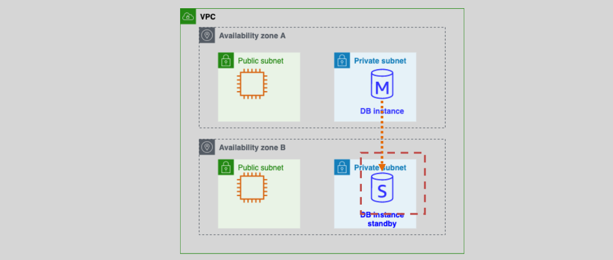
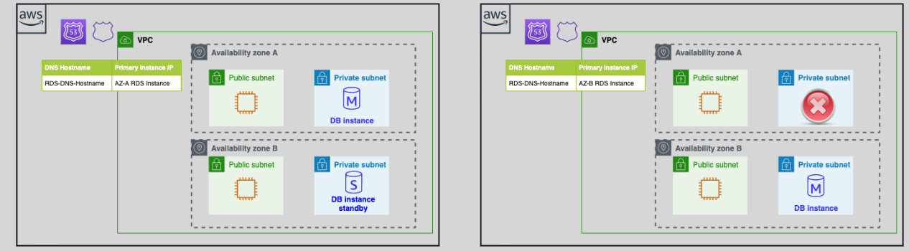

# **AWS RDS Multi-AZ Deployment 🌍**

Amazon **Relational Database Service (RDS)** provides **Multi-AZ (Availability Zone) deployments** to enhance **availability, durability, and failover support** for database instances. This deployment **automatically replicates** your primary database to a **synchronous standby replica** in a different **Availability Zone (AZ)**, ensuring **high availability and disaster recovery**.

---

<div style="text-align: center">
    
</div>

---

## **🛠️ How AWS RDS Multi-AZ Works?**

✅ **Automatic Setup**: When Multi-AZ is enabled, AWS automatically creates a **standby replica** in a separate **Availability Zone** (AZ) within the **same AWS region**.  
✅ **Synchronous Replication**: The primary and standby instances are kept in sync using **synchronous replication**, meaning transactions must be committed to both instances before being acknowledged.  
✅ **Standby Instance (Passive Failover)**: The **standby DB instance** is **not readable** and cannot handle queries—it is purely for failover purposes.  
✅ **Automatic Failover**: If an issue occurs with the primary DB instance, AWS automatically promotes the standby to become the new primary instance.

### **Key Multi-AZ Characteristics**

🔹 **Same Region, Different AZs** – The primary and standby instances are in different AZs but within the same AWS region.  
🔹 **No Read/Write on Standby** – Applications can only read and write to the primary DB instance.  
🔹 **Managed Failover** – RDS automatically detects failures and redirects traffic to the standby.  
🔹 **Amazon SNS Integration** – RDS can notify administrators of failover events via **Amazon SNS (Simple Notification Service)**.

---

## **⚠️ Multi-AZ Failover & Its Triggers**

Failover ensures database continuity by **automatically switching** to the standby DB instance. The failover process usually completes in **60–120 seconds**, during which **some brief service interruption** may occur.

### **🚀 When Does Failover Occur?**

Failover is triggered under the following scenarios:

| **Trigger**                         | **Description**                                                              |
| ----------------------------------- | ---------------------------------------------------------------------------- |
| **Primary Instance Failure**        | Hardware, storage, or compute failure causes the primary DB to stop working. |
| **Network Connectivity Loss**       | If AWS detects network partitioning between the DB and its applications.     |
| **Storage Failure**                 | Disk corruption or hardware issues trigger an automatic switch.              |
| **OS-Level Patching & Maintenance** | If AWS applies patches that require a reboot, failover is triggered.         |
| **Manual Failover**                 | You can manually force a failover using AWS Console, CLI, or API.            |

### **💡 How AWS Ensures Seamless Failover?**

- The **standby instance is already synchronized** with the primary instance.
- RDS **updates the DNS record** to point to the new primary instance **automatically**.
- **No manual intervention is needed**, ensuring **minimal downtime**.

---

## **🖥️ DNS Hostname vs. Static IP – Why It Matters?**

When using **Multi-AZ RDS**, always connect to your database via **DNS hostname** rather than a static IP.

✅ **AWS automatically updates the DNS** to point to the new primary instance during failover.  
✅ **If you use an IP address**, it will change after failover, causing connection failures.

**Example:**

Before failover:

```ini
mydbinstance.example.com → 192.168.1.10 (Primary)
```

After failover:

```ini
mydbinstance.example.com → 192.168.1.20 (Standby promoted to Primary)
```

Since the **DNS remains the same**, applications **automatically connect** to the new primary DB **without configuration changes**.

---

<div style="text-align: center">
    
</div>

---

## **🏆 Benefits of Multi-AZ Deployment**

| **Benefit**              | **Description**                                                                                |
| ------------------------ | ---------------------------------------------------------------------------------------------- |
| **🚀 High Availability** | Ensures database uptime even during failures.                                                  |
| **🔄 Disaster Recovery** | Provides automatic failover protection against **DB failure, hardware issues, or AZ outages**. |
| **💾 Data Durability**   | Uses **synchronous replication** to ensure real-time data consistency.                         |
| **🔧 Maintenance-Free**  | AWS manages failover, replication, and backups automatically.                                  |
| **📉 No Data Loss**      | Since failover is seamless, no transactions are lost.                                          |

---

## **🛠 How to Enable Multi-AZ in AWS RDS?**

### **🌐 Using AWS Console**

1️⃣ Go to **AWS RDS Console**.  
2️⃣ Click **Create Database**.  
3️⃣ Select **Database Engine** (MySQL, PostgreSQL, etc.).  
4️⃣ Choose **Production Use** → Enable **Multi-AZ Deployment**.  
5️⃣ Configure storage, security, and networking.  
6️⃣ Click **Create Database**.

### **🖥️ Using AWS CLI**

To create a **Multi-AZ RDS instance**, use:

```sh
aws rds create-db-instance \
    --db-instance-identifier mydb \
    --db-instance-class db.t3.medium \
    --engine mysql \
    --allocated-storage 20 \
    --multi-az \
    --master-username admin \
    --master-user-password mypassword
```

To modify an **existing Single-AZ RDS instance to Multi-AZ**, run:

```sh
aws rds modify-db-instance \
    --db-instance-identifier mydb \
    --multi-az \
    --apply-immediately
```

---

## **📌 When Should You Use Multi-AZ Mode?**

✅ **For critical production databases** that need **high availability**.  
✅ **For applications requiring disaster recovery** with automated failover.  
✅ **For managed backups and updates** without downtime.  
✅ **For regulated industries** (finance, healthcare) needing **99.95% uptime**.

🚫 **Avoid Multi-AZ if:**  
❌ You need **read scaling** (Use **Read Replicas** instead).  
❌ You want **cross-region replication** (Use **Cross-Region Replicas**).

---

## **🎯 Conclusion**

Amazon RDS **Multi-AZ deployment** is **not a scaling solution** but a **high availability mechanism**. It ensures **continuous database availability, disaster recovery, and automated failover** without manual intervention. **By enabling Multi-AZ, you significantly reduce downtime risks** and improve your database’s resilience to failures.

🚀 **To maximize uptime and reliability, AWS RDS Multi-AZ should be the default choice for mission-critical applications!**
