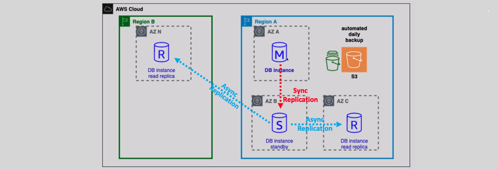
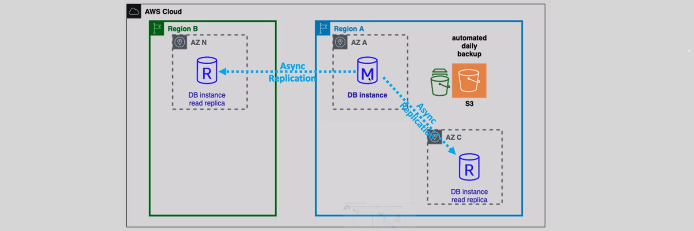
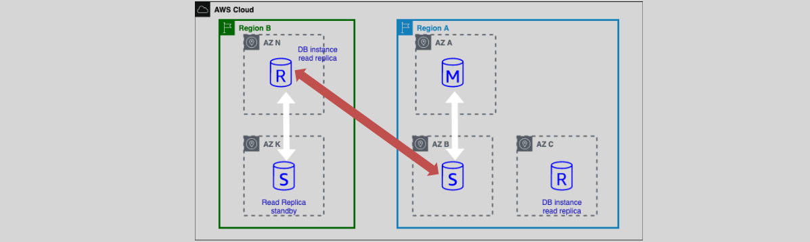

# **AWS RDS architecture design**

## **📌 Design 1: Multi-AZ Deployment + Read Replica (Cross-Region Replication)**

### **🖼️ Image 1**

<div style="text-align: center;">
  
</div>

### **🔍 Overview**

- **Primary DB Instance (M)**
- **Standby DB Instance (S) (Multi-AZ - Sync Replication)**
- **Read Replica (R) in the Same Region (Async Replication)**
- **Cross-Region Read Replica (R) in a different region (Async Replication)**

### ✅ **Key Features**

- **Synchronous Replication** between **Primary (M) and Standby (S)** for high availability.
- **Asynchronous Replication** for **Read Replicas (R)** for read scaling.
- **Cross-Region Read Replica** for **disaster recovery**.

---

### **🛠 How to Implement**

#### **1️⃣ Enable Multi-AZ Deployment**

**AWS Console Steps**:

1. Navigate to **RDS Console** → Select your **DB Instance**.
2. Click **Modify** → Enable **Multi-AZ Deployment**.
3. Apply the changes (**No downtime required**).

**AWS CLI Command**:

```sh
aws rds modify-db-instance \
    --db-instance-identifier mydb \
    --multi-az \
    --apply-immediately
```

---

#### **2️⃣ Create Read Replica in the Same Region**

**AWS Console Steps**:

1. Navigate to **RDS Console** → Select your **Primary DB Instance**.
2. Click **Actions** → **Create Read Replica**.
3. Choose **same AWS region**.
4. Configure instance type and storage → Click **Create**.

**AWS CLI Command**:

```sh
aws rds create-db-instance-read-replica \
    --db-instance-identifier my-read-replica \
    --source-db-instance-identifier mydb \
    --region us-east-1
```

---

#### **3️⃣ Create Cross-Region Read Replica**

**AWS Console Steps**:

1. Navigate to **RDS Console** → Select your **Primary DB Instance**.
2. Click **Actions** → **Create Read Replica**.
3. Choose a **different AWS region**.
4. Configure instance type and storage → Click **Create**.

**AWS CLI Command**:

```sh
aws rds create-db-instance-read-replica \
    --db-instance-identifier my-cross-region-replica \
    --source-db-instance-identifier mydb \
    --region us-west-2
```

---

### **📌 Supported Engines**

✔ **MySQL**  
✔ **PostgreSQL**  
✔ **MariaDB**  
✔ **Oracle**  
✔ **Amazon Aurora (MySQL-Compatible)**  
✔ **Amazon Aurora (PostgreSQL-Compatible)**

---

## **📌 Design 2: Single-AZ Deployment + Read Replicas**

### **🖼️ Image 2**



### **🔍 Overview**

- **Primary DB Instance (M)**
- **Two Read Replicas (R) (Same Region & Cross-Region)**
- **No Standby Instance (Not Multi-AZ)**

### ✅ **Key Features**

- **Asynchronous Replication** to Read Replicas.
- **No automatic failover** (because it's Single-AZ).
- **Cross-Region Read Replica** for **disaster recovery**.

---

### **🛠 How to Implement**

#### **1️⃣ Create a Single-AZ RDS Instance**

**AWS Console Steps**:

1. Go to **RDS Console** → Click **Create Database**.
2. Choose **Single-AZ Deployment**.
3. Configure instance type, storage, and database settings → Click **Create**.

**AWS CLI Command**:

```sh
aws rds create-db-instance \
    --db-instance-identifier mydb \
    --db-instance-class db.t3.medium \
    --engine mysql \
    --allocated-storage 20 \
    --no-multi-az
```

---

#### **2️⃣ Create Read Replica in the Same Region**

**AWS Console Steps**:

1. Go to **RDS Console** → Select your **Primary DB Instance**.
2. Click **Actions** → **Create Read Replica**.
3. Choose **same AWS region**.
4. Click **Create**.

**AWS CLI Command**:

```sh
aws rds create-db-instance-read-replica \
    --db-instance-identifier my-read-replica \
    --source-db-instance-identifier mydb \
    --region us-east-1
```

---

#### **3️⃣ Create Cross-Region Read Replica**

**AWS Console Steps**:

1. Go to **RDS Console** → Select your **Primary DB Instance**.
2. Click **Actions** → **Create Read Replica**.
3. Choose a **different AWS region**.
4. Click **Create**.

**AWS CLI Command**:

```sh
aws rds create-db-instance-read-replica \
    --db-instance-identifier my-cross-region-replica \
    --source-db-instance-identifier mydb \
    --region us-west-2
```

---

### **📌 Supported Engines**

✔ **MySQL**  
✔ **PostgreSQL**  
✔ **MariaDB**  
✔ **Oracle**  
✔ **Amazon Aurora (MySQL-Compatible)**  
✔ **Amazon Aurora (PostgreSQL-Compatible)**

---

## **📌 Design 3: Cross-Region Read Replica with Multi-AZ** 🌍

### **🖼️ Architecture Diagram**



---

### **🔍 Overview**

This architecture enhances **disaster recovery** by deploying a **cross-region read replica with Multi-AZ enabled**, allowing **automatic failover within the secondary region** while maintaining high availability.

#### **📌 Components**

- **Primary DB Instance (M) – Region A**
- **Standby DB Instance (S) – Region A** (**Multi-AZ, Synchronous Replication**)
- **Read Replica (R) – Region A** (**Async Replication for Scaling Reads**)
- **Cross-Region Read Replica (R) – Region B** (**Async Replication for Disaster Recovery**)
- **Cross-Region Read Replica (R) with Multi-AZ – Region B** (**Automatic Failover in the Secondary Region**)

---

#### **✅ Key Features**

✔ **High Availability & Disaster Recovery** – Ensures automatic failover within **both primary and secondary regions**.  
✔ **Synchronous Replication in Primary Region** – Ensures zero data loss between **Primary (M) and Standby (S)**.  
✔ **Asynchronous Replication for Read Replicas** – Offloads read traffic and provides **cross-region failover capability**.  
✔ **Cross-Region Read Replica with Multi-AZ** – Ensures high availability in **Region B** in case of a failure in **Region A**.  
✔ **Failover to the Cross-Region Replica is Manual** – AWS does **not** automatically promote cross-region read replicas.

---

### **🛠 How to Implement**

#### **1️⃣ Enable Multi-AZ for the Primary Instance**

1. **AWS Console Steps**:

   - Navigate to **RDS Console** → Select **Primary DB Instance**.
   - Click **Modify** → Enable **Multi-AZ Deployment**.
   - Apply changes (**No downtime required**).

2. **AWS CLI Command**:

```sh
aws rds modify-db-instance \
    --db-instance-identifier mydb \
    --multi-az \
    --apply-immediately
```

---

#### **2️⃣ Create a Read Replica in the Same Region (Region A)**

1. **AWS Console Steps**:

   - Navigate to **RDS Console** → Select **Primary DB Instance**.
   - Click **Actions** → **Create Read Replica**.
   - Choose **Same AWS Region (Region A)**.
   - Configure instance type and storage → Click **Create**.

2. **AWS CLI Command**:

```sh
aws rds create-db-instance-read-replica \
    --db-instance-identifier my-read-replica \
    --source-db-instance-identifier mydb \
    --region us-east-1
```

---

#### **3️⃣ Create a Cross-Region Read Replica (Region B)**

1. **AWS Console Steps**:

   - Navigate to **RDS Console** → Select **Primary DB Instance**.
   - Click **Actions** → **Create Read Replica**.
   - Choose a **Different AWS Region (Region B)**.
   - Configure instance type and storage → Click **Create**.

2. **AWS CLI Command**:

```sh
aws rds create-db-instance-read-replica \
    --db-instance-identifier my-cross-region-replica \
    --source-db-instance-identifier mydb \
    --region us-west-2
```

---

#### **4️⃣ Enable Multi-AZ for the Cross-Region Read Replica**

1. **AWS Console Steps**:

   - Navigate to **RDS Console** → Select the **Cross-Region Read Replica**.
   - Click **Modify** → Enable **Multi-AZ Deployment**.
   - Apply changes (**No downtime required**).

2. **AWS CLI Command**:

```sh
aws rds modify-db-instance \
    --db-instance-identifier my-cross-region-replica \
    --multi-az \
    --apply-immediately
```

---

#### **5️⃣ (Optional) Promote Cross-Region Read Replica as New Primary**

🚨 **If the primary region fails, manual intervention is required to promote the Cross-Region Read Replica to a standalone primary database.**

1. **AWS Console Steps**:

   - Navigate to **RDS Console** → Select **Cross-Region Read Replica**.
   - Click **Actions** → **Promote Read Replica**.
   - Confirm the action (**This process is irreversible**).

2. **AWS CLI Command**:

```sh
aws rds promote-read-replica \
    --db-instance-identifier my-cross-region-replica
```

### **📌 Supported Engines**

✔ **MySQL**  
✔ **PostgreSQL**  
✔ **MariaDB**  
✔ **Oracle**  
✔ **Amazon Aurora (MySQL-Compatible)**  
✔ **Amazon Aurora (PostgreSQL-Compatible)**

---

## **📊 Final Comparison Table**

| Feature              | **Multi-AZ + Read Replica**      | **Single-AZ + Read Replica** | **Cross-Region Read Replica (Multi-AZ)**      |
| -------------------- | -------------------------------- | ---------------------------- | --------------------------------------------- |
| **Replication Type** | Sync (Standby) + Async (Replica) | Async Only                   | Sync (Multi-AZ in Region B) + Async (Replica) |
| **Read Traffic**     | ✅ Yes (Replica)                 | ✅ Yes                       | ✅ Yes (Replica)                              |
| **Failover Support** | ✅ Automatic (Multi-AZ Standby)  | ❌ No                        | ✅ Automatic (Multi-AZ Replica in Region B)   |
| **Cross-Region DR**  | ❌ No                            | ❌ No                        | ✅ Yes (Read Replica in Region B)             |
| **Use Case**         | HA + Scaling                     | Scaling                      | HA + Global DR                                |

---

## **🎯 Summary**

✅ **Multi-AZ Standby is within the same AWS region** (synchronous replication).  
✅ **Cross-Region Read Replicas use asynchronous replication**, ensuring **disaster recovery**.  
✅ **Cross-Region Read Replicas can be Multi-AZ**, improving high availability in the secondary region.  
✅ **Failover to a Cross-Region Read Replica is manual**—AWS does not automatically promote it.

🚀 **With this architecture, you get high availability, scalability, and disaster recovery across regions!**
