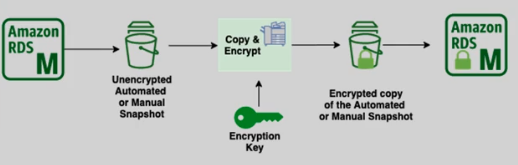
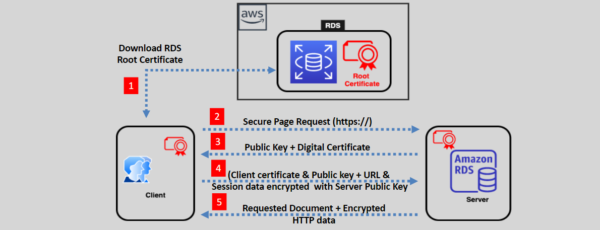
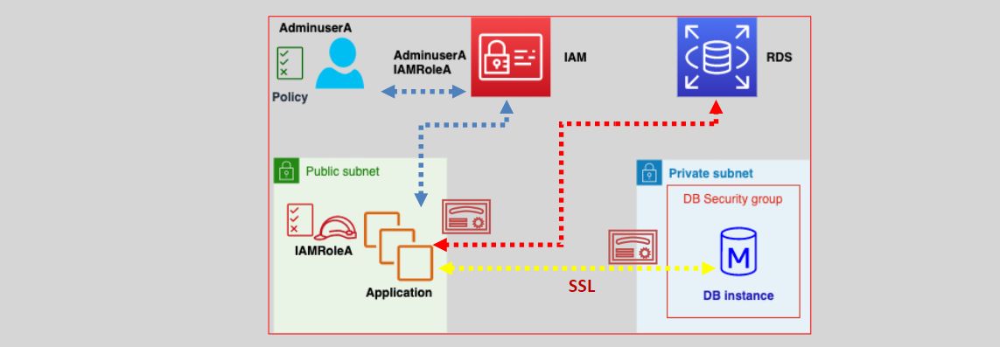

# **RDS Security 🔐**

Amazon RDS offers a robust set of security features to ensure that your data is safe and compliant, both at rest and in transit. These features include encryption, access management, and secure communication. Let's dive into the key security capabilities provided by RDS.

## **Encryption at Rest 🔒**

Amazon RDS supports **encryption at rest** using **AWS KMS (Key Management Service)** encryption keys. This ensures that all sensitive data stored in the database is encrypted, keeping your data secure.

### **Key Features:**

- **Encrypted Resources**: When encryption is enabled, the following are automatically encrypted:

  - **DB storage (EBS volumes)**
  - **DB logs**
  - **Automated backups**
  - **Manual snapshots**
  - **Read Replicas**

- **Encrypting Unencrypted Databases**: If you need to enable encryption on an unencrypted database, you can:
  1. Create a snapshot of the unencrypted DB.
  2. Use the "copy and encrypt" feature to create an encrypted snapshot.
  3. Restore the encrypted snapshot to a new, encrypted DB instance.  
     

### **Transparent Data Encryption (TDE)**

**Transparent Data Encryption (TDE)** is available for **Oracle** and **Microsoft SQL Server (MS SQL)** databases. TDE encrypts the database files and automatically handles encryption and decryption of data at the storage level.

**How It Works:**

- **Client-Side Encryption**: TDE works by encrypting data on the client side before it is written to the RDS database.
- **Compatibility**: TDE for **Oracle** and **MS SQL** can be used together with AWS’s built-in encryption at rest to provide an additional layer of security.

TDE is not specific to AWS but is an encryption method used by database engines to protect your data at the storage level.

## **In-Transit Encryption 🔄**

**In-transit encryption** protects data as it moves between your RDS instance and your applications. This is done using **SSL/TLS** encryption, ensuring that data in transit remains secure from eavesdropping or tampering.

### **Key Features:**

- **SSL/TLS Encryption**: All communication between the RDS client and the database is encrypted to secure data while it is transmitted over the network.
- **Secure Client-DB Communication**: This encryption ensures the confidentiality and integrity of sensitive information as it travels from your application to RDS.

## **IAM DB Authentication 🛡️**

Instead of using a password to authenticate access to `MySQL` and `PostgreSQL` databases in RDS, you can use **IAM authentication**. This is a secure method to control who has access to your RDS databases by using **IAM roles and policies**.

### **Key Features:**

- **Authentication Token**: IAM authentication uses a time-limited authentication token (valid for **15 minutes**) instead of a password.
- **IAM Integration**: IAM user or role names need to be configured in the database for authentication.
- **SSL Encryption**: To ensure secure communication, all **client-to-DB traffic must be SSL encrypted** when using IAM DB authentication.

## **Conclusion 🎯**

RDS offers comprehensive security features to protect your data:

- **Encryption at rest** with KMS ensures that your data is protected even when stored.
- **Transparent Data Encryption (TDE)** provides additional encryption for Oracle and MS SQL databases.
- **In-transit encryption** secures communication between your application and RDS using SSL/TLS.
- **IAM authentication** allows secure, password-free access to MySQL and PostgreSQL databases, using IAM roles and SSL encryption.
