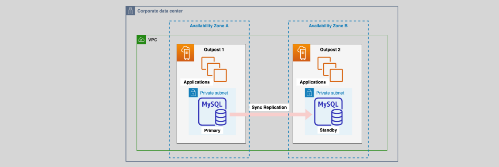

# **Amazon RDS on AWS Outposts 🏠**

Amazon RDS on AWS Outposts extends the power of AWS-managed databases to on-premises environments, allowing you to run fully managed databases closer to your on-premises applications. By combining the benefits of AWS RDS and the flexibility of Outposts, businesses can enjoy a hybrid cloud environment with seamless integration, low latency, and enhanced scalability.

## **Key Features of Amazon RDS on AWS Outposts ⚙️**

### **1. Fully Managed Databases Close to On-Premises Applications 🔐**

- Amazon RDS on AWS Outposts brings RDS databases (such as MS SQL Server, MySQL, and PostgreSQL) closer to the on-premises applications that require low-latency database access.
- This allows for high-performance databases and ensures that workloads running on-premises can integrate seamlessly with AWS services.

### **2. Automated Backups & Transaction Logs 📦**

- RDS on Outposts supports automated backups of your database, ensuring your data is securely stored and protected.
- All backups and transaction logs are stored in the AWS region, giving you the flexibility and scalability of AWS’s cloud infrastructure even when running your database on-premises.

### **3. RDS Encryption at Rest 🔐**

- As with all RDS instances, data is encrypted at rest using AWS Key Management Service (KMS) keys, providing robust data protection.

### **4. Network Connectivity Requirement 🌐**

- AWS Outposts requires network connectivity between your on-premises location and the AWS region to ensure smooth operation.
- This network connection is essential for syncing data and transaction logs between your on-premises and AWS region.

### **5. DNS Management with Route 53 🌍**

- Amazon RDS on Outposts leverages Amazon Route 53 to resolve DNS hostnames for your database.
- You can also configure DNS locally on-premises, ensuring the database continues to work even if network connectivity to the AWS region is lost.

### **6. Multi-AZ Support for High Availability 💼**

- Multi-AZ deployments are supported, which means RDS automatically provisions a standby instance in a second Outpost to ensure high availability.
- In the event of a failure in the primary Outpost, RDS can automatically failover to the standby instance in the second Outpost.

  

    
  

## **Benefits of Amazon RDS on AWS Outposts 🎯**

- **Low-Latency Access**: Running databases on AWS Outposts provides your on-premises applications with low-latency database access, crucial for workloads that need to stay within the local data center.

- **Seamless Hybrid Experience**: Outposts integrate with the broader AWS ecosystem, allowing you to manage databases in the same way as in AWS regions, while still meeting on-premises compliance and data residency needs.

- **High Availability**: With Multi-AZ support, your database can remain highly available, even if one Outpost goes down. The automatic failover ensures minimal downtime, which is crucial for mission-critical applications.

- **Scalability & Flexibility**: You can scale your database on AWS Outposts just like you would in an AWS region. The storage and compute resources are elastic and can be resized based on demand.

## **Conclusion 🌟**

Amazon RDS on AWS Outposts brings the power of fully managed AWS databases to your on-premises environment, providing the best of both worlds: low-latency access to your database and the flexibility and scalability of AWS. Whether you’re running critical applications that require low latency or need to comply with on-premises requirements, RDS on Outposts ensures your databases are always available, secure, and scalable.

With features like automated backups, RDS encryption at rest, Multi-AZ support, and seamless DNS management, RDS on AWS Outposts is an ideal solution for businesses looking to modernize their on-premises infrastructure while leveraging the power of AWS’s cloud services.
