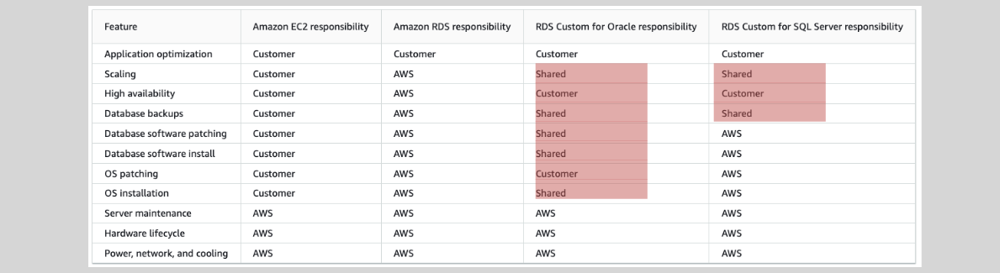

# **Amazon RDS Custom for Oracle and MS SQL 🛠️**

Amazon RDS Custom provides a specialized solution for customers who need more control over their database environment but still want to take advantage of some managed services that RDS offers. This service is ideal for use cases where specific customizations are required, such as installing OS patches, custom database packages, or fine-tuning database settings.

Unlike fully managed Amazon RDS databases, RDS Custom allows customers to have more control over their environment while still benefiting from the core advantages of Amazon RDS. This is particularly useful for workloads that require custom configurations not available in fully managed RDS.

## **When to Use Amazon RDS Custom 📝**

RDS Custom is best suited for customers who need to perform tasks such as:

- **Installing Custom Database and OS Patches/Packages**: Some applications or database configurations require specific OS-level patches and software packages that are not supported by default in RDS.

- **Configuring Specific Database Settings**: If you need to configure certain settings or perform optimizations that are unique to your workload, RDS Custom provides the flexibility to do so.

- **Configuring File Systems for Direct Sharing**: RDS Custom allows for more control over the file system, enabling the sharing of files directly with your applications.

## **Key Features of RDS Custom 🔑**

- **Full Administrative Access**: With RDS Custom, you gain administrative rights to both the operating system and the database, allowing you to configure and customize the environment to fit your specific needs.

- **Supports Oracle and MS SQL**: Currently, RDS Custom is only available for the **Oracle** and **Microsoft SQL Server (MS SQL)** database engines.

- **Midway Between Managed and Self-Managed**: It offers a balance between fully managed RDS databases and a completely self-managed environment. While you get full control over database and OS configurations, Amazon RDS still takes care of essential tasks such as:

  - **Provisioning**
  - **Scaling**
  - **Upgrades**
  - **Backups**

- **BYOL (Bring Your Own License)**: For Oracle customers, RDS Custom supports the **BYOL** model, meaning you can use your existing Oracle database license instead of purchasing a new one.

## **Responsibilities: Customer vs. AWS ⚖️**

Amazon RDS Custom enables a shared responsibility model between AWS and the customer, offering flexibility while ensuring key aspects are still managed by AWS.

  

---

### **Customer's Responsibilities:**

- **OS Patching**: You can apply custom OS patches as needed.
- **Database Customization**: You have the freedom to install custom database packages and configure database settings.
- **File System Management**: Customers can configure file systems to meet application-specific requirements.

### **AWS's Responsibilities:**

- **Provisioning and Scaling**: AWS handles database provisioning and automatic scaling as needed to ensure availability and performance.
- **Database Upgrades**: AWS ensures that the database engine is upgraded as new versions are released, while allowing customers to control the application-level configurations.
- **Backups**: AWS takes care of backing up the database and managing the snapshot lifecycle.

## **Conclusion 🎯**

Amazon RDS Custom for Oracle and MS SQL is a flexible solution for customers needing more control over their database environments. It provides the benefits of managed services while enabling full administrative access for custom configurations. This service is ideal for businesses with specialized workloads that require unique configurations and customizations that are not supported in fully managed RDS databases.

With RDS Custom, you can:

- Enjoy the flexibility of managing database and OS customizations.
- Focus on building and managing applications while Amazon RDS handles the infrastructure management.
- Utilize the BYOL model for Oracle to leverage your existing licensing agreements.

RDS Custom is the perfect choice for businesses with complex requirements that need a hybrid approach to database management.
