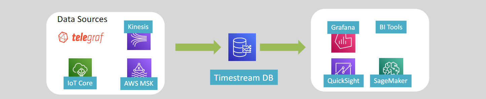

# AWS TimeStream: Purpose-Built Time-Series Database ⏳

Amazon TimeStream is a **fully managed, serverless time-series database** designed to handle massive volumes of time-stamped data. It enables businesses to efficiently store, analyze, and query time-series data, making it ideal for applications like monitoring metrics, IoT sensor data, and user behavior tracking.

---

  

---

## 🌟 **What is Time-Series Data?**

**Time-series data** refers to a sequence of data points collected at specific time intervals. It is widely used to monitor changes over time, with granularity ranging from milliseconds to years.

### Key Characteristics

- **Chronological Order**: Data points are captured and stored in the order they occur.
- **Massive Scalability**: Time-series databases handle trillions of data points.
- **Built-in Analytics**: Often includes specialized functions to identify trends and patterns.

---

## 🔑 **What is Amazon TimeStream?**

Amazon TimeStream is a **fast, scalable, serverless database** optimized for time-series workloads.

### Key Features

1. **Scalability**:

   - Handles **trillions of time-series data points per day**.
   - Automatically scales up or down based on demand.

2. **Performance**:

   - Keeps recent data in **memory** for fast access.
   - Moves older data to a **cost-optimized storage tier**.

3. **Purpose-Built Query Engine**:

   - Provides built-in **time-series analytics functions** for real-time trend analysis and pattern detection.

4. **Serverless**:

   - No infrastructure to manage, allowing you to focus on building applications.

5. **Integration**:
   - Works seamlessly with tools for **data collection**, **visualization**, and **machine learning**.

---

## 🚀 **Use Cases for Amazon TimeStream**

1. **Application Monitoring**:

   - Analyze metrics to improve application performance and availability.
   - Example: Monitoring CPU and memory usage of servers over time.

2. **Industrial Telemetry**:

   - Store and analyze equipment data to streamline maintenance.
   - Example: Predicting failures in manufacturing machines.

3. **IoT Sensor Data**:

   - Track and process data from IoT devices.
   - Example: Storing temperature and humidity readings from smart sensors.

4. **User Interaction Analytics**:
   - Understand user behavior and trends in applications.
   - Example: Tracking app usage and feature adoption over time.

---

## 🔒 **Security in Amazon TimeStream**

1. **Encryption at Rest**:

   - Data is encrypted using **AWS Key Management Service (KMS)**.

2. **Encryption in Transit**:
   - Supports only **HTTPS connections** to ensure secure communication.

---

## 🛠️ **How Amazon TimeStream Works**

1. **Data Tiering**:

   - **In-Memory Storage**:
     - Recent data is stored in-memory for fast queries.
   - **Cost-Optimized Tier**:
     - Historical data is automatically moved to lower-cost storage for long-term retention.

2. **Query Engine**:

   - Purpose-built to process time-series queries efficiently.
   - Includes functions for aggregations, smoothing, and anomaly detection.

3. **Integration**:
   - Compatible with AWS services and third-party tools for:
     - Data ingestion (e.g., IoT Core, Kinesis).
     - Visualization (e.g., QuickSight, Grafana).
     - Machine Learning (e.g., SageMaker).

---

## ✅ **Conclusion**

Amazon TimeStream is an essential tool for modern applications requiring fast and efficient processing of time-series data. Its **serverless architecture**, **scalable design**, and built-in analytics make it perfect for monitoring, IoT, and industrial applications. By simplifying time-series data storage and analysis, TimeStream empowers businesses to gain actionable insights in real time, enhancing decision-making and operational efficiency.
