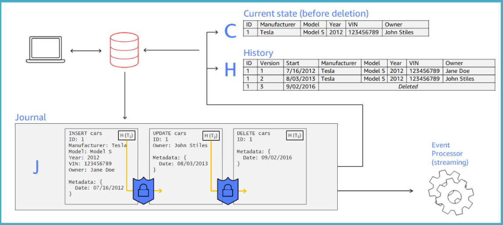
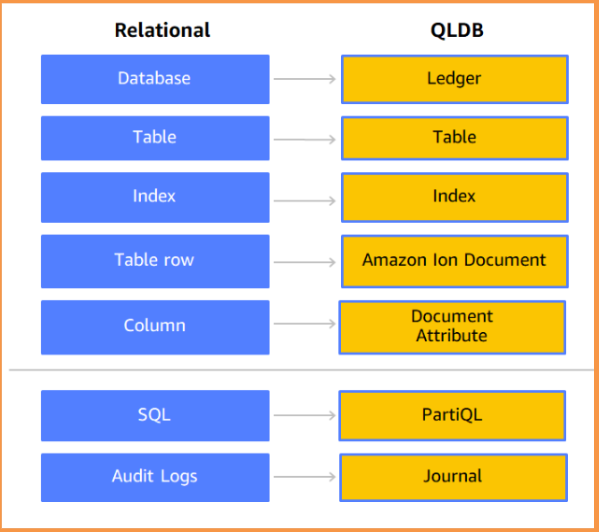

# Amazon Quantum Ledger Database (QLDB): A Transparent and Immutable Ledger Database 📜

Amazon Quantum Ledger Database (QLDB) is a **fully managed, serverless ledger database** that provides a **transparent, immutable**, and **cryptographically verifiable transaction log**. It is purpose-built to help organizations easily build ledger-like applications that maintain a complete and trustworthy history of changes to their data.

---

## 🚨 ⚠️ **Amazon QLDB Deprecated**

---

### ❌ **1. Why is Amazon QLDB Being Deprecated?**

Amazon QLDB will **no longer be supported after July 31, 2025**. This decision likely stems from several key factors:

#### 📉 **Low Adoption & Market Demand**

- While QLDB offers a unique **immutable ledger**, many customers found it too niche.
- Most companies opted for **traditional relational databases with audit trails** instead of a ledger-based system.

#### ⚡ **Operational & Cost Challenges**

- QLDB’s architecture made it expensive to scale compared to standard databases.
- Users found it difficult to **integrate QLDB with existing AWS services** effectively.

#### 🔗 **Overlap with Other AWS Services**

- AWS offers alternative solutions like **Amazon Aurora PostgreSQL**, which provides **ledger-like functionality** without the complexity of QLDB.
- Customers prefer **Amazon Managed Blockchain** for decentralized, multi-party use cases.

#### ⏳ **Lack of Community Support & Ecosystem Growth**

- Unlike **DynamoDB, RDS, and Aurora**, QLDB never gained strong adoption.
- Limited third-party tools and integrations made migration **less attractive**.

---

### 🔄 **2. What to Use Instead of QLDB?**

Since QLDB is going away, here are the **best AWS alternatives** based on your use case:

#### 🏛 **1. Amazon Aurora PostgreSQL (Best for Traditional Ledger Needs)**

- **Why?** ✅ Supports _ledger tables_, transaction logs, and point-in-time recovery.
- **How?** Use **AWS DMS** to migrate data from QLDB to Aurora PostgreSQL.
- **Key Benefit?** 🚀 Faster, **SQL-compatible**, and more widely supported.

#### 🔗 **2. Amazon Managed Blockchain (Best for Decentralized Ledgers)**

- **Why?** ✅ For **multi-party** trust-based applications requiring blockchain.
- **How?** Use **Hyperledger Fabric** or **Ethereum** on AWS.
- **Key Benefit?** 🔐 Secure, distributed, and tamper-proof.

#### 🗂 **3. Amazon DynamoDB with Streams (For NoSQL Workloads)**

- **Why?** ✅ DynamoDB **streams + event sourcing** create an **append-only** history.
- **How?** Use **DynamoDB Streams + AWS Lambda** for transaction tracking.
- **Key Benefit?** ⚡ Scalable & high-performance.

#### 🏦 **4. AWS Audit Manager + Amazon RDS (For Compliance & Auditing)**

- **Why?** ✅ RDS with **AWS Audit Manager** provides regulatory compliance tracking.
- **How?** Store records in **Amazon RDS** and monitor changes using **Audit Manager**.
- **Key Benefit?** 🏛 Ideal for financial & healthcare compliance.

---

### 🔄 **3. How to Achieve Similar Benefits Without QLDB?**

✅ **Data Integrity & Verification (QLDB Digest Alternative)**

- Use **SHA-256 hashing** for transactions in **Aurora PostgreSQL**.
- Implement **cryptographic proofs** using database **checkpoints & versioning**.

✅ **Immutable Transactions (QLDB Journal Alternative)**

- Use **DynamoDB Streams** to track changes over time.
- Use **Aurora's native versioning** to maintain history.

✅ **Tamper-proof Audit Logs (QLDB Ledger Alternative)**

- Enable **Amazon RDS PostgreSQL’s Ledger Tables**.
- Store **signed digests** in **Amazon S3 + AWS KMS** for extra security.

---

### 🛠 **4. Migrating from QLDB to Aurora PostgreSQL**

AWS provides an official migration guide for moving QLDB data to **Amazon Aurora PostgreSQL**:

#### 🔄 **Migration Steps**

1. **Export QLDB Data** 📝
   - Use `ExportJournalToS3` to extract QLDB transactions into **Amazon S3** (JSON format).
2. **Transform Data Using AWS Glue** 🔄
   - Convert JSON records into **CSV or SQL inserts** for Aurora.
3. **Load Data into Aurora PostgreSQL** 📥
   - Use **AWS Database Migration Service (DMS)** to import data.
4. **Enable Ledger Features in Aurora** 🔒
   - Configure **Ledger Tables** for audit history tracking.

---

### 🎯 **Conclusion: What Should You Do?**

🔹 **If you need a centralized, immutable ledger:** **Use Amazon Aurora PostgreSQL** with ledger tables.  
🔹 **If you need a multi-party, decentralized ledger:** **Use Amazon Managed Blockchain.**  
🔹 **If you need a scalable NoSQL solution:** **Use DynamoDB with event streams.**  
🔹 **If you need compliance & audit logs:** **Use Amazon RDS + AWS Audit Manager.**

🚀 **Action Plan Before July 31, 2025:**  
✅ **Migrate from QLDB ASAP** using AWS’s official migration guide.  
✅ **Choose the best alternative** based on your business needs.  
✅ **Set up continuous data validation** to maintain ledger integrity.

AWS is **retiring QLDB** because **better, more flexible alternatives exist**—so **migrate now to avoid service disruptions!** 🔥

---

## 🌟 **What is a Ledger Database?**

A ledger database is designed to record and track the history of transactions, ensuring the integrity and accuracy of the data over time. Many industries require ledger functionality for maintaining reliable records.

### Examples of Ledger Use Cases

- **Banking & Finance**: Recording credits, debits, and transaction histories.
- **E-Commerce**: Maintaining order history and tracking.
- **Transportation**: Tracking shipments and deliveries.
- **Government**: Recording vehicle ownership history.
- **HR & Payroll**: Tracking payments and benefits.

---

## 🔑 **What is Amazon QLDB?**

QLDB is a **purpose-built ledger database** that simplifies building applications requiring ledger functionality.

### Key Features

- **Immutable History**:
  - Data cannot be altered, updated, or deleted once recorded.
- **Cryptographically Verifiable**:
  - Ensures the integrity of data using cryptographic hashing.
- **Fully Managed and Serverless**:
  - No need to manage infrastructure or worry about scaling.
- **ACID Transactions**:
  - Guarantees consistency, isolation, and durability for transactional operations.

---

  

---

## 🛠 **Core Components of Amazon QLDB**

1. **The Journal**:

   - An **append-only transactional log** that forms the core of QLDB.
   - Stores application data and metadata in a **hash-chained structure** to ensure immutability.
   - Used to determine:
     - The **current state** of the data.
     - The **entire history** of changes to the data.
   - Data from the journal can be **streamed** or **exported** for analysis.

2. **Amazon Ion Data Model**:

   - QLDB uses **Amazon Ion**, a document-oriented data model that supports:
     - **Structured**, **semi-structured**, and **nested data**.

3. **PartiQL Query Language**:
   - An **SQL-compatible query language** that simplifies interacting with data in QLDB.
   - Allows developers to leverage familiar SQL syntax for querying documents.

---

## 🔒 **Security in QLDB**

1. **Encryption at Rest**:

   - All data is encrypted using AWS Key Management Service (**KMS**).

2. **Encryption in Transit**:
   - Supports only **HTTPS connections**, ensuring secure communication between the client and the database.

---

## 🚀 **Why Use Amazon QLDB?**

1. **Simplifies Ledger Application Development**:
   - Reduces the complexity of building and maintaining ledger-like applications.
2. **Immutable and Transparent**:
   - Ensures historical accuracy and integrity of data, critical for audit trails and compliance.
3. **Scalable and Durable**:
   - Automatically scales as demand increases and replicates data across multiple **Availability Zones** for high availability.

---

## 📚 **Common Use Cases**

1. **Financial Applications**:

   - Record and maintain immutable transaction histories for banking or insurance systems.

2. **E-Commerce**:

   - Track orders, payments, and returns with complete visibility into transaction histories.

3. **Supply Chain Management**:

   - Log the movement of goods, ensuring traceability and transparency.

4. **Government Systems**:

   - Manage registries like vehicle ownership or property records.

5. **Human Resources**:
   - Maintain accurate payroll, benefits, and employee records.

---

## 🛡️ **How QLDB Maintains Trust**

1. **Immutable Journal**:

   - The journal is append-only, ensuring no changes can be made to historical records.

2. **Cryptographic Hashing**:

   - Each journal entry is hashed and chained to the previous entry, enabling cryptographic verification of the data's integrity.

3. **Transparent Access**:
   - Provides a complete history of data changes, accessible for audits or compliance reporting.

---

  

---

## ✅ **Conclusion**

Amazon QLDB is a revolutionary service for organizations that require **immutable, trustworthy, and transparent data recording**. With features like **cryptographic verification**, **serverless scalability**, and support for SQL-compatible queries, QLDB simplifies building ledger-based applications for various industries. Whether for financial transactions, supply chain tracking, or compliance reporting, QLDB provides a robust foundation for securely managing and analyzing historical data.
