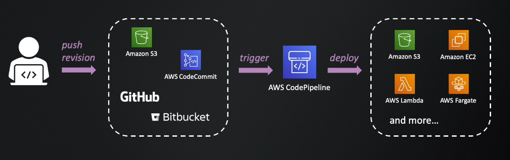
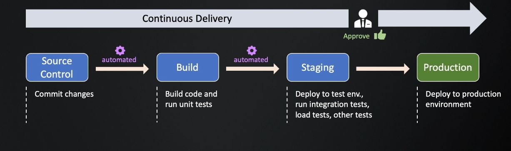
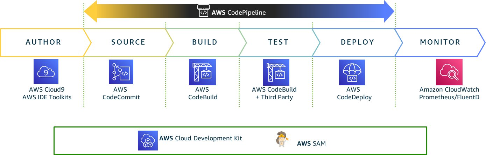
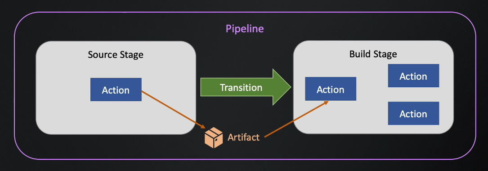
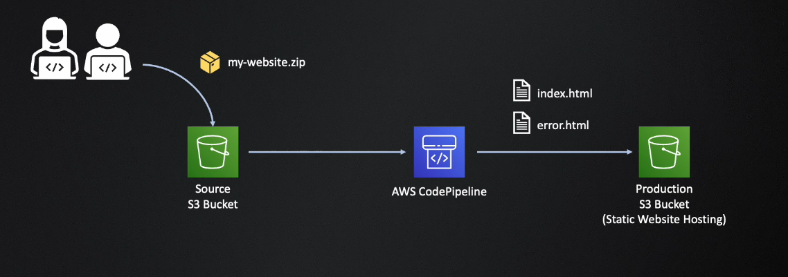
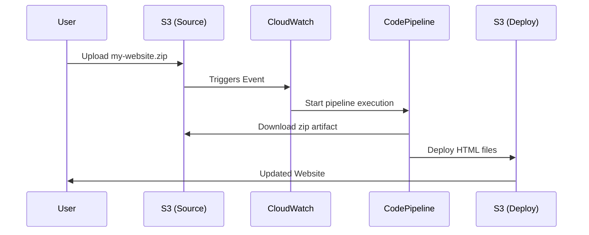

# 🚀 **AWS CodePipeline**

In the modern DevOps world, **deployment automation** is critical to delivering software **fast, safely, and repeatedly**. Enter **AWS CodePipeline**—your orchestration engine for Continuous Integration and Continuous Delivery (CI/CD) on AWS.

---

    

---

## 🔄 CI/CD Modes

    

    

---

| Mode                            | Description                                                              |
| ------------------------------- | ------------------------------------------------------------------------ |
| **Continuous Integration (CI)** | Code is built and tested on every commit.                                |
| **Continuous Delivery (CD)**    | Built code is deployed to staging; manual approval is required for prod. |
| **Continuous Deployment**       | Built code goes to production automatically after testing.               |

## 🧩 What is AWS CodePipeline?

---

    

---

**AWS CodePipeline** is a **fully managed CI/CD service** that helps you **automate your software release process** using a series of **stages** (Source → Build → Test → Deploy).

Think of it as an **assembly line** for your code 🚗:

1. Code change? Pipeline starts.
2. Code is tested.
3. Code is deployed.
4. Users see the update.

## 🛠️ Key Concepts in AWS CodePipeline

    

---

| Concept             | Description                                                               |
| ------------------- | ------------------------------------------------------------------------- |
| **Pipeline**        | The entire CI/CD workflow from source to deployment.                      |
| **Stage**           | A logical phase (Source, Build, Deploy).                                  |
| **Action**          | A task in a stage (e.g., Build with CodeBuild, Deploy to S3).             |
| **Transition**      | A link between stages (can be disabled/enabled).                          |
| **Artifact**        | Output of an action (e.g., zip file, build output) passed to next action. |
| **Execution**       | A unique run of the pipeline.                                             |
| **Source Revision** | The specific code version or change triggering the pipeline.              |

---

## 🎯 Real Example: Deploy Static Website with CodePipeline

### 🎉 Goal

Build a pipeline that:

- Takes a **.zip** file from an S3 **source bucket**.
- Deploys its contents to a **production S3 bucket**.
- Supports automatic or manual deployments.

---

  

---

## 🛠️ Step-by-Step Pipeline Setup

### 1️⃣ **Create Buckets**

- `my-website-source` (with **versioning** enabled) – for source `.zip` file.
- `my-website-prod` – for deployment with **static website hosting**.

### 2️⃣ **Create a Pipeline**

#### ✅ General Settings

- Pipeline name: `MyWebsitePipeline`
- Create a new service role
- Default artifact store in same region

#### ✅ Source Stage

- Provider: **Amazon S3**
- Bucket: `my-website-source`
- Object Key: `my-website.zip`
- Change Detection: **Amazon CloudWatch Events**

#### ✅ Build Stage

- **Skipped** (we’re just deploying HTML files)

#### ✅ Deploy Stage

- Provider: **Amazon S3**
- Bucket: `my-website-prod`
- Extract file before deploy: ✅

---

## ⚙️ How a CodePipeline Execution Works (S3-based)

---

## 🔃 Execution Modes

| Mode           | Behavior                                         |
| -------------- | ------------------------------------------------ |
| **Queued**     | Allows multiple executions; waits in queue.      |
| **Superseded** | New execution cancels older ones between stages. |
| **Parallel**   | Executes all versions at once (use cautiously!). |

---

## 📦 How Transitions Work

Transitions connect stages (e.g., Source → Deploy).

- **Enabled**: execution flows automatically.
- **Disabled**: execution **waits** after the current stage.
- Helpful for manual approval or testing intermediate stages.

---

## 📁 CodePipeline Artifacts

| Action Type | Output Artifact   | Input for…      |
| ----------- | ----------------- | --------------- |
| Source      | `SourceArtifact`  | Build or Deploy |
| Build       | `BuildArtifact`   | Deploy          |
| Deploy      | Usually no output | Final delivery  |

Artifacts are stored in an **artifact store S3 bucket**.

---

## 💡 Tips & Best Practices

| Best Practice                       | Why It Matters                                             |
| ----------------------------------- | ---------------------------------------------------------- |
| ✅ Use versioning on source buckets | Required for triggering S3-based pipelines                 |
| ✅ Use `Extract file before deploy` | Ensures files are deployed, not just uploaded as `.zip`    |
| ✅ Add tags to pipelines            | Helps with resource tracking, billing, and management      |
| ✅ Use CloudWatch Events            | More efficient than polling for source changes             |
| ✅ Use `Release change` button      | For manual deployments or testing edits to pipeline config |

---

## 🔍 Monitor Pipeline Executions

- **Pipeline List**: See status, revision, execution ID, time.
- **Details Page**:
  - Each **stage** has an execution status.
  - Each **action** has input/output artifacts, logs, and version ID.
- **Timeline View**: See durations and exact trigger (CloudWatch, IAM User).
- **Manual Triggering**: Use `Release change` to deploy manually.

---

## 🧠 Final Thoughts

### 🚦 AWS CodePipeline Is

- Your **traffic controller** for CI/CD.
- The **orchestrator** of build, test, and deploy stages.
- A **flexible, low-maintenance** deployment engine.

Start with S3 pipelines, grow to CodeCommit, CodeBuild, CodeDeploy, or integrate with **Jenkins**, **GitHub**, **Lambda**, or **CloudFormation**.

---

## ✅ Summary Table

| Concept         | Description                                                   |
| --------------- | ------------------------------------------------------------- |
| CodePipeline    | AWS service for automating CI/CD workflows                    |
| Stages          | Phases like source, build, test, deploy                       |
| Actions         | Tasks in stages (e.g., build with CodeBuild, deploy to S3)    |
| Artifacts       | Files passed between actions                                  |
| Transitions     | Connect stages; can be enabled/disabled                       |
| Execution Modes | `Queued`, `Superseded`, or `Parallel`                         |
| Trigger Methods | Manual release, S3 upload, CodeCommit push, or GitHub webhook |
