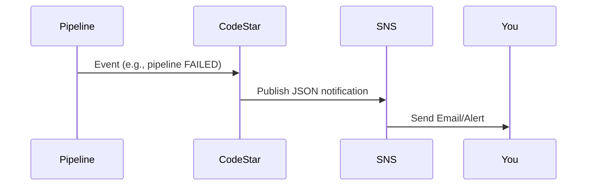

# 📢 **10. Notifications in CodePipeline**

_Trigger Smart Alerts for Pipeline Success, Failures, and Approvals with SNS + CodeStar!_

---

## 🧠 What You’ll Learn

By the end of this topic, you'll know how to:

- Set up **email notifications** for any pipeline event (success, failure, approvals, etc.)
- Create and configure **notification rules** for your pipelines
- Use **SNS topics** as targets for notifications
- Understand **CodeStar’s role** behind the scenes
- Modify **SNS access policies** to make it all work correctly
- Get real-time visibility into your CI/CD process 💡

---

## ⚙️ What is the Notification System in CodePipeline?

AWS Developer Tools (including CodePipeline) come with a **built-in notification system**.  
It uses **notification rules** + **SNS topics** to:

- 🔔 Send **email alerts** (or push to other systems)
- 📦 Trigger external **automation tools**
- 📈 Integrate with **monitoring dashboards**

It works via **CodeStar Notifications** under the hood.

---

## 🔧 How It Works Internally



✅ CodePipeline doesn’t directly publish to SNS  
✅ **CodeStar** does it — and that’s why you need to update the SNS topic policy

---

## 🌩️ Setting Up Notifications (Step-by-Step)

---

### 🪜 Step 1: Go to Your Pipeline Settings

- Go to your pipeline in AWS Console
- Click **Settings → Notifications**
- Click **“Create notification rule”**

---

### 🪜 Step 2: Fill Notification Rule Details

- **Name**: `PipelineNotificationRule`
- **Detail type**:
  - `Full` → Includes all execution info (recommended ✅)
  - `Basic` → Less data (only use if you want light messages)

---

### 🪜 Step 3: Choose Events to Monitor

#### ✅ Suggested Events to Select

| Category                     | Recommended? | Description                                 |
| ---------------------------- | ------------ | ------------------------------------------- |
| ✅ Pipeline Execution States | ✔️ Yes       | Notify on start, success, or failure        |
| ❌ Stage Execution States    | ⚠️ No        | Too noisy (every stage triggers)            |
| ❌ Action Execution States   | ⚠️ No        | Even noisier (every CodeBuild, CFN, etc.)   |
| ✅ Approval Action States    | ✔️ Yes       | Notify when approvals are approved/rejected |

You can also customize to:

- Get alerts **only on failure**
- Get notified when **manual approvals are rejected**

---

### 🪜 Step 4: Choose or Create the SNS Target

You have 2 options:

#### Option 1: **Create New Target (Easy Way ✅)**

- Click **"Create target"**
- It creates an SNS topic **automatically**
- AWS CodeStar automatically sets required permissions ✅

💡 You just need to **subscribe your email** to the topic

---

#### Option 2: **Use Existing SNS Topic (Manual Way)**

- Select your existing SNS topic (maybe used for ManualApproval)
- But here’s the catch:  
  Since CodePipeline uses **CodeStar Notifications**, you must manually update the SNS topic policy to allow it.

---

## 🛡️ Fixing SNS Topic Permissions (for CodeStar)

Open your **SNS topic → Edit → Access Policy**  
Add the following statement inside the `"Statement"` array:

```json
{
  "Sid": "AllowCodeStarNotifications",
  "Effect": "Allow",
  "Principal": {
    "Service": "codestar-notifications.amazonaws.com"
  },
  "Action": "SNS:Publish",
  "Resource": "arn:aws:sns:your-region:your-account-id:your-topic-name"
}
```

> ✅ Replace the `Resource` with the actual ARN of your SNS topic  
> ✅ Don’t forget to add a comma before if this is the second statement in the array

---

### 🧪 Example Policy Snippet

```json
{
  "Version": "2012-10-17",
  "Statement": [
    {
      "Sid": "Default",
      "Effect": "Allow",
      "Principal": "*",
      "Action": "SNS:Publish",
      "Resource": "arn:aws:sns:us-east-1:123456789012:MyPipelineTopic"
    },
    {
      "Sid": "AllowCodeStarNotifications",
      "Effect": "Allow",
      "Principal": {
        "Service": "codestar-notifications.amazonaws.com"
      },
      "Action": "SNS:Publish",
      "Resource": "arn:aws:sns:us-east-1:123456789012:MyPipelineTopic"
    }
  ]
}
```

✅ Save the policy  
✅ Now your existing SNS topic will work with pipeline notifications!

---

## ✨ Format of the Notification Email

You’ll get JSON emails like:

```json
{
  "eventTypeId": "codepipeline-pipeline-pipeline-execution-failed",
  "source": "aws.codepipeline",
  "detailType": "CodePipeline Pipeline Execution State Change",
  "pipeline": "my-app-pipeline",
  "state": "FAILED",
  "region": "us-east-1",
  "time": "2025-04-16T15:00:00Z"
}
```

✅ You can forward this to:

- Slack via Lambda
- PagerDuty
- Microsoft Teams
- Any monitoring tool that parses JSON

---

## ✅ Final Tips

| Tip 💡                              | Why It Matters                 |
| ----------------------------------- | ------------------------------ |
| Use `Full` details                  | Better debugging info          |
| Don’t over-select events            | Avoid inbox flooding           |
| Use `ManualApproval` + SNS          | Great for release coordination |
| Use new topic for each app          | Easier filtering & routing     |
| Combine with CloudWatch Alarms      | Unified alerting strategy      |
| Auto-reject approvals after timeout | Avoid hanging deploys          |

---

## 🎯 Real-World Example

Let’s say:

- You push to `main`
- Pipeline builds, deploys to staging
- A `ManualApproval` step waits
- You get an email:
  > “A manual approval is required. Test here: <http://staging.myapp.com”>

After approval:

- Prod deploy happens
- You get another email:
  > “Pipeline succeeded 🎉”

---

## 📚 Wrap-Up

AWS CodePipeline notifications let you:

- **Stay informed** of your pipeline progress
- React fast to **failures or approvals**
- Integrate pipeline status into **external systems**
- Build **smart, controlled** CI/CD with real-time feedback
