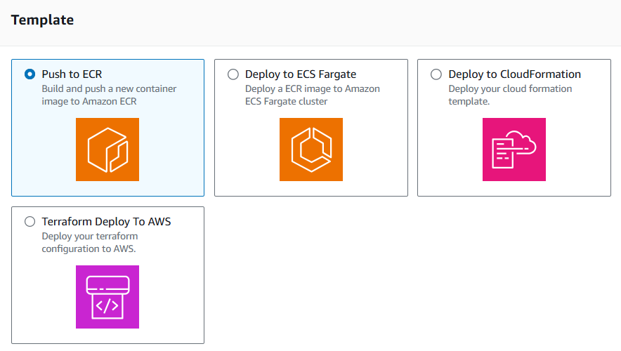
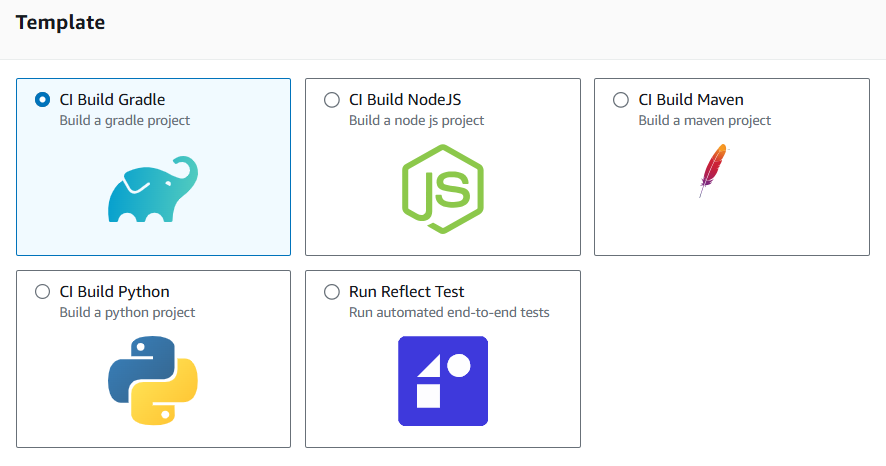
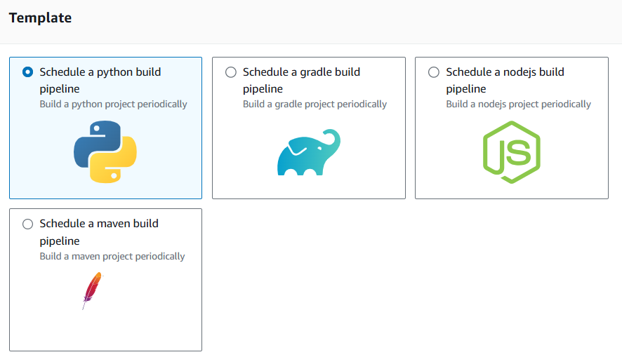
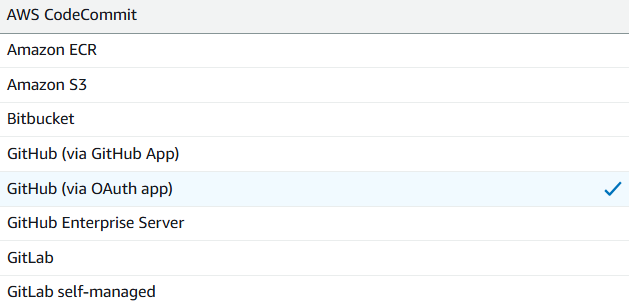

# **AWS CodePipeline: Creating Your First Pipeline from Scratch** 🛠️🚀

AWS CodePipeline is a fully managed **CI/CD service** that automates your build, test, and deployment phases every time you make a code change. In this topic, we’ll walk through the **end-to-end process of creating a pipeline**, integrating GitHub as the source, deploying to S3, and understanding each configuration step in detail.

---

## 🧩 **1. Choose Creation Option**

When you begin creating a pipeline in the **AWS CodePipeline Console**, you’re presented with two options:

- **Start from scratch**: Create a custom pipeline tailored to your architecture.
- **Use a pipeline template**: Predefined templates for common patterns (useful for rapid prototyping).

Choose **“Start from scratch”** for full control and learning.

---

    <h3>Deployment templates</h3>
    

    <h3>Continuous Integration templates</h3>
    

    <h3>Automation templates</h3>
    

---

## ⚙️ **2. Pipeline Settings**

This section configures the name, version, role, and artifact store for your pipeline.

---

### 🔖 **Pipeline Name**

- Follow a naming convention (e.g., `MyGitHubPipeline`) for clarity and traceability.
- Once created, the name **cannot be changed**.

---

### ⚡ **Execution Modes (Pipeline Type V2)**

When creating a pipeline, you can choose one of three execution modes. Here's a simplified explanation:

⏹️ **1. Superseded Mode**

- 👉 **New replaces old**: If the pipeline is running and you make changes, the new version takes over.
- 📌 Useful for **fast updates**, but the older process stops.

🔢 **Queued Mode**

- 👉 **One at a time**: Processes run **sequentially** in a queue.
- 📌 Best for **ordered and safe deployments** (e.g., when releasing to production).

🔀 **3. Parallel Mode**

- 👉 **Multiple at once**: All executions run **simultaneously** (e.g., for different test types like unit or integration tests).
- 📌 Ideal for **faster testing**.

> 🚨 **Tip:** Use **Queued Mode** when sequential releases are crucial, like in **production environments**! 🎯

---

### 🔐 **Service Role**

AWS CodePipeline needs a role to interact with other AWS services (S3, GitHub, etc.).

- Let **CodePipeline create the role** for you (recommended).
- Or choose an existing role (if you’ve customized IAM policies).

---

### ⚙️ **Advanced Settings**

#### 🗂️ **Artifact Store**

The **Artifact Store** is an S3 bucket used to store source/build artifacts between pipeline stages.

- **Default location**: Automatically creates a regional S3 bucket.
- **Custom location**: Select a pre-created S3 bucket (must be in the **same region**).

#### 🔐 **Encryption Key**

- **AWS Managed Key**: Simplest option, managed by AWS.
- **Customer Managed Key**: Use your own KMS key if you need full control or compliance.

#### 🔁 **Pipeline-Level Variables**

You can declare environment-like variables to be reused in actions across your pipeline.

- Example: `APP_VERSION`, `DEPLOY_ENV`
- Can be passed dynamically when triggering the pipeline

---

## 🧬 **3. Add Source Stage (GitHub as Source)**

In this step, you define where your source code lives and how to trigger pipeline runs.

    

### 🧩 **Source Provider Options**

- **CodeCommit** _(deprecated)_

- **Amazon S3**

- **Bitbucket**

- **GitHub**

  - **Via GitHub App**
  - **Via GitHub OAuthApp**
  - **GitHub Enterprise Server**

- **GitLab**
  - **GitLab Server**
  - **GitLab self-managed**

---

### ✅ **GitHub Integration Steps**

1. Authenticate with GitHub through CodeStar Connection.
2. Choose:
   - **Repository** (e.g., `username/my-static-website`)
   - **Branch** (e.g., `main` or `master`)

---

### ⚙️ **Trigger Options**

| Option              | Behavior                                                 |
| ------------------- | -------------------------------------------------------- |
| No filters          | Trigger pipeline on **every push** to the branch         |
| Branch/Tag Filters  | Trigger only on specific branches or tags                |
| Pull Request events | Trigger pipeline when a PR is opened, updated, or merged |
| Manual trigger only | Run pipeline manually from the console                   |

> ✅ In most cases, triggering on every push to `main` is ideal for CD.

---

## 🧱 **4. Build Stage (Optional)**

- If your app doesn’t require building (e.g., static HTML), you can skip this stage.
- If building is needed (e.g., React/Node app), use **AWS CodeBuild**.

---

## 🚀 **5. Add Deploy Stage (S3 Deploy)**

- Choose `Amazon S3` as your deploy provider.
- Select your production bucket.
- ✅ Enable: **Extract file before deploy** to unzip your artifact.
- Leave **deployment path** empty if you want files in the bucket root.

---

## 💡 **Bonus: Tips for Production Pipelines**

- 🛑 Use **approval actions** before production deploys in business-critical pipelines.
- 🔁 Add a **build stage** with unit tests before deploying.
- 🧪 Use **CodeBuild** to lint, test, and package apps (especially for dynamic apps).
- 🛡️ Use IAM policies to **restrict access** to GitHub connections and pipelines.

---

## ✅ Conclusion

AWS CodePipeline allows you to automate your entire deployment lifecycle from source to production.

By following this guide, you now know how to:

- Create a pipeline from scratch
- Use GitHub as a trigger source
- Deploy to S3
- Understand execution modes and artifacts
