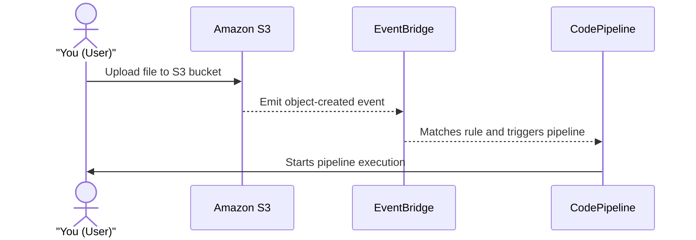
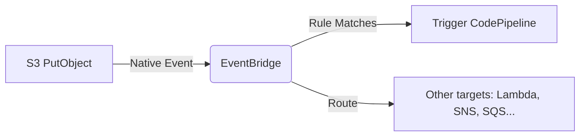

# 🧠 How First-Party Source Providers Use EventBridge for Change Detection in CodePipeline

> 🎯 Covers: S3, ECR, EventBridge, CloudTrail, and pipeline triggering internals  
> 📦 Providers: Amazon S3 and Amazon ECR  
> 💡 Purpose: Automate CodePipeline start based on resource changes  
> 🛠 Internals: Event lifecycle, event bus routing, source structure, matching rules, and execution logic

---

## 🧱 1. The Basics: What Is a “Source Action” in CodePipeline?

In CodePipeline, **source actions** are used to detect changes in your code or artifact repositories and kick off the pipeline. AWS supports **first-party sources** like:

- 🪣 **Amazon S3**
- 🐳 **Amazon ECR**
- 🧑‍💻 **AWS CodeCommit**

These source actions must detect "something changed" (e.g., new file uploaded to S3 or new image pushed to ECR). But how do they detect that?

---

## ⚙️ 2. The Change Detection Flow: EventBridge Is the Trigger Engine

AWS uses **Amazon EventBridge** as the core change detection system behind CodePipeline for first-party sources.

### ✅ For example, this is what happens



> So, EventBridge works as the **reactive engine** here.

---

## 🔍 3. What Triggers the Event in the First Place?

### 🅰️ Native Emission (e.g., ECR and some S3 events)

Some services, like **ECR** and **S3**, can **natively emit events** to EventBridge **without CloudTrail**:

- **ECR emits "ImagePushed" events** when a container image is pushed.
- **S3 emits “ObjectCreated” events** when a file is added.

> ✅ These go straight to EventBridge without needing CloudTrail if you configure the right rules.

### 🅱️ CloudTrail-Based Emission (S3 - in specific cases)

In more advanced cases (e.g., complex audit or older behavior), **CloudTrail acts as a secondary event emitter**:

- CloudTrail records API events like `PutObject`, `DeleteObject`, etc.
- These can **generate CloudTrail events**, which **EventBridge rules can match**.

> ✅ This is **only needed when you want to detect changes via API calls**, not basic `ObjectCreated` notifications.

### ❗ So, is CloudTrail required?

- **NO**, if using S3 native notifications with EventBridge.
- **YES**, if you're relying on API-based detection for more complex audit trails or older setups.

---

## 🧭 4. How EventBridge Works Internally (Not a Black Box!)

Let’s open up the hood 🔧.

### ✅ EventBridge Internals

1. **Event Emitters**: Any AWS service (S3, ECR, Lambda, etc.) or your app (`PutEvents` API).
2. **Event Buses**:
   - **Default Bus** (for AWS services)
   - **Custom Buses** (for your apps)
3. **Rules**:
   - Match events based on event patterns (e.g., `"source": "aws.s3"` and `"detail-type": "Object Created"`).
4. **Targets**:
   - Can route to: CodePipeline, Lambda, Step Functions, SQS, SNS, etc.

<div align="center">



</div>

---

## 🏗️ 5. Behind the Scenes: How CodePipeline Reacts to Events

When a matching event is received, EventBridge **invokes the CodePipeline start execution API**:

### Example S3 Event Payload

```json
{
  "source": "aws.s3",
  "detail-type": "Object Created",
  "detail": {
    "bucket": "97hw-source-bucket",
    "object": {
      "key": "my-website.zip"
    }
  }
}
```

If this event matches the rule pattern in EventBridge that’s tied to your pipeline’s source action, then:

```bash
aws codepipeline start-pipeline-execution \
  --name my-pipeline \
  --client-request-token 6a3e...
```

---

## 💡 6. Example Use Case: S3 Trigger for a Pipeline

### ✅ Goal

Trigger a pipeline when a new `.zip` file is uploaded to an S3 bucket.

### 🧩 Required Components

1. S3 bucket: `97hw-source-bucket`
2. EventBridge rule:

   ```json
   {
     "source": ["aws.s3"],
     "detail-type": ["AWS API Call via CloudTrail"],
     "detail": {
       "eventSource": ["s3.amazonaws.com"],
       "eventName": ["PutObject", "CompleteMultipartUpload", "CopyObject"],
       "requestParameters": {
         "bucketName": ["97hw-source-bucket"],
         "key": ["my-website.zip"]
       }
     }
   }
   ```

3. Target: AWS CodePipeline execution API.

---

## 🧠 7. Advanced Insight: Who Can Emit Events to EventBridge?

| Event Source           | Can Emit To EventBridge | Notes                       |
| ---------------------- | ----------------------- | --------------------------- |
| AWS Services (S3, ECR) | ✅ Yes                  | First-party, native         |
| CloudTrail             | ✅ Yes                  | Logs API activity, optional |
| Custom Apps            | ✅ Yes                  | Use `PutEvents` API         |
| SaaS Applications      | ✅ Yes                  | Via partner integrations    |

---

## 📤 8. What Can EventBridge Send Events To?

| Target Type     | Description                   |
| --------------- | ----------------------------- |
| Lambda Function | Run code                      |
| Step Functions  | Run workflow                  |
| CodePipeline    | Start pipeline                |
| SQS Queue       | Buffer for async              |
| SNS Topic       | Fan-out notifications         |
| Event Bus       | Forward to another bus        |
| API Destination | HTTP call to external service |

---

## ✅ Summary

| Concept              | Insight                                                      |
| -------------------- | ------------------------------------------------------------ |
| Native Emission      | S3/ECR send events directly to EventBridge                   |
| CloudTrail Role      | Logs API activity → used for rule filtering if needed        |
| EventBridge Job      | Match rules + forward event to targets                       |
| CodePipeline Trigger | Triggered via matching event to a rule tied to source action |

---

## 🔗 References

- 📄 [S3 as a Source in CodePipeline](https://docs.aws.amazon.com/codepipeline/latest/userguide/action-reference-S3.html)
- 📄 [ECR Source Actions](https://docs.aws.amazon.com/codepipeline/latest/userguide/create-cwe-ecr-source.html)
- 📄 [Using EventBridge with CodePipeline](https://docs.aws.amazon.com/codepipeline/latest/userguide/triggering.html)
- 📄 [EventBridge Event Pattern Syntax](https://docs.aws.amazon.com/eventbridge/latest/userguide/eb-event-patterns.html)

---

Let me know if you'd like a full hands-on lab or Terraform example to implement this!
