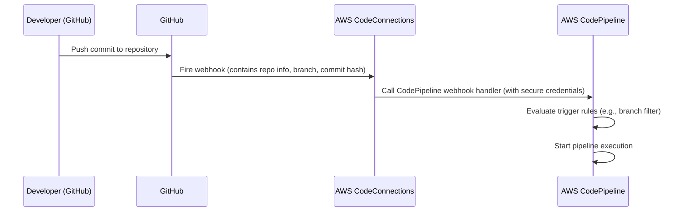

# 🌐 How Change Detection Works for Third-Party Source Providers in CodePipeline (via Webhooks & AWS CodeConnections)

When using **third-party source providers** such as **GitHub**, **GitLab**, or **Bitbucket** with **AWS CodePipeline**, AWS uses **webhooks** through **AWS CodeConnections** to detect source changes and start the pipeline execution.

This process is different from how **first-party providers** like Amazon S3 or ECR use **EventBridge and CloudTrail**. Here's an internal breakdown of how it all works — from basics to internals.

---

## 🧩 Components Involved

1. **Third-Party Repository (e.g., GitHub)**: Your source code resides here.
2. **AWS CodeConnections**: A managed service that establishes a secure connection between AWS and your third-party repository.
3. **AWS CodePipeline**: Orchestrates the workflow from source to deployment.
4. **Webhooks**: HTTP callbacks triggered by events in your repository (e.g., code push).

---

## 🔌 2. What Is AWS CodeConnections?

**AWS CodeConnections** is a managed service that securely connects AWS services (like CodePipeline or CodeBuild) to external source providers via **OAuth apps** or **GitHub Apps**.

### **Key Roles of CodeConnections:**

- Manages **secure authentication** and **access tokens**.
- Sets up **webhooks** from your source provider (e.g., GitHub) to notify AWS of events (push, PR, etc.).
- Acts as a **bridge** between CodePipeline and the third-party Git service.

---

## 🔁 3. Webhooks for Change Detection (CDN)

Here's the internal process of how a **push to a GitHub repo** triggers a pipeline execution:

### ⚙️ 3.1 Step-by-Step Workflow

1. **Code Commit**: A developer pushes code to the GitHub repository.
2. **Webhook Triggered**: GitHub detects the push event and triggers a webhook.
3. **CodeConnections Receives Event**: The webhook sends an HTTP POST request to an endpoint managed by AWS CodeConnections.
4. **Pipeline Execution**: CodeConnections authenticates the request and initiates the associated CodePipeline execution.

---

---

### 🔍 3.2 What’s Inside the Webhook?

When GitHub triggers the webhook:

- It sends a **JSON payload** to the CodeConnections-managed webhook endpoint.
- Payload includes:
  - `repository URL`
  - `branch`
  - `commit ID`
  - `pusher`
  - Optional metadata (PR info, files changed, etc.)

AWS uses this metadata to:

- Identify the **source action** configured in your pipeline.
- Evaluate **trigger conditions** (branch filters, file path includes/excludes).
- Trigger **source revision override**, if enabled.

---

## 🛠️ 4. Setting Up the Integration

1. **Create a Connection**:

   - Navigate to the AWS CodePipeline console.
   - Under "Connections", create a new connection to your GitHub account.
   - Follow the prompts to authorize AWS access to your repositories.

2. **Configure the Pipeline**:

   - In CodePipeline, create a new pipeline or edit an existing one.
   - Add a source stage and select "GitHub (CodeStar Connection)" as the source provider.
   - Choose the repository and branch you want to monitor.

3. **Define Build and Deploy Stages**:
   - Add subsequent stages for building and deploying your application as needed.

---

## 🔐 5. Security and Authentication

- **GitHub App Installation**: AWS provides a GitHub App that you install in your repository, granting AWS the necessary permissions.
- **Secure Webhook Endpoint**: AWS CodeConnections manages the webhook endpoint, ensuring secure communication between GitHub and AWS.
- **IAM Roles**: AWS uses IAM roles to control access and permissions for the pipeline execution.

---

## 📌 6. Key Points

- **Event-Driven**: The integration is event-driven; code changes in your repository automatically trigger pipeline executions.
- **Managed Service**: AWS CodeConnections handles the complexity of authentication and webhook management.
- **Secure Communication**: All interactions between GitHub and AWS are secured using industry-standard practices.

---

## ⚠️ 7. Comparison to First-Party CDN (EventBridge)

| Feature                    | First-Party Providers (S3, ECR) | Third-Party Providers (GitHub, GitLab)        |
| -------------------------- | ------------------------------- | --------------------------------------------- |
| Change Detection Mechanism | EventBridge + CloudTrail        | Webhooks via CodeConnections                  |
| Triggered By               | AWS internal events             | Push events from external repo                |
| Event Routing              | EventBridge Rules               | Webhook to CodeConnections                    |
| IAM Role Usage             | Source action IAM role          | IAM + GitHub token/Auth                       |
| Custom Filters             | Event pattern JSON              | Branch, PR, file path filters in CodePipeline |

---

## 🧠 8. Advanced Internals

### 8.1 CodeConnections Webhook Routing

- Every connection has an internal **ARN** like:  
  `arn:aws:codestar-connections:region:account-id:connection/abc123`
- This connection is tied to:
  - A **GitHub App** (installed in your repo)
  - A **repository and branch** you configure in the source stage of the pipeline.

When an event is received:

- CodeConnections verifies the payload signature (if required).
- The matching **pipeline’s source stage** is updated with the new `revision`.

### 8.2 Trigger Rule Evaluation

Before the pipeline starts:

- AWS evaluates:
  - **Trigger mode**: Continuous delivery or manual.
  - **Filters**: Branch names (e.g., only `main`), PR status, file paths.
- If all pass, the pipeline is triggered.

---

## 🚀 9. Real-World Example

### Goal: Trigger pipeline when `main` branch in GitHub is updated

1. Connect GitHub repo using CodeConnections.
2. Set pipeline source action to use that repo and `main` branch.
3. Push code to GitHub:
   - GitHub → sends webhook to CodeConnections.
   - CodeConnections → forwards event to CodePipeline.
   - CodePipeline → checks filters and starts pipeline execution.

---

## 📌 10. References

- [AWS CodeConnections Docs](https://docs.aws.amazon.com/codepipeline/latest/userguide/connections.html)
- [Pipeline Webhooks (GitHub)](https://docs.aws.amazon.com/codepipeline/latest/userguide/connections-github.html)
- [Source Action Configuration](https://docs.aws.amazon.com/codepipeline/latest/userguide/action-reference-CodestarConnectionSource.html)
- [CodePipeline Trigger Filters](https://docs.aws.amazon.com/codepipeline/latest/userguide/pipelines-triggers.html)
