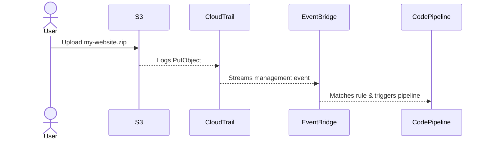

# 🪣 AWS CodePipeline with Amazon S3 Source

> A complete and **2025-updated** guide to setting up Amazon S3 as a source in AWS CodePipeline, including how change detection actually works, what's happening behind the scenes, and how to configure it correctly via the **console** or **CLI**.

---

## 🌌 Overview

Amazon S3 can act as a **source stage** in CodePipeline. You upload an object (typically a `.zip` or build artifact) to an S3 bucket, and that change triggers the pipeline.

---

## 🔧 Use Case Example

> "Start my pipeline when a file named `my-website.zip` is uploaded to the bucket `97hw-source-bucket`."

---

## ⚖️ Change Detection Internals

| Feature                     | Behavior                                                                 |
| --------------------------- | ------------------------------------------------------------------------ |
| ✔️ Console Setup            | Creates a CloudTrail-based EventBridge rule                              |
| ❌ Native S3 to EventBridge | Not supported via console for CodePipeline trigger                       |
| 💡 How Trigger Works        | CloudTrail logs S3 `PutObject` ➔ EventBridge rule ➔ invokes CodePipeline |

---

## 🔄 Sequence: Upload to Trigger



---

## ✨ Console Configuration Steps

### 1. 🔹 Source Provider

Choose: **Amazon S3**

### 2. 📦 Bucket

Choose: `97hw-source-bucket`

### 3. 📂 Object Key

Set to: `my-website.zip`

### 4. ✅ Enable These Options

- [x] **Create EventBridge rule to automatically detect source changes**
- [x] **Enable automatic retry on stage failure**

---

## 🪧 Behind the Scenes

AWS creates a rule in EventBridge that looks like this:

```json
{
  "source": ["aws.s3"],
  "detail-type": ["AWS API Call via CloudTrail"],
  "detail": {
    "eventSource": ["s3.amazonaws.com"],
    "eventName": ["PutObject", "CompleteMultipartUpload", "CopyObject"],
    "requestParameters": {
      "bucketName": ["97hw-source-bucket"],
      "key": ["my-website.zip"]
    }
  }
}
```

> ⚠️ Still depends on **CloudTrail management events**, even though it uses EventBridge.

---

## 🚧 Required IAM Permissions

### Pipeline Role Must Have:

```json
{
  "Effect": "Allow",
  "Action": ["s3:GetObject", "s3:GetObjectVersion", "s3:GetBucketVersioning", "s3:ListBucket"],
  "Resource": ["arn:aws:s3:::97hw-source-bucket", "arn:aws:s3:::97hw-source-bucket/*"]
}
```

---

## 🔧 Optional: Start With Source Revision Override

To trigger your pipeline manually using the uploaded object as a revision:

```bash
aws codepipeline start-pipeline-execution \
  --name my-pipeline \
  --source-revision "{"S3":{"bucketName":"97hw-source-bucket","objectKey":"my-website.zip"}}"
```

---

## 💡 Key Insights

| Question                                             | Answer                                                                |
| ---------------------------------------------------- | --------------------------------------------------------------------- |
| Is this true EventBridge change detection?           | ❌ No. It uses **CloudTrail stream to EventBridge** behind the scenes |
| Is CloudTrail required?                              | ✔️ Yes, but the **default integration is free**                       |
| Can I skip CloudTrail and use native events instead? | ❌ Not for S3 in CodePipeline via console                             |
| How do I configure native detection instead?         | Use **CLI** + `start-pipeline-execution` with custom EventBridge rule |

---

## 📅 Updated as of: April 2025

This documentation reflects the **most recent changes** including:

- New S3 `AllowOverrideForS3ObjectKey` feature
- Support for `BucketName` and `ObjectKey` as output variables

See [official docs](https://docs.aws.amazon.com/codepipeline/latest/userguide/create-S3-source-events.html).

---

Let me know if you'd like:

- 🚀 Terraform or CDK example for native event triggers
- 🧰 Integration with ECR, GitHub, or GitLab sources
- 🔐 IAM security guide for CodePipeline roles
