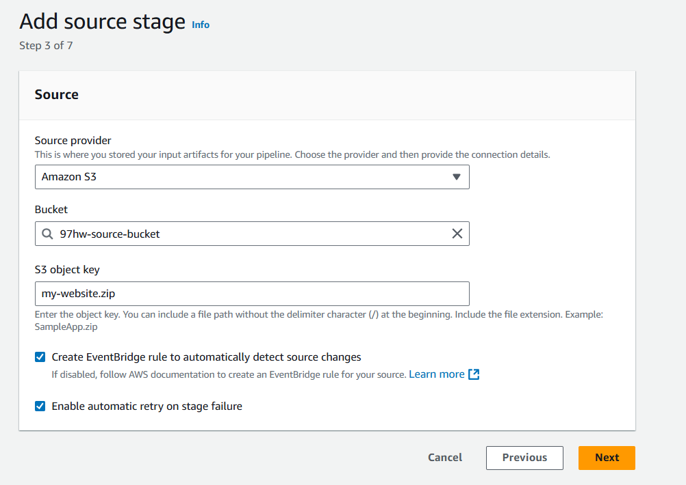
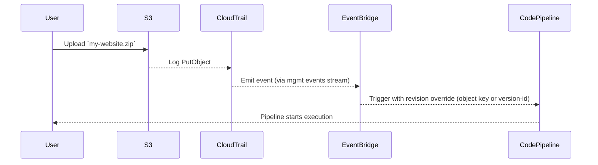

# 🪣 AWS CodePipeline with Amazon S3 Source (Updated for 2025)

> Your ultimate guide to triggering pipelines from an S3 object upload with **automatic event detection** using **CloudTrail + EventBridge** — the smart, up-to-date way.

---

## 🧠 Overview

When you choose **Amazon S3** as the **source provider** in a CodePipeline, you want your pipeline to start automatically when a new `.zip` file is uploaded.

That magic is made possible by combining:

- ✅ **AWS CloudTrail**: Captures `PutObject` events from S3.
- ✅ **Amazon EventBridge**: Listens for those events and triggers the pipeline.
- ✅ **CodePipeline Source Revision Overrides**: Passes the uploaded object's version ID to the pipeline.

Now let’s break it all down.

---

## ⚙️ Configuration from the Console: What Happens?

When you go through the **AWS Console wizard** to add an S3 source action, you’ll see:

---

<div style="text-align: center;">
  
</div>

---

Let’s decode each part 👇

### ✅ Source Fields

- **Bucket**: Your source bucket (e.g., `97hw-source-bucket`)
- **S3 object key**: The object (e.g., `my-website.zip`) that triggers the pipeline

### 🧠 [x] Create EventBridge Rule to Automatically Detect Source Changes

When this box is checked:

1. AWS **automatically creates a CloudTrail trail** (if one doesn't exist).
2. It **creates an EventBridge rule** with the right event pattern:

   ```json
   {
     "source": ["aws.s3"],
     "detail-type": ["AWS API Call via CloudTrail"],
     "detail": {
       "eventSource": ["s3.amazonaws.com"],
       "eventName": ["PutObject", "CompleteMultipartUpload", "CopyObject"],
       "requestParameters": {
         "bucketName": ["97hw-source-bucket"],
         "key": ["my-website.zip"]
       }
     }
   }
   ```

3. The rule targets the pipeline and **automatically invokes it**.

> 🧠 You **don’t need to set up CloudTrail or EventBridge manually** unless you uncheck the box.

### 🔁 [x] Enable Automatic Retry on Stage Failure

This option tells CodePipeline to:

- Automatically **retry this stage** if it fails
- Great for **transient S3 issues** or **flaky downloads**

---

## 🛠️ If You Want to Set This Up Manually (via CLI or Infra-as-Code)

Let’s say you uncheck “Create EventBridge rule…” or want to do this in Terraform/CDK.

### Step 1️⃣ – Create a CloudTrail Trail (if not already)

- Enable **management events**
- Choose **Write** for **PutObject** operations
- Store logs in an S3 bucket with appropriate permissions

> 📘 [Creating a Trail – AWS Docs](https://docs.aws.amazon.com/awscloudtrail/latest/userguide/cloudtrail-create-and-update-a-trail.html)

---

### Step 2️⃣ – Create EventBridge Rule to Match the S3 Upload

📍 Open EventBridge → Rules → **Create Rule**

Use the following event pattern:

```json
{
  "source": ["aws.s3"],
  "detail-type": ["AWS API Call via CloudTrail"],
  "detail": {
    "eventSource": ["s3.amazonaws.com"],
    "eventName": ["PutObject", "CompleteMultipartUpload", "CopyObject"],
    "requestParameters": {
      "bucketName": ["97hw-source-bucket"],
      "key": ["my-website.zip"]
    }
  }
}
```

---

### Step 3️⃣ – Set Target: CodePipeline

- Select **AWS Service** → **CodePipeline**
- Paste the **Pipeline ARN** like:

```ini
arn:aws:codepipeline:us-east-1:123456789012:MyS3Pipeline
```

---

### ⚡ (Optional) Add Input Transformer for Source Revisions

This allows EventBridge to **override the revision** in your pipeline (e.g., set specific version of the object).

#### 💡 Use this input

**Input Path**:

```json
{ "revisionValue": "$.detail.object.version-id" }
```

**Template**:

```json
{
  "sourceRevisions": {
    "actionName": "Source",
    "revisionType": "S3_OBJECT_VERSION_ID",
    "revisionValue": "<revisionValue>"
  }
}
```

---

## 📊 Mermaid Flow: What Happens Internally?



---

## ✅ Summary

| Feature                             | Behavior                                                         |
| ----------------------------------- | ---------------------------------------------------------------- |
| ✅ **Console auto-setup**           | EventBridge + CloudTrail created for you when checkbox is ticked |
| ✅ **Manual setup possible**        | Use CloudTrail + EventBridge with proper event pattern           |
| 🔁 **Retry on failure**             | Retries the **source stage** if the `.zip` fails to be pulled    |
| 🔧 **Input transformer (optional)** | Allows you to use object version ID for better reproducibility   |

---

## 📚 References

- [📘 Create S3 Source with Events (AWS Docs)](https://docs.aws.amazon.com/codepipeline/latest/userguide/create-cloudtrail-S3-source-console.html)
- [📘 EventBridge Rule with Input Transformer](https://docs.aws.amazon.com/eventbridge/latest/userguide/eb-input-transformer.html)
- [📘 CodePipeline Start Execution](https://docs.aws.amazon.com/codepipeline/latest/APIReference/API_StartPipelineExecution.html)
