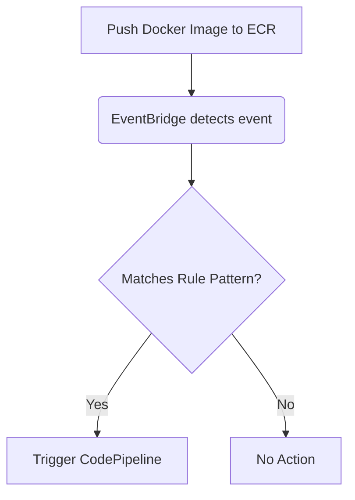

# 📦 **AWS CodePipeline & Amazon ECR Integration Using EventBridge**

When developing containerized applications, automating your pipeline to react instantly to container image changes can feel like magic ✨. Let's explore how AWS CodePipeline can trigger pipeline executions automatically when new images are pushed to Amazon ECR (Elastic Container Registry) using **Amazon EventBridge**.

---

## 📌 **What’s Amazon ECR Source Action?**

**Amazon ECR source action** allows AWS CodePipeline to listen for changes in your Docker images stored in an Amazon ECR repository. When an image is pushed or updated, the pipeline is automatically triggered.

You have two ways to set this up:

- **AWS Console**: Automated via console wizard.
- **AWS CLI or CloudFormation**: Requires additional manual setup.

---

## 🚨 **Triggering Pipelines with EventBridge**

EventBridge acts as the "eyes 👀 and ears 👂" for your pipeline. It detects ECR events and triggers pipeline executions automatically.

The trigger works through an **EventBridge rule**, watching for events like:

- New image pushed.
- Tag updated.

---

## 🎯 **How Does It Work? (Flowchart)**

<div align="center">



</div>

---

## 🛠️ **Creating EventBridge Rule (AWS Console)**

Follow these detailed steps to create your EventBridge rule via the AWS Management Console:

1. **Navigate to EventBridge Console**  
   [Amazon EventBridge Console](https://console.aws.amazon.com/events/)

2. **Create a New Rule**:

   - Click **Events → Create rule**.
   - For **Event source**, choose:
     - **Service Name**: `Elastic Container Registry (ECR)`
     - **Event Pattern**: Choose **Edit** and use the following example:

   ```json
   {
     "detail-type": ["ECR Image Action"],
     "source": ["aws.ecr"],
     "detail": {
       "action-type": ["PUSH"],
       "image-tag": ["latest"],
       "repository-name": ["eb-test"],
       "result": ["SUCCESS"]
     }
   }
   ```

   > **🔖 Note**:  
   > Modify `repository-name` and `image-tag` according to your needs.

3. **Define Target as CodePipeline**:

   - Select **CodePipeline** as your target.
   - Enter your pipeline ARN. The ARN format is:

     ```ini
     arn:aws:codepipeline:<region>:<account>:<pipeline-name>
     ```

     Example:

     ```ini
     arn:aws:codepipeline:us-east-2:80398EXAMPLE:MyFirstPipeline
     ```

4. **Set IAM Service Role**:

   - **Create a new role** or **Use existing role**.
   - This role lets EventBridge trigger CodePipeline.

5. **Optional Input Transformer**:

   - Expand **Additional settings → Configure target input → Configure input transformer**.
   - Enter these key-value pairs in the **Input path**:

     ```json
     { "revisionValue": "$.detail.image-digest" }
     ```

   - And in **Template**:

     ```json
     {
       "sourceRevisions": {
         "actionName": "Source",
         "revisionType": "IMAGE_DIGEST",
         "revisionValue": "<revisionValue>"
       }
     }
     ```

6. **Review & Create**:
   - Enter rule name and description.
   - Set **State** to `Enabled`.
   - Finally, click **Create rule**.

🎉 **Your pipeline is now set up to automatically trigger whenever you push a new image to ECR!**

---

## 💻 **Creating EventBridge Rule (AWS CLI)**

If you prefer command-line magic, here’s your CLI incantation:

```bash
aws events put-rule \
  --name "ECRPushTriggerRule" \
  --event-pattern '{
    "source": ["aws.ecr"],
    "detail-type": ["ECR Image Action"],
    "detail": {
      "action-type": ["PUSH"],
      "image-tag": ["latest"],
      "repository-name": ["eb-test"],
      "result": ["SUCCESS"]
    }
  }' \
  --state ENABLED
```

Now, add the pipeline target:

```bash
aws events put-targets \
  --rule "ECRPushTriggerRule" \
  --targets "Id"="1","Arn"="arn:aws:codepipeline:us-east-2:80398EXAMPLE:MyFirstPipeline","RoleArn"="arn:aws:iam::80398EXAMPLE:role/YourEventBridgeRole"
```

---

## 🗃️ **Creating EventBridge Rule (CloudFormation Template)**

Here’s how you define this rule in AWS CloudFormation:

```yaml
Resources:
  ECRPushTriggerRule:
    Type: AWS::Events::Rule
    Properties:
      Name: "ECRPushTriggerRule"
      EventPattern:
        source:
          - "aws.ecr"
        detail-type:
          - "ECR Image Action"
        detail:
          action-type:
            - "PUSH"
          image-tag:
            - "latest"
          repository-name:
            - "eb-test"
          result:
            - "SUCCESS"
      Targets:
        - Arn: "arn:aws:codepipeline:us-east-2:80398EXAMPLE:MyFirstPipeline"
          Id: "CodePipelineTarget"
          RoleArn: "arn:aws:iam::80398EXAMPLE:role/YourEventBridgeRole"
```

---

## 📖 **Additional References**

- [Create an EventBridge Rule for ECR (Console)](https://docs.aws.amazon.com/codepipeline/latest/userguide/create-cwe-ecr-source-console.html)
- [Create an EventBridge Rule for ECR (CLI)](https://docs.aws.amazon.com/codepipeline/latest/userguide/create-cwe-ecr-source-cli.html)
- [Create an EventBridge Rule for ECR (CloudFormation)](https://docs.aws.amazon.com/codepipeline/latest/userguide/create-cwe-ecr-source-cfn.html)
