# 🚀 AWS CodePipeline Triggers: Automate Your CI/CD

Triggers allow you to configure your pipeline to start on a particular event type or filtered event type, such as when a change on a particular branch or pull request is detected. Triggers are configurable for source actions with connections that use the CodeStarSourceConnection action in CodePipeline, such as GitHub, Bitbucket, and GitLab

---

## 📌 What Are AWS CodePipeline Triggers?

AWS CodePipeline **triggers** are events that automatically start your pipeline execution when certain conditions are met. They are especially useful when integrating with source providers like GitHub, GitLab, or Bitbucket via AWS CodeStar Connections.

---

## 📂 Types of Pipeline Triggers

### 1. 🌍 No Filter (Default Trigger)

Automatically triggers your pipeline for any push to the default branch.

### 2. 🔬 Specify Filter (Custom Trigger)

Triggers pipeline execution based on specific conditions, such as:

- **Branch Names**
- **File Paths**
- **Git Tags**
- **Pull Request Events**

### 3. ⛔ Do Not Detect Changes

Disables automatic triggering; you manually start pipeline executions.

---

## 📝 Easy & Practical Examples

### 🔸 Example 1: Trigger on Push to 'main' Branch

```json
{
  "push": [
    {
      "branches": { "includes": ["main"] }
    }
  ]
}
```

### 🔸 Example 2: Trigger on Pull Requests Targeting 'develop'

```json
{
  "pullRequest": [
    {
      "branches": { "includes": ["develop"] }
    }
  ]
}
```

### 🔸 Example 3: Trigger on 'release' Branch, Exclude README Changes

```json
{
  "push": [
    {
      "branches": { "includes": ["release"] },
      "filePaths": { "excludes": ["README.md"] }
    }
  ]
}
```

---

## ⚙️ Considerations for Using Triggers

- Only **one trigger per source action**.
- Combine filters such as branches and file paths.
- New branches might not trigger pipelines immediately when using file path filters.
- Merging pull requests can trigger multiple pipeline executions if both push and PR triggers apply.

---

## 🌐 Pull Request Events by Provider

| Event   | Bitbucket                      | GitHub | GitLab |
| ------- | ------------------------------ | ------ | ------ |
| Opened  | ✅                             | ✅     | ✅     |
| Updated | ✅                             | ✅     | ✅     |
| Closed  | ⚠️ (Triggers only when merged) | ✅     | ✅     |

---

## 📊 Trigger Workflow Diagram (Mermaid)

```mermaid
---
config:
  look: handDrawn
  layout: elk
  elk:
    mergeEdges: false
    nodePlacementStrategy: LINEAR_SEGMENTS
---
flowchart TD
    A[Code Change Detected] --> B{Is Trigger Configured?}
    B -- Yes --> C{Does Event Match Filter?}
    C -- Yes --> D[🚀 Start Pipeline]
    C -- No --> E[🛑 Do Nothing]
    B -- No --> E
```

<div align="center">



</div>

---

## ⚡ Configuring Triggers: Step-by-Step

### Using AWS Management Console

1. Navigate to **AWS CodePipeline**.
2. Select your pipeline → Click **Edit**.
3. Edit the **Source stage**.
4. Choose **"Add trigger"** and configure conditions (branch, file paths, events).

### Using AWS CLI

Create or update your pipeline using a JSON configuration:

```bash
aws codepipeline update-pipeline --cli-input-json file://pipeline.json
```

Example `pipeline.json` snippet:

```json
{
  "pipeline": {
    "name": "MyPipeline",
    "roleArn": "arn:aws:iam::123456789012:role/CodePipelineRole",
    "stages": [
      {
        "name": "Source",
        "actions": [
          {
            "name": "SourceAction",
            "actionTypeId": {
              "category": "Source",
              "owner": "AWS",
              "provider": "CodeStarSourceConnection",
              "version": "1"
            },
            "configuration": {
              "ConnectionArn": "arn:aws:codestar-connections:region:account-id:connection/connection-id",
              "FullRepositoryId": "myrepo/repo-name",
              "BranchName": "main",
              "DetectChanges": "true"
            }
          }
        ]
      }
    ],
    "version": 1
  }
}
```

---

## 📚 Additional Resources

- [Official AWS CodePipeline Triggers Documentation](https://docs.aws.amazon.com/codepipeline/latest/userguide/pipelines-triggers.html)
- [AWS CodePipeline CLI Reference](https://docs.aws.amazon.com/cli/latest/reference/codepipeline/index.html)
- [AWS CloudFormation PipelineTriggerDeclaration](https://docs.aws.amazon.com/AWSCloudFormation/latest/UserGuide/aws-properties-codepipeline-pipeline-pipelinetriggerdeclaration.html)
