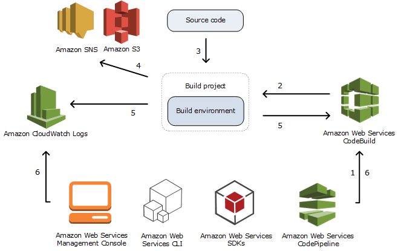
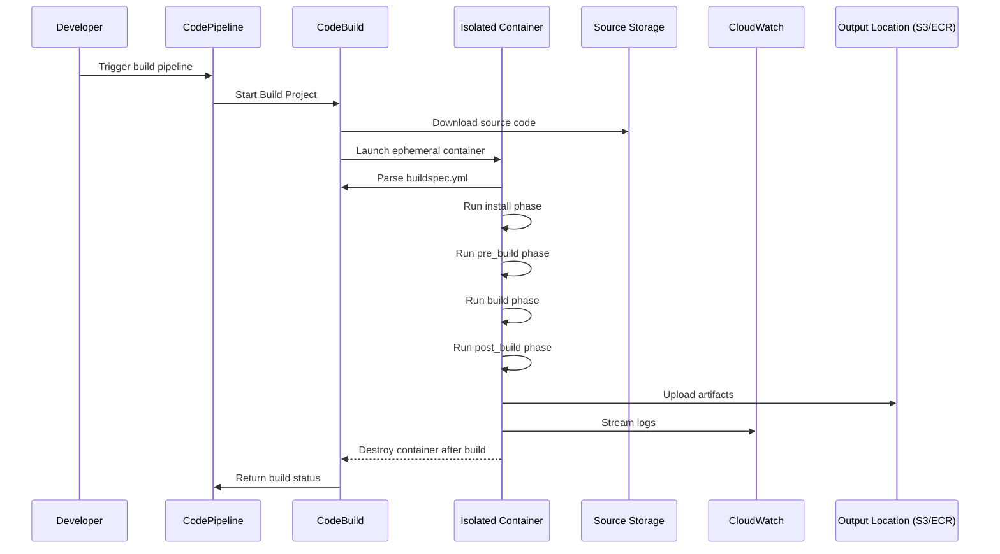

# 🏗️ **How AWS CodeBuild Works Internally**

**AWS CodeBuild** is a **fully managed continuous integration (CI) service** that compiles your source code, runs tests, and produces build artifacts ready for deployment.

> 🔍 _From Source to Artifact, Behind the Scenes_  
> 💡 It's like your own personal build robot that lives in AWS, spins up only when needed, builds your code in a secure isolated environment, and then shuts down.

---

> 📘 **Official Definition:**  
> _“AWS CodeBuild is a fully managed build service in the cloud. CodeBuild scales continuously and processes multiple builds concurrently, so your builds are not left waiting in a queue.”_

---

<div style="text-align: center">
  
</div>

---

## ⚙️ How CodeBuild Works (Internals)

At its core, CodeBuild is just a container orchestrator built on top of ECS/Fargate that:

- Spins up an **ephemeral compute container** based on your selected build image.
- Mounts your source code (from S3 or CodeCommit, etc).
- Executes commands from your **buildspec.yml**.
- Streams logs to CloudWatch Logs.
- Uploads artifacts (if any) to your configured destination (e.g., S3 or CodeDeploy).

🔍 It works behind the scenes using:

- **Amazon ECS with Fargate launch type**
- **EBS volumes** for ephemeral storage
- **IAM roles** for secure access
- **EventBridge** to report state changes

---

## 🧠 Internal Concepts You Must Know

Before diving deep, let's define a few official CodeBuild concepts:

| Term                  | Description                                                                   |
| --------------------- | ----------------------------------------------------------------------------- |
| **Build Project**     | Configuration that tells CodeBuild _how_ to build (source, env, commands)     |
| **Buildspec**         | A YAML file (`buildspec.yml`) that defines the _actual_ build steps           |
| **Build Environment** | A container or runtime (like Ubuntu, Node.js, etc.) used to execute the build |
| **Artifacts**         | Files you want to keep (e.g., compiled code, zipped builds)                   |
| **Phases**            | Steps in the build lifecycle (install, pre_build, build, post_build)          |

---

## ⚙️ Internal Flow: How CodeBuild Actually Works

Let’s visualize the full lifecycle using a **Mermaid sequence diagram**:



---

## 🔍 Step-by-Step Breakdown

### 1. 🧭 **Start the Build**

- You can trigger a build manually, via:
  - AWS Console
  - CLI/SDK
  - EventBridge
  - Or more commonly, as part of a **CodePipeline stage**

### 2. 📥 **Download the Source**

- CodeBuild fetches the source code from:
  - AWS CodeCommit
  - GitHub/GitLab/Bitbucket
  - S3
- Stores it in a secure volume attached to a new build container

### 3. 🧪 **Create a Build Environment (Ephemeral Container)**

- CodeBuild starts a **dedicated, isolated container** for the job.
- The container uses the image defined in the project (managed or custom Docker image).

> This ensures builds don’t leak data across runs — each build gets a fresh box 🧼.

---

### 4. 🧾 **Parse `buildspec.yml`**

This YAML file controls the logic of the build. Here’s a basic example:

```yaml
version: 0.2
phases:
  install:
    commands:
      - echo Installing dependencies
      - npm install
  build:
    commands:
      - echo Building the app
      - npm run build
artifacts:
  files:
    - "**/*"
```

> If you don’t include a `buildspec.yml`, you can define the same phases inline in the UI or CLI.

---

### 5. 🔨 **Execute Phases**

Phases are executed in this order:

| Phase        | Description                              |
| ------------ | ---------------------------------------- |
| `install`    | Install dependencies (e.g., SDKs, tools) |
| `pre_build`  | Set env vars, auth, pre-steps            |
| `build`      | Main build (compilation, tests, etc.)    |
| `post_build` | Cleanup, zip artifacts, tagging, etc.    |

---

### 6. 🧾 **Generate and Upload Artifacts**

At the end of the build:

- The output files are stored in:
  - Amazon S3 (default)
  - Amazon ECR (for Docker images)
- You define them using the `artifacts` section of the `buildspec.yml`

---

### 7. 📊 **Send Logs to CloudWatch**

During every phase:

- All stdout/stderr logs are streamed to **CloudWatch Logs** in near-real-time.
- You can debug from the console or subscribe alerts.

---

### 8. 🧼 **Tear Down Container**

After the build:

- The container is **destroyed**.
- No state or cache is preserved (unless you enable caching).

---

## ☁️ Advanced Features (Internal Enhancements)

| Feature                   | How It Works Behind the Scenes                                              |
| ------------------------- | --------------------------------------------------------------------------- |
| **Environment Variables** | Passed into the container as `ENV` vars, masked in logs if sensitive        |
| **Secrets Manager**       | Secrets injected securely at runtime                                        |
| **VPC Access**            | CodeBuild can launch in your VPC to access internal services                |
| **Privileged Mode**       | Needed to run Docker commands inside build container (for Docker-in-Docker) |
| **Batch Builds**          | Splits large builds into smaller ones and aggregates results                |

---

---

## 📦 Supported Build Environments

You can choose a **predefined image** (like `aws/codebuild/standard:7.0`) or use a **custom Docker image** from Amazon ECR or DockerHub.

### Built-in Runtimes

| Language | Supported Versions         |
| -------- | -------------------------- |
| Node.js  | 12.x, 14.x, 16.x           |
| Python   | 3.8, 3.9, 3.10             |
| Java     | 8, 11, 17                  |
| .NET     | 3.1, 6.0                   |
| Go       | 1.18, 1.20                 |
| Docker   | Available via custom image |

---

## 🔐 IAM and Permissions

CodeBuild uses two IAM roles:

- **Service Role (Execution Role)**  
  👉 Grants CodeBuild permissions to read/write to services like S3, Secrets Manager, etc.

- **Source Role** (when triggered via CodePipeline or CodeCommit)  
  👉 Used to clone source code and interact with the repo.

---

## 📊 Monitoring and Logs

- Logs are streamed to **CloudWatch Logs**.
- Build status is visible in the **CodeBuild Console**.
- You can configure notifications using **EventBridge** and **SNS**.

---

## 🧪 CodeBuild vs CodePipeline vs CodeDeploy

| Service          | Purpose                            |
| ---------------- | ---------------------------------- |
| **CodeBuild**    | Build and test code                |
| **CodePipeline** | Orchestrate CI/CD workflow         |
| **CodeDeploy**   | Deploy apps to EC2, Lambda, or ECS |

💡 CodeBuild is often used _inside_ a CodePipeline stage as the build step.

---

## 💡 Real-World Example

You’re building a React app and want to automate the process:

```yaml
version: 0.2
phases:
  install:
    runtime-versions:
      nodejs: 18
    commands:
      - npm ci
  build:
    commands:
      - npm run build
artifacts:
  files:
    - build/**/*
```

> This builds the app, and outputs the `build/` folder to S3 for use with CloudFront or CodeDeploy.

---

## 🎯 Best Practices

- ✅ Always use **least privilege IAM roles**.
- ✅ Store secrets in **Secrets Manager**, not in `buildspec.yml`.
- ✅ Use **custom images** for consistent tooling.
- ✅ Separate build and deploy responsibilities.
- ✅ Cache dependencies (npm, pip, etc.) to reduce build times.

---

## 🏁 Final Thought

> AWS CodeBuild is not just "a CI tool" — it’s a **build factory on demand**, where each job gets a private environment, full AWS access (if you allow it), and integrates beautifully into the rest of your CI/CD pipeline.

---

## 📚 References

- 📘 [AWS CodeBuild Docs](https://docs.aws.amazon.com/codebuild/latest/userguide/welcome.html)
- 📘 [Buildspec Reference](https://docs.aws.amazon.com/codebuild/latest/userguide/build-spec-ref.html)
- 📘 [CodeBuild Pricing](https://aws.amazon.com/codebuild/pricing/)
