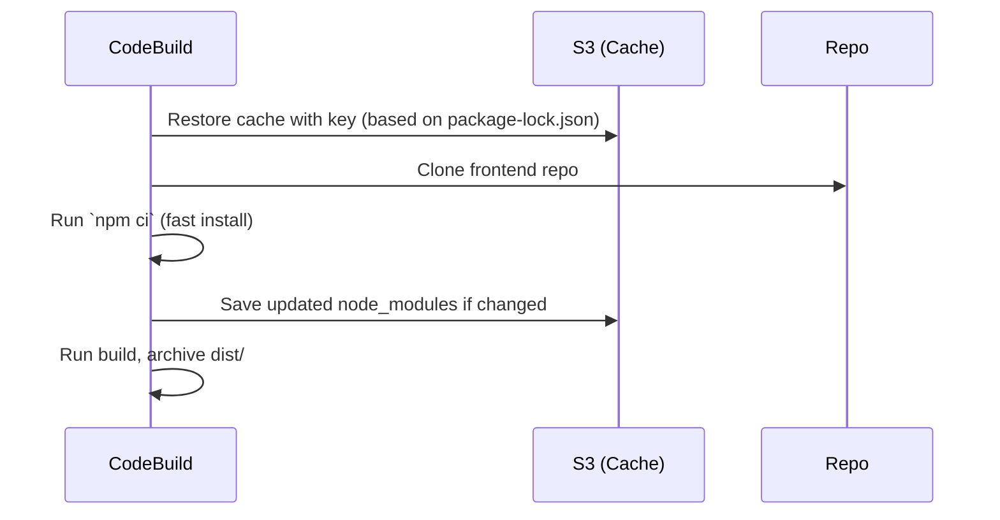
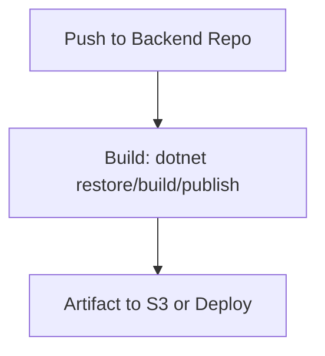
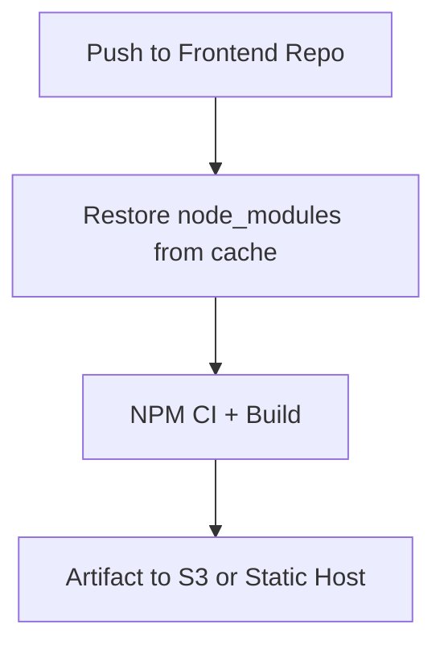

# 🏗️ **Mastering the Build Stage in CI/CD**

📦 For Separate Pipelines: .NET API (Backend) + Angular App (Frontend)

---

## 📌 Overview: What is the Build Stage?

The **Build Stage** is the CI/CD pipeline phase where your raw source code gets turned into **validated, tested, packaged artifacts**.

> It's like a **factory line**: source code goes in → a deployable artifact comes out.

This happens _before_ deploy, and should include:

- Dependency installation
- Compilation/bundling
- Unit tests
- Artifact creation (ZIP, JAR, binary, static site)
- Optional report generation (e.g., test, coverage)

---

## ⚙️ Your Architecture: Separate Repos = Separate Pipelines

Since your backend and frontend are in different repositories, treat them as **independent pipelines**.

| Repo         | Build Pipeline                             | Target Output                    |
| ------------ | ------------------------------------------ | -------------------------------- |
| **Backend**  | .NET SDK Build + Publish                   | `/publish` folder for deployment |
| **Frontend** | Angular CLI Build + NPM Cache Optimization | `/dist/app-name` for static site |

---

## 🎯 Best Practices for Any Build Stage

| Practice 💡                    | Description                                         |
| ------------------------------ | --------------------------------------------------- |
| **Use runtime versions**       | Lock your Node/.NET versions via `runtime-versions` |
| **Isolate build logic**        | Use scripts (`build.sh`) for portability & testing  |
| **Fail Fast**                  | Add linting and unit tests to catch bugs early      |
| **Use cache**                  | Avoid reinstalling `node_modules` / `.nuget`        |
| **Create versioned artifacts** | Helps trace which build went live                   |
| **Minimize logs/secrets**      | Mask sensitive env vars & clean up debug noise      |

---

## 🧱 Build Stage – For .NET API Project

### ✅ Example `buildspec.yml`

```yaml
version: 0.2

phases:
  install:
    runtime-versions:
      dotnet: 8.0
    commands:
      - echo "Installing dependencies..."
      - dotnet restore
  build:
    commands:
      - echo "Building project..."
      - dotnet build -c Release --no-restore
  post_build:
    commands:
      - echo "Publishing app..."
      - dotnet publish -c Release -o ./publish

artifacts:
  files:
    - "**/*"
  base-directory: publish
```

> 🔁 You can optionally cache `~/.nuget/packages` folder using the `cache` block to speed up dependency restoration.

---

## 🌐 Build Stage – For Angular Frontend

### 📦 Common Pain: Re-downloading `node_modules`

> `node_modules` is large. Reinstalling every build slows everything down.

✅ **Solution**: Use **CodeBuild cache** with a hash key derived from `package-lock.json`.

---

### ✅ Example `buildspec.yml` (Optimized)

```yaml
version: 0.2

cache:
  paths:
    - "node_modules/**/*"
  key: npm-cache-$(codebuild-hash-files package-lock.json)
  fallback-keys:
    - npm-cache-
    - npm-

phases:
  install:
    runtime-versions:
      nodejs: 18
    commands:
      - echo "Installing dependencies..."
      - npm ci
  build:
    commands:
      - echo "Linting..."
      - npm run lint
      - echo "Building Angular..."
      - npm run build -- --configuration production
  post_build:
    commands:
      - echo "Build completed on $(date)"

artifacts:
  files:
    - "**/*"
  base-directory: dist/my-app
  discard-paths: yes
```

---

## 🧠 How CodeBuild Caching Works (Angular)



✅ This ensures `node_modules` only updates when `package-lock.json` changes.  
❌ Avoid caching `node_modules` without a hash key — stale cache can break builds!

---

## 🧪 Add Linting & Unit Tests

```yaml
build:
  commands:
    - npm run lint
    - npm run test -- --watch=false --browsers=ChromeHeadless
```

> ❗ Break the build early if quality checks fail.

---

## 📦 Artifacts: Output What You Deploy

| App Type   | What to Export                          |
| ---------- | --------------------------------------- |
| Angular    | `dist/` folder                          |
| .NET       | `publish/` folder                       |
| Docker App | Push to ECR (no artifacts block needed) |

Use this in `buildspec.yml`:

```yaml
artifacts:
  files:
    - "**/*"
  base-directory: dist/app-name
```

---

## 🔐 Secrets & Secure Builds

Use:

```yaml
env:
  parameter-store:
    LOGIN_PASSWORD: "/MyApp/dockerPassword"
```

> Avoid hardcoding secrets or printing them in logs. Masking is automatic for SSM and Secrets Manager.

---

## 📌 Final Pipeline Flow (Simplified View)

### .NET API



### Angular Frontend



---

## 🏁 Final Thoughts

| ✅ Do This                                | ❌ Avoid This                         |
| ----------------------------------------- | ------------------------------------- |
| Use CI cache for node_modules             | Reinstalling NPM packages every build |
| Use `npm ci` not `npm install`            | Ignoring lock files                   |
| Split build and deploy pipelines          | Mixing concerns in monorepos          |
| Secure secrets via SSM or Secrets Manager | Echoing passwords in shell            |
| Track build version/commit                | Publishing anonymous builds           |

---

Would you like ready-made CloudFormation templates or CodePipeline definitions for these pipelines?
