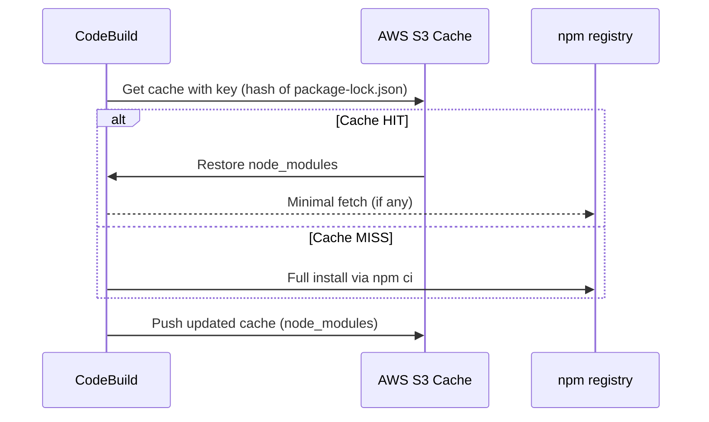

# 🚀 Deep Dive: CodeBuild Caching

📦 For .NET & Angular – Explained Line by Line

---

## 🤔 Why Is Caching Important?

Without caching, every build:

- Reinstalls all dependencies (`dotnet restore`, `npm ci`)
- Downloads packages from the internet
- Slows down your CI/CD pipelines (wasted time ⏱️)

### ✅ With Caching

- If your dependency files **don’t change**, you **reuse previously downloaded packages** from AWS S3.
- Faster builds 💨
- Fewer network failures 🌐
- Less cost & bandwidth 💸

---

## 🧱 How CodeBuild Caching Works Internally

```mermaid
---
config:
  look: handDrawn
  layout: elk
  elk:
    mergeEdges: false
    nodePlacementStrategy: LINEAR_SEGMENTS
---
flowchart TD
  A[Build Starts] --> B{Is Cache Configured?}
  B -- No --> D[Install All Dependencies from Internet]
  B -- Yes --> C[Check Cache Key in S3]
  C -->|Hit| E[Restore Cache - node_modules, NuGet, etc.]
  C -->|Miss| D
  E --> F[Run Build]
  F --> G[Update Cache and Push to S3]
```

<div align="center">



</div>

---

## ⚙️ Anatomy of the Cache Block

Let’s break this down:

```yaml
cache:
  paths:
    - "node_modules/**/*"
  key: npm-cache-$(codebuild-hash-files package-lock.json)
  fallback-keys:
    - npm-cache-
    - npm-
```

### 🔹 `paths`

> What you want to cache

📦 For Angular:

```yaml
paths:
  - "node_modules/**/*"
```

📦 For .NET:

```yaml
paths:
  - "/root/.nuget/packages/**/*"
```

This tells CodeBuild to:

- 🔍 Look for these folders/files
- 🔄 Save them after the build (if caching is enabled)
- 📦 Restore them before the build (if the cache key matches)

---

### 🔹 `key`

> Uniquely identifies the cache version to use

```yaml
key: npm-cache-$(codebuild-hash-files package-lock.json)
```

🔍 What’s this doing?

- `codebuild-hash-files package-lock.json` creates a **hash (fingerprint)** of the file.
- If your `package-lock.json` **changes**, the hash changes → new cache used.
- If it’s the **same**, CodeBuild restores the old cache from S3 → 🚀 faster install

> Same applies to `.NET` using `*.csproj` or `.sln` as the fingerprint file.

---

### 🔹 `fallback-keys`

> What if the exact cache **key** is not found?

Then CodeBuild tries the `fallback-keys`, in order.

```yaml
fallback-keys:
  - npm-cache-
  - npm-
```

This is helpful if:

- You added `package-lock.json` recently (so no hash match)
- You still want to try a **general fallback**

---

## 🧪 Real Example: Angular Caching Buildspec (Fully Explained)

```yaml
version: 0.2

cache:
  paths:
    - "node_modules/**/*" # ← What to cache
  key: npm-cache-$(codebuild-hash-files package-lock.json) # ← Fingerprint based on dependency file
  fallback-keys:
    - npm-cache- # ← Try this if hash fails
    - npm- # ← Final fallback
phases:
  install:
    runtime-versions:
      nodejs: 18
    commands:
      - echo "Installing dependencies..."
      - npm ci # ← Fast & clean install using lock file
  build:
    commands:
      - echo "Building app..."
      - npm run build -- --configuration production
```

---

## 🧪 Real Example: .NET NuGet Caching Buildspec (Fully Explained)

```yaml
version: 0.2

cache:
  paths:
    - "/root/.nuget/packages/**/*" # ← Cache NuGet global package cache
  key: nuget-cache-$(codebuild-hash-files **/*.csproj) # ← Change if project files change
  fallback-keys:
    - nuget-cache-
    - nuget-

phases:
  install:
    runtime-versions:
      dotnet: 8.0
    commands:
      - echo "Restoring NuGet packages..."
      - dotnet restore # ← Uses the local cache if found
  build:
    commands:
      - echo "Building .NET app..."
      - dotnet build --configuration Release --no-restore
  post_build:
    commands:
      - echo "Publishing .NET app..."
      - dotnet publish -c Release -o ./publish

artifacts:
  files:
    - "**/*"
  base-directory: publish
```

---

### 🧠 Behind the Scenes (Angular)

<div align="center">



</div>

---

## 🔥 Pro Tips

<div align="center">

| Tip                                    | Why It Matters                             |
| -------------------------------------- | ------------------------------------------ |
| 🗝️ Use lock files for hashes           | Ensures only meaningful changes bust cache |
| 🧹 Use ✅ `npm ci` not ❌`npm install` | Clean, fast, reproducible installs         |
| ⚡ Cache global NuGet                  | `.NET restore` becomes blazing fast        |
| 💥 Clear cache manually if needed      | Delete in S3 or update key logic           |
| 🧪 Use `codebuild-hash-files`          | Secure, dynamic cache key generation       |

</div>
