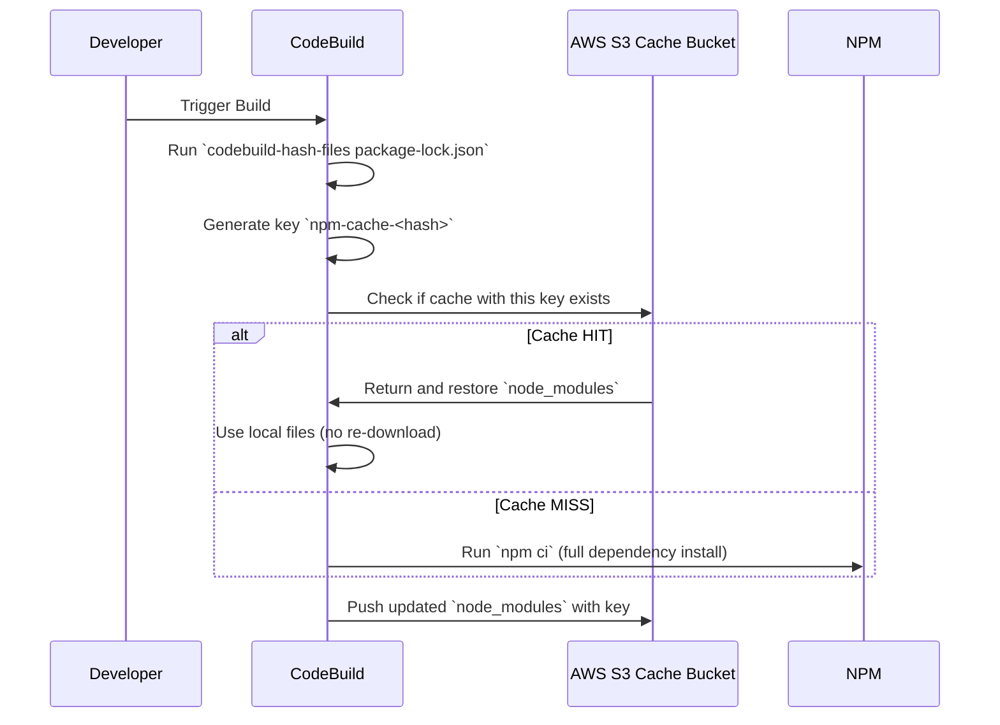

# 🚀 Deep Dive: How Caching Works in AWS CodeBuild

Let’s focus on the meaning of this line:

```yaml
key: npm-cache-$(codebuild-hash-files package-lock.json)
```

And what _actually happens_ step by step inside CodeBuild 🔬.

---

## 📌 Part 1: What Does This Cache Key Mean?

```yaml
key: npm-cache-$(codebuild-hash-files package-lock.json)
```

It creates a **dynamic, fingerprinted cache key**.

### 🧠 What is `$(codebuild-hash-files ...)`?

It’s a special CodeBuild function that:

- Calculates a **hash** (e.g., SHA256) of the given file(s)
- The hash is **used as a version tag** for the cache

So this line:

```yaml
key: npm-cache-$(codebuild-hash-files package-lock.json)
```

Might resolve at runtime to something like:

```yaml
key: npm-cache-a4e57c9d843f98fa1e94b16fcf8b2784cbb2a3a8
```

If you change anything in `package-lock.json`, the hash changes.

> ✅ So this avoids **stale caches** by invalidating the cache **only when your actual dependencies change**.

---

## 🧪 Part 2: How CodeBuild Uses This Key (Internals)

Here’s what happens _behind the scenes_, **step-by-step** 🔍:

### 🛠️ Internal Caching Lifecycle



---

## 🧪 Real-Time Step-by-Step Breakdown

| 📃 Step | What Happens                                                                    |
| ------- | ------------------------------------------------------------------------------- |
| 1️⃣      | CodeBuild starts the build                                                      |
| 2️⃣      | It evaluates your cache `key:` value                                            |
| 3️⃣      | Runs `codebuild-hash-files package-lock.json` to generate a **unique hash**     |
| 4️⃣      | Builds the **final key**, e.g. `npm-cache-abc123`                               |
| 5️⃣      | Checks S3 to see if a **cache with this key exists**                            |
| 6️⃣      | If **yes** → downloads & restores the cache folder (`node_modules`)             |
| 7️⃣      | If **no** → runs `npm ci`, installs everything from scratch                     |
| 8️⃣      | After the build → CodeBuild **uploads `node_modules` to S3** using the same key |

---

## 🔁 What If the Key Doesn’t Match?

That’s where `fallback-keys` come in:

```yaml
fallback-keys:
  - npm-cache-
  - npm-
```

📦 CodeBuild tries these **less-specific keys** in order:

- `npm-cache-` → grabs any older matching key
- `npm-` → even more generic fallback

Your build doesn’t fail — it might use an older cache if available.

---

## 💡 Pro Tip: Why Not Just Use `key: npm-cache`?

Because then:

- It will **never bust the cache**
- If your dependencies change, it **won’t reflect the changes**
- You risk **dependency mismatches, broken builds, bugs**

That’s why `codebuild-hash-files` is the **correct, automated way** to ensure **safe and versioned caching**.

---

## 🗓️ Recap Table: What Each Part Does

| Element                        | Purpose                                                  |
| ------------------------------ | -------------------------------------------------------- |
| `key:`                         | Primary identifier for the cache                         |
| `$(codebuild-hash-files file)` | Dynamically generates a hash to create a unique key      |
| `paths:`                       | Files/folders to restore before build & save after build |
| `fallback-keys:`               | Tries other fallback caches if main key isn’t found      |
| `S3 Bucket (backend)`          | Stores & retrieves cache automatically                   |

---

## 📌 Summary: What You’re Really Saying with This Block

```yaml
cache:
  paths:
    - "node_modules/**/*"
  key: npm-cache-$(codebuild-hash-files package-lock.json)
  fallback-keys:
    - npm-cache-
    - npm-
```

> 🔥 "Dear CodeBuild, please cache my `node_modules` folder unless my `package-lock.json` changes.  
> If there’s no exact match, try any similar npm cache instead. Thanks!"

---

## 🔹 How is the Cache Key Created?

CodeBuild internally:

1. 🔍 Reads `package-lock.json` as plain text
2. 📊 Runs SHA-256 hashing on it
3. 📄 Generates a hash like `a4e57c...`
4. 📁 Combines with prefix to get: `npm-cache-a4e57c...`
5. ✔️ Uses this as the cache key

Even small changes cause a new key (new version). This enables:

> 🧠 **Content-Based Cache Invalidation**

---

## 📁 What Is Actually Stored in the Cache?

Anything under this `paths:` setting:

```yaml
paths:
  - "node_modules/**/*"
```

The whole directory gets zipped and stored in S3.

---

## 🔁 Next Build: What Happens?

1. Same hash? ✅ Match found → download zip → restore
2. Different hash? ❌ Miss → fallback check → install fresh
3. At the end, save new cache zip in S3

---

## 🧪 Real Cache Folder in S3

Stored like:

```ini
s3://codebuild-cache/project-name/
  └── npm-cache-a4e57c9d84...zip
```

Inside:

```ini
node_modules/
├── angular/
├── rxjs/
└── zone.js/
```

---

## 🔥 TL;DR: What’s Going On

| Step | Action                             |
| ---- | ---------------------------------- |
| 1️⃣   | Hash `package-lock.json`           |
| 2️⃣   | Generate `npm-cache-<hash>` key    |
| 3️⃣   | Lookup cache in S3                 |
| 4️⃣   | Restore if hit → otherwise install |
| 5️⃣   | Push updated cache to S3           |

---

## 🧠 Why `fallback-keys` Are Smart

If current key has no match, try these:

```yaml
fallback-keys:
  - npm-cache-
  - npm-
```

Works _only if_ past caches exist with those prefixes.

---

## 💪 Real-World Use Case

### Day 1: First build

```yaml
key: npm-cache-abc123
```

- No cache yet → full install
- Saves zip to S3

### Day 2: Lock file change

```yaml
key: npm-cache-def456
```

- Cache miss → fallback key `npm-cache-` matches previous
- Uses it, installs delta, and saves new zip

---

## 🌟 Final Thoughts: Should You Use `fallback-keys`?

| Scenario       | Use `fallback-keys`? | Why                         |
| -------------- | -------------------- | --------------------------- |
| Initial build  | ❌ No                | Nothing to fall back on     |
| Ongoing builds | ✅ Yes               | Reuse older partial matches |
| Monorepos      | ✅ Yes               | Share base layers           |

---

## ✅ TL;DR Summary

| Concept                | Explanation                           |
| ---------------------- | ------------------------------------- |
| `codebuild-hash-files` | Creates dynamic cache keys            |
| Fallbacks              | Optional prefixes to reuse old caches |
| No match               | Fresh install, save zip for future    |
| S3 Cache               | Stores zip named with cache key       |

---

> Want the .NET version of this example too? Let me know and I’ll break it down for `dotnet restore` with NuGet caching too!
