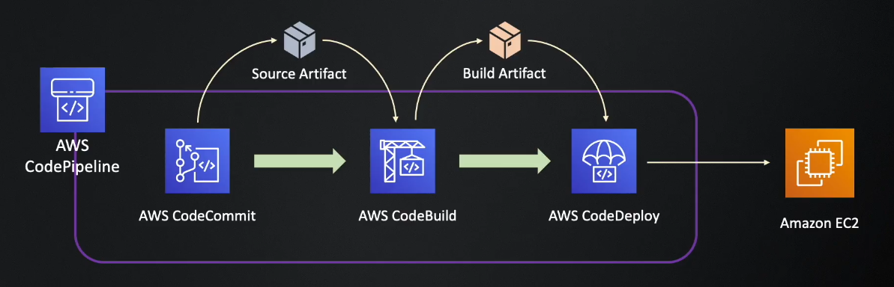
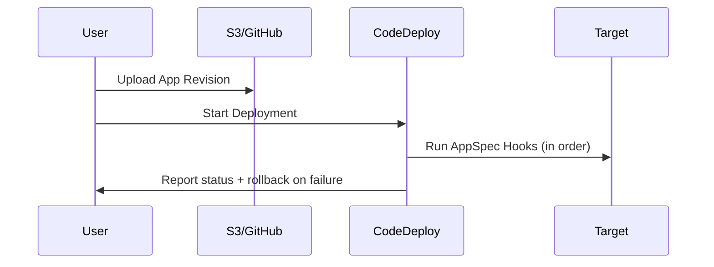

# 🚀 Introduction to AWS CodeDeploy

**AWS CodeDeploy** is a fully managed deployment service that automates software deployments to various compute services such as:

- **Amazon EC2 instances**
- **AWS Lambda functions**
- **On-premises servers**
- **Amazon ECS (with Blue/Green deployments)**

Its goal is to make deployments **safe, repeatable, and automated** — minimizing downtime and manual errors.

> 👉 You can create deployments manually using AWS CLI  
> 👉 You can integrate CodeDeploy with AWS CodePipeline

---

<div style="text-align: center;">
    
</div>

---

## 📦 Why Use CodeDeploy?

| Benefit          | Description                                 |
| ---------------- | ------------------------------------------- |
| ✅ Automation    | Removes manual deployment steps             |
| ⏱️ Zero Downtime | Supports blue/green and rolling updates     |
| 💥 Rollbacks     | Automatic rollback if deployment fails      |
| 💡 Visibility    | Real-time status, logs, and lifecycle hooks |

---

## ⚙️ Supported Deployment Types

### 1. **In-Place Deployment (Rolling)**

- Updates existing EC2 instances or on-prem servers in-place
- Stops the old version, installs the new one

### 2. **Blue/Green Deployment**

- Creates a new environment (Green)
- Switches traffic only after the new version passes health checks
- Can be used with ECS, Lambda, or EC2

---

## 📁 CodeDeploy App Structure

A CodeDeploy app includes:

<div align="center">
| Component          | Description                                                                                                                |
| ------------------ | -------------------------------------------------------------------------------------------------------------------------- |
| `Application`      | Main component of CodeDeploy. It represents your application                                                               |
| `Compute Platform` | The platform CodeDeploy application deploys. E.g., EC2/On-premises, Lambda, ECS.                                           |
| `Deployment Group` | A set of tagged EC2 instances, Lambda aliases, etc.                                                                        |
| `Revision`         | The version of your app containing your source code, deployment scripts and deployment specific file (e.g., `appspec.yml`) |
| `Deployment`       | Execution of the deployment to the deployment group for a specific revision and deployment configuration.                  |

</div>

---

## 📜 What Is AppSpec File?

The `appspec.yml` file defines **how CodeDeploy deploys your application**.

- it has to be in the **root directory** of your source bundle (e.g., `.zip` uploaded to S3)
- For EC2 deployments, it must be `appspec.yml` or `appspec.json`
- For ECS and Lambda deployments, it must be `appspec.yaml` or `appspec.json`

### Sample `appspec.yml` (EC2)

```yaml
version: 0.0
os: linux
files:
  - source: /
    destination: /home/ec2-user/app
hooks:
  BeforeInstall:
    - location: scripts/clean.sh
  AfterInstall:
    - location: scripts/install.sh
  ApplicationStart:
    - location: scripts/start.sh
  ValidateService:
    - location: scripts/verify.sh
```

### AppSpec Hooks Phases

<div align="center">

| Hook             | When It Runs                           |
| ---------------- | -------------------------------------- |
| BeforeInstall    | Before file copying begins             |
| AfterInstall     | After files are copied to destination  |
| ApplicationStart | Start application or service           |
| ValidateService  | Final validation (e.g., health checks) |

</div>

---

## 🔄 CodeDeploy Lifecycle

<div align="center">



</div>

---

## 🚀 Integration with Other AWS Services

| Service      | Integration Example                                    |
| ------------ | ------------------------------------------------------ |
| CodeBuild    | Builds artifact + triggers deployment                  |
| CodePipeline | Manages full CI/CD pipeline including CodeDeploy stage |
| CloudWatch   | Monitors logs and alarms for deployment health         |
| Lambda       | Blue/Green alias shifting for versions                 |
| S3/GitHub    | Stores and delivers deployment artifacts               |

---

## ✅ Best Practices

| Practice                     | Why It Helps                          |
| ---------------------------- | ------------------------------------- |
| Use AppSpec hooks            | Automate install/start/validate steps |
| Monitor with CloudWatch      | Alert and log failed deployments      |
| Use blue/green when possible | Avoid downtime and simplify rollback  |
| Use CodePipeline             | Simplify orchestration and visibility |

---

## 📌 Summary

- AWS CodeDeploy helps automate reliable deployments to EC2, Lambda, ECS, and on-prem
- It uses a YAML file (`appspec.yml`) to define your deployment lifecycle
- Works well with CodePipeline, CodeBuild, S3, and GitHub
- Supports rollback, blue/green deployments, and lifecycle hooks
