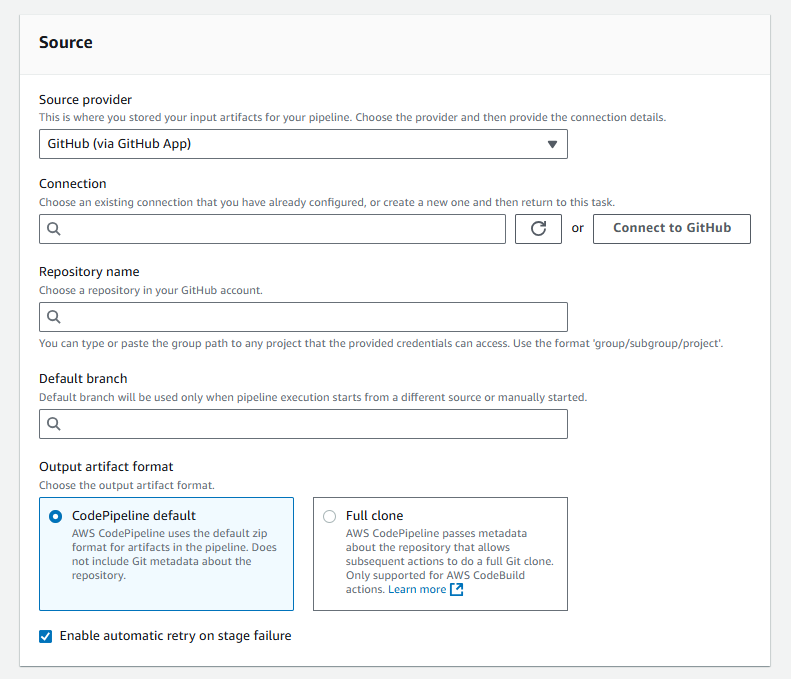

# 🔗 **Connect GitHub to AWS CodePipeline (via GitHub App)**

Use GitHub as a source in AWS CodePipeline to automatically trigger builds and deployments on every code push.

---

## 🧰 **Before You Start**

Make sure you have:

- ✅ A GitHub account and repository
- ✅ Permissions in AWS to create CodePipeline and connections
- ✅ A CodePipeline **service role** with this permission:

```json
"Action": "codestar-connections:UseConnection"
```

---

## 🪜 **Step-by-Step: GitHub Setup in CodePipeline Console**

<div style="text-align: center">
  
</div>

---

### 🧩 Step 1: Add Source Stage

In the **Source stage** of the pipeline wizard:

| Field                      | Value                                  |
| -------------------------- | -------------------------------------- |
| **Source provider**        | `GitHub (via GitHub App)`              |
| **Repository**             | Select your GitHub repo                |
| **Branch**                 | Choose the branch (e.g., `main`)       |
| **Output artifact format** | `CodePipeline default` or `Full clone` |

> 🧠 **What's the difference?**
>
> - `CodePipeline default`:
>   - CodePipeline zips your code and stores it as an artifact.
>   - Works with most downstream actions.
> - `Full clone`:
>   - CodePipeline stores Git metadata so **CodeBuild** can run Git commands.
>   - Requires additional IAM permissions for CodeBuild role (see below).

---

### 🔌 Step 2: Connect to GitHub

If this is your first time:

1. Click **Connect to GitHub**
2. Choose **Authorize AWS Connector for GitHub**
3. Install or select the **GitHub App**
4. Choose **specific repositories** to give access
5. Click **Connect**

---

### 🔁 Step 3: Configure Triggers

- ✅ **Start pipeline on code change** – Automatically triggers on `git push`
- ❌ Uncheck it to trigger manually or with advanced filters (e.g. Git tags)

> 📌 Advanced trigger filters like Git tags or PRs must be set via JSON trigger definitions.

---

### ♻️ Step 4: Enable Retry on Failure (Recommended)

✅ Check **“Enable automatic retry on stage failure”**

> If a stage fails (e.g. due to a network blip), it will automatically retry once before marking the pipeline failed.
>
> ⚠️ Best practice: Enable this to avoid transient failures (e.g., GitHub API throttling).

---

## 🔐 Extra IAM Permissions (If using Full Clone)

If you selected **Full clone**, add this permission to your **CodeBuild role**:

```json
{
  "Effect": "Allow",
  "Action": "codestar-connections:UseConnection",
  "Resource": "arn:aws:codestar-connections:<region>:<account-id>:connection/<connection-id>"
}
```

---

## 💡 Best Practices

| ✅ Do This                                                 | 💬 Why                         |
| ---------------------------------------------------------- | ------------------------------ |
| Use **default** output format unless you need Git metadata | It’s simpler and faster        |
| Enable **retry on failure**                                | Improves pipeline reliability  |
| Limit GitHub App access to specific repos                  | Improves security              |
| Grant **least privilege IAM permissions**                  | Follow security best practices |

---

## 📘 References

- [GitHub Connections (Official Docs)](https://docs.aws.amazon.com/codepipeline/latest/userguide/connections-github.html)
- [Full Clone Option](https://docs.aws.amazon.com/codepipeline/latest/userguide/tutorials-github-gitclone.html)
- [Add UseConnection Permissions](https://docs.aws.amazon.com/codepipeline/latest/userguide/security-iam.html#how-to-custom-role)
