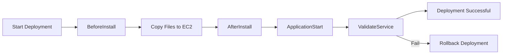

# 📘 **AWS CodeDeploy `appspec.yml` – Full Syntax & Usage Guide**

> The `appspec.yml` file is the core of AWS CodeDeploy. It defines **how your application should be deployed**, **where files go**, and **which scripts run at each stage** of the deployment lifecycle.

---

## 📦 What Is `appspec.yml`?

`appspec.yml` is a **required file** for AWS CodeDeploy when deploying to:

- **Amazon EC2 instances**
- **On-premises servers**
- _(A JSON version is used for Lambda/ECS deployments)_

The file must be in the **root directory** of your source bundle (e.g., `.zip` uploaded to S3).

---

## 🗂️ appspec.yml Structure Overview

```yaml
version: 0.0
os: linux

files:
  - source: /
    destination: /var/www/app

hooks:
  BeforeInstall:
    - location: scripts/clean.sh
  AfterInstall:
    - location: scripts/install.sh
  ApplicationStart:
    - location: scripts/start.sh
  ValidateService:
    - location: scripts/verify.sh
```

---

## 🔢 Sections Breakdown

### ✅ 1. `version`

```yaml
version: 0.0
```

- Required
- Only valid value for EC2/on-prem is `0.0`

---

### ✅ 2. `os`

```yaml
os: linux
```

- Required
- Must be `linux` or `windows` (depending on your instance OS)

---

### ✅ 3. `files`

Defines which files to copy and **where to place them** on the target instance.

```yaml
files:
  - source: /
    destination: /var/www/html
```

| Field         | Description                                     |
| ------------- | ----------------------------------------------- |
| `source`      | Path inside your ZIP or Git repo                |
| `destination` | Absolute path on EC2 where files will be copied |

> 💡 If `source: /`, it means “copy everything from root of bundle”

---

### ✅ 4. `hooks`

Defines **lifecycle event hooks** — shell scripts run during deployment.

Each phase supports one or more scripts.

```yaml
hooks:
  BeforeInstall:
    - location: scripts/clean.sh
```

---

## 🔁 Lifecycle Hook Events (In Order)

| Hook               | Description                                                     |
| ------------------ | --------------------------------------------------------------- |
| `BeforeInstall`    | Run _before_ files are copied                                   |
| `AfterInstall`     | Run _after_ files are copied                                    |
| `ApplicationStart` | Run after install — typically starts your app                   |
| `ValidateService`  | Final step — can do health checks; if it fails, rollback begins |

---

## 🧪 Sample Full Example for EC2

```yaml
version: 0.0
os: linux

files:
  - source: /
    destination: /var/www/my-api

hooks:
  BeforeInstall:
    - location: scripts/stop_app.sh
      timeout: 60
      runas: ec2-user

  AfterInstall:
    - location: scripts/install_dependencies.sh

  ApplicationStart:
    - location: scripts/start_app.sh

  ValidateService:
    - location: scripts/health_check.sh
```

---

### 🧠 Common Hook Script Tasks

| Hook               | What It Typically Does                          |
| ------------------ | ----------------------------------------------- |
| `BeforeInstall`    | Stop running app, clean up previous build       |
| `AfterInstall`     | Install libs, config files, permissions         |
| `ApplicationStart` | Start the app (e.g., `dotnet run`, `npm start`) |
| `ValidateService`  | Curl endpoint, check logs, test port open       |

---

## ⚙️ Hook Script Format

Scripts must be:

- Located in the `scripts/` folder (or another folder you define)
- **Executable** (`chmod +x script.sh`)
- Must have proper shebang: `#!/bin/bash` or `#!/bin/sh`
- Should **exit with non-zero** on failure to trigger rollback

---

## 🪄 Advanced Fields (Optional)

Each hook can include:

```yaml
hooks:
  AfterInstall:
    - location: scripts/setup.sh
      timeout: 120 # seconds
      runas: ec2-user
```

| Field      | Description                          |
| ---------- | ------------------------------------ |
| `location` | Relative path to script              |
| `timeout`  | Max time (in seconds) before failure |
| `runas`    | Run as this user (not root)          |

---

## 🧼 Cleanup After Deployment

Want to remove old builds or logs? Add a `post_deployment_cleanup.sh` in `ValidateService` or use `AfterInstall`.

---

## 🔄 appspec.yml Lifecycle Visual



---

## 🚨 Common Mistakes

| Issue                     | Cause                                       |
| ------------------------- | ------------------------------------------- |
| Deployment fails on hooks | Missing shebang, not executable, wrong path |
| `appspec.yml` not found   | ZIP file doesn't have it at root            |
| File not copied           | Wrong `source:` or missing file in ZIP      |
| Scripts not executed      | Not listed in `hooks:` or path incorrect    |

---

Great question! Let's clarify this 100% ✅

---

## ❓ Can You Rename `appspec.yml` to Something Like `test-appspec.yml`?

> ❌ **No, you cannot rename `appspec.yml` for EC2 or on-prem deployments.**

### 💡 Why?

- For **EC2 and on-prem** deployments, CodeDeploy **requires the file to be named exactly `appspec.yml`**
- It must also be located in the **root directory** of the revision (i.e., top of your ZIP file or GitHub repo)

---

### 🔍 What Happens If You Rename It?

If you name it anything else like `test-appspec.yml` or `deploy.yml`, **CodeDeploy will fail**, usually with:

```ini
The AppSpec file does not exist within the deployment's application revision.
```

---

### ✅ Valid Format Summary

| Deployment Type | Format | File Name      | Notes                    |
| --------------- | ------ | -------------- | ------------------------ |
| EC2 / On-prem   | YAML   | `appspec.yml`  | Must be at the root      |
| Lambda / ECS    | JSON   | `appspec.json` | Required, format differs |

---

## 🧠 Best Practices

- ✅ Test scripts **locally** on EC2 before deploying
- ✅ Use `chmod +x` on all scripts
- ✅ Structure your ZIP like:

```ini
.
├── appspec.yml
├── scripts/
│   ├── start.sh
│   └── stop.sh
└── dist/ or publish/
```

- ✅ Always check `/opt/codedeploy-agent/deployment-root` logs on EC2 for debugging
- ✅ Use `runas: ec2-user` to avoid permissions issues when not root

---

## 📌 Summary

| Concept       | Key Points                                        |
| ------------- | ------------------------------------------------- |
| `appspec.yml` | Declares file copy + script hooks for CodeDeploy  |
| Required      | For EC2 and on-premises deployments               |
| Scripts       | Must be executable, properly pathed, and tested   |
| Lifecycle     | Follows: Before → Copy → After → Start → Validate |
