# 🚀 **How AWS CodeDeploy Works with EC2 Deployments**

_A Step-by-Step Deep Dive with Real-World Examples!_

---

<div style="text-align: center">
  
</div>

---

<div style="text-align: center">
  
</div>

---

## 1️⃣ Introduction to EC2 Deployments

In this method, AWS CodeDeploy deploys application files (build artifacts) to **EC2 instances** using a ZIP revision and lifecycle instructions defined in an `appspec.yml`.

### ✅ When to Use

- Hosting frontend apps (e.g., Angular with Nginx)
- Hosting .NET, Node.js, Python apps on virtual servers
- You want **full control over the server**

---

## 🔧 2. How CodeDeploy Works Internally

### 🧠 Key Concepts

| Component        | Role                                                              |
| ---------------- | ----------------------------------------------------------------- |
| CodeDeploy Agent | A background service running on EC2 that polls AWS CodeDeploy     |
| Deployment       | A rollout of code to an instance group (tagged or in AutoScaling) |
| Revision         | Your uploaded ZIP (includes app + appspec + scripts)              |

### 📡 Workflow Overview

```mermaid
sequenceDiagram
    participant EC2 as EC2 Instance (CodeDeploy Agent)
    participant CodeDeploy as AWS CodeDeploy
    participant S3 as S3 Bucket (Artifact)

    EC2->>CodeDeploy: Poll for new deployments
    CodeDeploy-->>EC2: Return deployment revision + S3 link
    EC2->>S3: Download the build artifact
    EC2->>EC2: Run appspec.yml hooks (BeforeInstall → Start → Validate)
```

<div style="text-align: center">



</div>

### 🧠 Notes

- The **agent pulls deployments** — not pushed
- You **must install the agent manually**
- Agent supports Amazon Linux, Ubuntu, RHEL, Windows

---

## 🏗️ 3. Preparing EC2 Instance

### 🔹 Steps

1. **Launch EC2** (e.g., Amazon Linux 2)
2. Attach **IAM Role** (explained in next section)
3. Add a **tag** like `Application=MyAngularProject`
4. **Install CodeDeploy Agent**:

   ```bash
   sudo yum update -y
   sudo yum install ruby wget -y

   cd /home/ec2-user
   wget https://aws-codedeploy-eu-west-1.s3.eu-west-1.amazonaws.com/latest/install
   chmod +x ./install
   sudo ./install auto
   ```

5. **Check agent is running:**

   ```bash
   sudo service codedeploy-agent status
   ```

6. **Install Nginx** (example for Angular):

   ```bash
   sudo amazon-linux-extras install nginx1 -y
   sudo service nginx start
   sudo chkconfig nginx on
   ```

7. **Create Deployment Directory:**

   ```bash
   sudo mkdir -p /var/www/my-angular-project
   ```

8. **Configure Nginx:**

   Update `/etc/nginx/nginx.conf` to:

   ```nginx
   root /var/www/my-angular-project;
   ```

   Then:

   ```bash
   sudo service nginx restart
   ```

---

## 🔐 4. IAM Roles: EC2 + CodeDeploy

### 🎭 EC2 Instance Role (attached to instance)

#### Name: `WebServerRole`

- Grants EC2 permission to pull deployment from S3

Policy: `AmazonEC2RoleforAWSCodeDeploy` (managed)

---

### ⚙️ CodeDeploy Service Role (used in deployment group)

#### Name: `CodeDeployEC2ServiceRole`

- Lets CodeDeploy **manage EC2 instances** and **read tags**

Policy: `AWSCodeDeployRole`  
You may also add custom inline policy for Blue/Green deployments:

```json
{
  "Action": ["ec2:RunInstances", "ec2:CreateTags", "iam:PassRole"],
  "Effect": "Allow",
  "Resource": "*"
}
```

---

## 🏷️ 5. Tagging EC2 Instances for Deployment Targeting

Instead of specifying individual instances, CodeDeploy allows selecting EC2s using **tags**.

### Example

```text
Key = Application
Value = MyAngularProject
```

When creating a deployment group, define:

```yaml
Tag Key: Application
Tag Value: MyAngularProject
```

You can also define **multiple tag groups** with AND/OR logic for more complex targeting.

---

## 🧩 6. Creating a CodeDeploy Application & Deployment Group

### 🔨 Application

- Name: `MyAngularApp`
- Compute platform: `EC2/on-prem`

---

### 📦 Deployment Group

- Name: `TaggedEC2Instances`
- Platform: EC2
- Service Role: `CodeDeployEC2ServiceRole`
- Deployment Type: `In-Place`
- Environment: Tag-based EC2 targeting
- Tag Group:

  ```yaml
  Application = MyAngularProject
  ```

---

## 📥 7. How Deployments Actually Happen

When a deployment starts:

1. CodeDeploy sends the S3 artifact URL to the EC2 agent
2. Agent downloads the ZIP (revision)
3. Reads the `appspec.yml` inside
4. Executes hooks:
   - ApplicationStop
   - BeforeInstall
   - Install (copying files)
   - AfterInstall
   - ApplicationStart
   - ValidateService

🧠 The `Install` and `DownloadBundle` events are **internal** (you can’t override them)

---

## 🔁 8. Lifecycle Events (Deployment Phases)

| Event            | Description                                   |
| ---------------- | --------------------------------------------- |
| ApplicationStop  | Stop old app gracefully                       |
| DownloadBundle   | Reserved – downloads artifact from S3         |
| BeforeInstall    | Backup, clean folders                         |
| Install          | Reserved – copy files to `destination:` paths |
| AfterInstall     | Run setup, decryption, env config             |
| ApplicationStart | Start app (e.g., `nginx restart`)             |
| ValidateService  | Health check scripts, curl checks, etc.       |

🧠 For **Blue/Green**: also supports

- `BeforeBlockTraffic`, `AfterBlockTraffic`
- `BeforeAllowTraffic`, `AfterAllowTraffic`

---

## 🛠️ 9. Error Handling & Retry

- View errors in **CodeDeploy console**
- Inspect EC2 instance logs:

  ```bash
  /opt/codedeploy-agent/deployment-root/deployment-logs/
  ```

- You can **retry** failed deployments
- Pipeline can auto-trigger next deployment on `git push`

---

## ✅ Best Practices Summary

| ✅ Do This                                  | 🚫 Avoid This                         |
| ------------------------------------------- | ------------------------------------- |
| Use tag-based EC2 selection                 | Hard-coding specific instance IDs     |
| Install agent and verify before deploying   | Assuming agent is installed           |
| Include `appspec.yml` + scripts in artifact | Relying only on frontend code         |
| Align `buildspec.yml` and `appspec.yml`     | Mismatched artifact structure         |
| Test manually before CI/CD integration      | Direct production deployment w/o test |

---

## 🎁 Bonus: Want the Full Pipeline + Sample App?

Let me know and I’ll generate:

- A working Angular+CodeDeploy build
- `buildspec.yml`, `appspec.yml`, and scripts
- Complete CI/CD pipeline with CodePipeline
