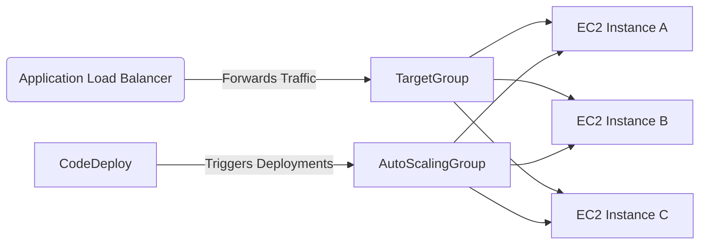

# 🚀 EC2 Instance Deployments Behind ALB with CodeDeploy (In-Depth Guide)

High availability isn't just a buzzword — it's a requirement. In real-world scenarios, we deploy applications to fleets of EC2 instances behind Application Load Balancers (ALB), not to a single server. Let’s break down **how EC2 deployments work with ALB and Auto Scaling Groups using AWS CodeDeploy**.

---

## 🔧 Overview of Architecture

Here’s what we’re building:

<div align="center">



</div>

✅ **Goal**: Zero-downtime deployments to a group of EC2 instances behind an ALB  
✅ **Tools Used**: CodeDeploy + Auto Scaling + Launch Templates + ALB  
✅ **Type**: In-Place Deployments (All-At-Once, Rolling) or Blue/Green (coming later)

---

## 🛠️ Step-by-Step Setup

### 1. 🧼 Clean Up Deployment Folder

Before creating an AMI:

```bash
sudo rm -rf /var/www/my-angular-project/*
```

### 2. 📸 Create an AMI

Stop the EC2 instance > Create AMI > Use it in a Launch Template.

### 3. 🧬 Launch Template

Contains:

- AMI ID from the stopped instance
- Instance Type (`t2.micro`)
- IAM Role (e.g. `WebServerRole`)
- Security Group (`web-server-security-group`)

### 4. ⚖️ Application Load Balancer (ALB)

- **Type**: Internet-facing
- **Listener**: HTTP:80
- **Target Group**: Instance-based, health check on `/`

### 5. 📏 Deregistration Delay Tuning

Set ALB target group attribute:

```bash
Deregistration Delay = 60 seconds (default is 300s)
```

### 6. 🤖 Auto Scaling Group

- Uses Launch Template
- Associated with ALB Target Group
- ELB Health Checks + 30min Grace Period
- Desired/Min/Max: 2 instances (for example)

### 7. 🎯 Deployment Group in CodeDeploy

- **Type**: In-Place Deployment
- **Environment**: EC2 Auto Scaling Group
- **Load Balancer Info**: Associated ALB Target Group

---

## ⚙️ How CodeDeploy Works with ALB

When deploying to instances behind an ALB, CodeDeploy uses additional lifecycle events:

### 🚥 Deregistration (BeforeBlockTraffic → BlockTraffic)

- Instance is **removed from ALB target group**
- ALB waits for connections to drain (deregistration delay)

### 🔧 Deployment

- CodeDeploy installs new version via `appspec.yml`
- Runs hooks (e.g., restart nginx)

### 🚦 Re-registration (AllowTraffic → AfterAllowTraffic)

- Instance is **added back to ALB target group**
- Becomes eligible to serve traffic again

---

## 🔄 Deployment Lifecycle Events with ALB

```yaml
hooks:
  BeforeBlockTraffic:
    - location: ...
  BlockTraffic: # System-managed
  ApplicationStop:
  BeforeInstall:
  Install: # System-managed
  AfterInstall:
  ApplicationStart:
    - location: ...
  ValidateService:
    - location: ...
  AllowTraffic: # System-managed
  AfterAllowTraffic:
```

🧠 **Note**:

- `BlockTraffic` and `AllowTraffic` are reserved and system-managed.
- `ValidateService` is a great place to add tests to fail a deployment if needed.

---

## 🧠 Best Practices

| ✅ Best Practice              | 💡 Why it Matters                                              |
| ----------------------------- | -------------------------------------------------------------- |
| Use **Rolling Deployments**   | Avoid downtime during deployments.                             |
| Tune **deregistration delay** | Speed up deployment while allowing safe connection draining.   |
| **Enable health checks**      | Both ELB and EC2 health checks ensure healthy traffic routing. |
| Use **automated rollbacks**   | Auto-recover from failed deployments with minimal impact.      |
| Use **unique target groups**  | Prevent conflict across deployment groups.                     |

---

## 🧪 Real-World Example

You release version 5.0 → push code → CodePipeline runs:

1. **Build** stage creates a new Angular dist bundle.
2. **Deploy** stage sends to CodeDeploy.
3. CodeDeploy:
   - Deregisters EC2a and EC2b
   - Deploys version 5.0
   - Re-registers EC2a and EC2b

🌍 During this, ALB may serve a mix of 4.0 and 5.0 (if rolling). If **All-At-Once**, all servers go offline temporarily!

---

## 📌 Summary

| Feature                     | Description                                                  |
| --------------------------- | ------------------------------------------------------------ |
| ALB                         | Forwards HTTP traffic to healthy instances                   |
| Auto Scaling Group          | Manages EC2 lifecycle, scales instances                      |
| CodeDeploy                  | Handles deployments and integrates with ASG & ALB            |
| Deployment Group (In-Place) | Uses lifecycle events to deploy to live instances            |
| AppSpec.yml                 | Defines hooks, files, permissions                            |
| Lifecycle Events with ALB   | Extra deregistration & re-registration steps                 |
| Automated Rollback          | Optional, but recommended to auto-recover failed deployments |
