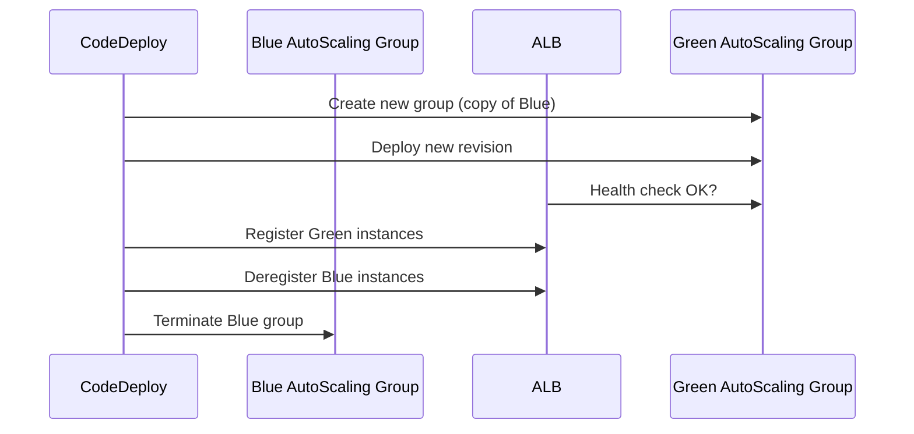

# 🚀 Mastering CodeDeploy Deployment Types: Focus on Blue/Green 💙💚

When you're deploying applications to EC2 instances, **downtime is your enemy** 😬 and so is a buggy release. AWS CodeDeploy offers multiple deployment strategies to help you avoid both — and the **Blue/Green** deployment strategy is the king of them all 👑 (especially in production).

---

## 1. 🧠 What Are CodeDeploy Deployment Types?

CodeDeploy supports **three major deployment types** for EC2-based deployments:

| Type                   | Description                                            |
| ---------------------- | ------------------------------------------------------ |
| **In-place**           | Deploy to existing instances                           |
| **Rolling (in-place)** | Deploy in batches (e.g., one-by-one or half-at-a-time) |
| **Blue/Green**         | Create new instances, deploy, then swap traffic        |

---

## 2. ⚙️ Overview: In-Place vs Blue/Green Deployments

| Feature                        | In-Place                                 | Rolling                  | Blue/Green                                      |
| ------------------------------ | ---------------------------------------- | ------------------------ | ----------------------------------------------- |
| 🛠 Deploys To                   | Existing EC2s                            | Batches of existing EC2s | New set of EC2s (Green)                         |
| ⚡️ Downtime                   | High (All-at-once) or Moderate (Rolling) | Medium to Low            | Near Zero                                       |
| 🔁 Rollback Behavior           | Manual or partial automatic              | Partial automatic        | Rollback not needed unless traffic was rerouted |
| 💸 Cost During Deployment      | No additional EC2s                       | No additional EC2s       | Double the EC2s temporarily                     |
| 🔎 Deployment Visibility       | Limited                                  | Better visibility        | Full visibility, isolated                       |
| 🧪 Two Versions Simultaneously | ❌                                       | ✅ (can cause issues)    | ✅ (but managed cleanly)                        |

---

## 3. 💙💚 What is Blue/Green Deployment?

A **blue/green deployment** creates a **new environment (green)**, deploys the new version there, and once it’s ready, it **switches traffic** from the current environment (blue) to the green one.

> ✅ This ensures **zero-downtime deployments** and lets you **test the new version** in isolation.

---

## 4. 🌀 Blue/Green Deployment Workflow (with EC2 + ALB)

Let's visualize it:

---

## 5. 🔁 Rollbacks in Blue/Green Deployments

Here’s the twist:

- **If deployment fails BEFORE traffic shift** (e.g., app fails on green):  
  ✅ The blue group is untouched → **No rollback needed**

- **If deployment fails AFTER traffic shift**:  
  🔁 You’ll need **manual rollback** (CodeDeploy doesn’t auto revert traffic)

### ⛔️ Common Pitfall

> CodeDeploy **does not rollback traffic** automatically once shifted. You have to manually trigger a rollback to blue instances (if kept).

---

## 6. 🧩 Comparison Table: Deployment Configuration Options

| Configuration Name              | Type       | What It Means                              |
| ------------------------------- | ---------- | ------------------------------------------ |
| `CodeDeployDefault.AllAtOnce`   | In-place   | All instances updated at once              |
| `CodeDeployDefault.OneAtATime`  | In-place   | One instance at a time                     |
| `CodeDeployDefault.HalfAtATime` | In-place   | Half the fleet at a time                   |
| `AllAtOnce` + Blue/Green        | Blue/Green | All green instances updated simultaneously |

---

## 7. ✅ Best Practices for Blue/Green Deployments

### 🔐 IAM Setup

- Your EC2 launch template **must** include CodeDeploy agent and IAM role permissions.
- Ensure ALB health checks are correctly configured on `/`.

### 📦 AMI Setup

- Use pre-baked AMIs to reduce instance spin-up time.
- Don’t leave residual app files from old deployments in the AMI.

### 🧹 Clean-Up

- Set termination time (e.g., 0 minutes) for blue group post-deployment.
- Or retain blue group temporarily for **manual rollback** if needed.

### 🔁 Rollback Ready

- Even with B/G, **enable automated rollback** in case of pre-switch failures.
- Tag ASGs with deployment IDs to avoid confusion.

### 💰 Watch Your Bill

- EC2 cost _doubles_ temporarily.
- Ensure your **region quotas** allow spinning up duplicate capacity.

---

## 8. 🧪 Real Example Recap (From Course)

| Action                        | Outcome                                    |
| ----------------------------- | ------------------------------------------ |
| Pushed version 8.0            | B/G deployment → new ASG → success         |
| Pushed version 9.0 with error | B/G deployment → failure → **no rollback** |
| Fixed and pushed 9.0 again    | New ASG created → success                  |

✅ During the failed deployment, **blue group was untouched**, traffic stayed safe, and the green group (failed one) was **manually deleted** after identifying the issue.

---

## 9. 📌 Summary

> **Blue/Green deployments** offer the safest deployment model for production apps — especially those behind **Application Load Balancers** with EC2 Auto Scaling Groups.

### Key Benefits

- 🚫 **No downtime** if done right
- 🔍 **Isolated testing** on green before switching
- ✅ Ideal for production-grade, highly-available systems
- 🛠 Requires slightly more setup, but offers **maximum safety**
