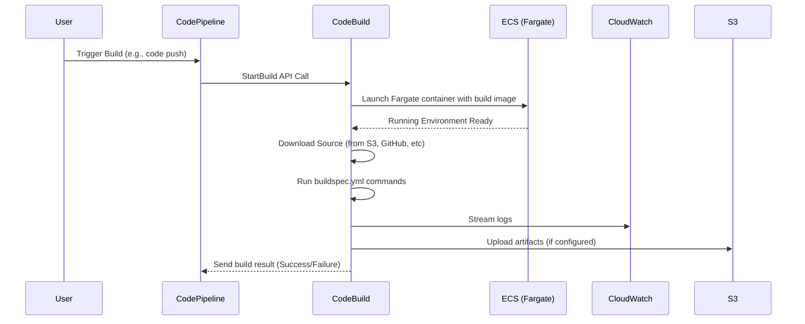

# 🧱 AWS CodeBuild: The Smart Builder of the Cloud

## 🚀 What is AWS CodeBuild?

**AWS CodeBuild** is a **fully managed continuous integration service** that compiles source code, runs tests, and produces software packages that are ready to deploy.

> 📘 **Official Definition:**  
> _“AWS CodeBuild is a fully managed build service in the cloud. CodeBuild scales continuously and processes multiple builds concurrently, so your builds are not left waiting in a queue.”_

---

## ⚙️ How CodeBuild Works (Internals)

At its core, CodeBuild is just a container orchestrator built on top of ECS/Fargate that:

- Spins up an **ephemeral compute container** based on your selected build image.
- Mounts your source code (from S3 or CodeCommit, etc).
- Executes commands from your **buildspec.yml**.
- Streams logs to CloudWatch Logs.
- Uploads artifacts (if any) to your configured destination (e.g., S3 or CodeDeploy).

🔍 It works behind the scenes using:

- **Amazon ECS with Fargate launch type**
- **EBS volumes** for ephemeral storage
- **IAM roles** for secure access
- **EventBridge** to report state changes

---

## 📦 Supported Build Environments

You can choose a **predefined image** (like `aws/codebuild/standard:7.0`) or use a **custom Docker image** from Amazon ECR or DockerHub.

### Built-in Runtimes

| Language | Supported Versions         |
| -------- | -------------------------- |
| Node.js  | 12.x, 14.x, 16.x           |
| Python   | 3.8, 3.9, 3.10             |
| Java     | 8, 11, 17                  |
| .NET     | 3.1, 6.0                   |
| Go       | 1.18, 1.20                 |
| Docker   | Available via custom image |

---

## 🔐 IAM and Permissions

CodeBuild uses two IAM roles:

- **Service Role (Execution Role)**  
  👉 Grants CodeBuild permissions to read/write to services like S3, Secrets Manager, etc.

- **Source Role** (when triggered via CodePipeline or CodeCommit)  
  👉 Used to clone source code and interact with the repo.

---

## 🔁 CodeBuild Lifecycle (Behind the Scenes)

Here’s a breakdown of what happens when a build is triggered:



---

## 🧪 Real-World Example: Building a Node.js App

1. **Source:** GitHub repo with Node.js code.
2. **buildspec.yml** in the root:

   ```yaml
   version: 0.2
   phases:
     install:
       runtime-versions:
         nodejs: 16
       commands:
         - echo "Installing dependencies"
         - npm install
     build:
       commands:
         - echo "Building the app"
         - npm run build
   artifacts:
     files:
       - "**/*"
   ```

3. **Output:** All build files are zipped and uploaded to S3.

---

## 📊 Monitoring and Logs

- Logs are streamed to **CloudWatch Logs**.
- Build status is visible in the **CodeBuild Console**.
- You can configure notifications using **EventBridge** and **SNS**.

---

## 🧪 CodeBuild vs CodePipeline vs CodeDeploy

| Service          | Purpose                            |
| ---------------- | ---------------------------------- |
| **CodeBuild**    | Build and test code                |
| **CodePipeline** | Orchestrate CI/CD workflow         |
| **CodeDeploy**   | Deploy apps to EC2, Lambda, or ECS |

💡 CodeBuild is often used _inside_ a CodePipeline stage as the build step.

---

## 🎯 Best Practices

- ✅ Always use **least privilege IAM roles**.
- ✅ Store secrets in **Secrets Manager**, not in `buildspec.yml`.
- ✅ Use **custom images** for consistent tooling.
- ✅ Separate build and deploy responsibilities.
- ✅ Cache dependencies (npm, pip, etc.) to reduce build times.

---

## 📚 References

- 📘 [AWS CodeBuild Docs](https://docs.aws.amazon.com/codebuild/latest/userguide/welcome.html)
- 📘 [Buildspec Reference](https://docs.aws.amazon.com/codebuild/latest/userguide/build-spec-ref.html)
- 📘 [CodeBuild Pricing](https://aws.amazon.com/codebuild/pricing/)
