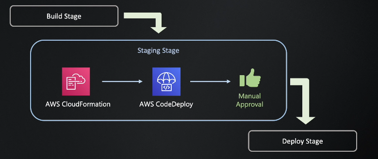
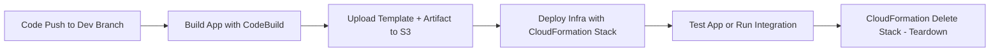
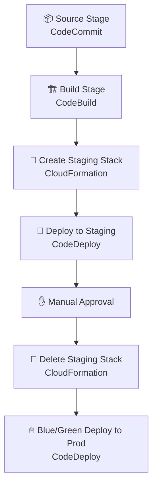
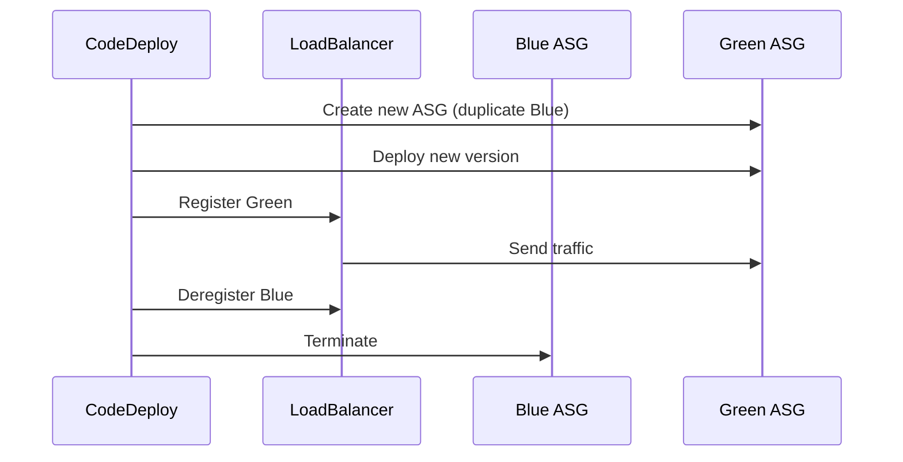

# ⚙️ **Using CloudFormation in CodePipeline to Create & Destroy Staging Environments**

🧪 _Build disposable environments on the fly — test hard, spend less._

---

<div style="text-align: center;">
  
</div>

## 🧠 Why Use CloudFormation (Only) for Staging?

Bro, look — if you’re already deploying to **production manually or through a different system**, you don’t need to overcomplicate it with CloudFormation. But for **ephemeral environments** like:

- 🧪 **Staging** (temporary test env before production)
- 👨‍💻 **Preview** (per-feature testing)
- ✅ **Integration Test Infra** (create → test → destroy)

...CloudFormation is your best friend 💪

---

## 🔥 Benefits of Spinning Up Staging with CloudFormation

| Feature 🧩                     | Why It Matters                                               |
| ------------------------------ | ------------------------------------------------------------ |
| 🧱 **Infra as Code**           | Reproducible environments (like “Clone staging” button)      |
| 💸 **Auto-delete**             | Destroy infra after testing to save \\\\\\\\\\$\\\\\\\\\\$\$ |
| 🤝 **Clean team testing**      | Create isolated infra per pull request                       |
| 🧼 **Zero leftover resources** | Avoid orphaned databases, buckets, etc.                      |
| 🚀 **Fast iteration**          | Deploy and test infra + app together on every push           |

> Staging should be **ephemeral** and **cheap**. That’s where CloudFormation shines.

---

## 💡 When to Use This Pattern?

You should use CloudFormation in CodePipeline **only for**:

| Situation                                        | Use CloudFormation?          |
| ------------------------------------------------ | ---------------------------- |
| 🚀 Creating disposable staging/test environments | ✅ Yes                       |
| 🔁 Preview environments per branch/PR            | ✅ Yes                       |
| 🏗️ Deploying prod stacks manually                | ❌ No (skip this topic then) |
| 🧰 Managing large prod infra with Terraform      | ❌ Use Terraform separately  |

---

## ⚙️ High-Level Pipeline Flow



---

## 🔍 TL;DR - Architecture Overview



---

## 📁 Prerequisites

- You’ve built a pipeline with **source** and **build** stages.
- You already have:
  - ✅ A custom EC2 AMI with required packages
  - ✅ A CodeDeploy application and service role
  - ✅ A launch template for your production Auto Scaling Group (ASG)
  - ✅ A CloudFormation template (`staging-stack-template.yaml`)
  - ✅ Intermediate understanding of YAML / CloudFormation
  - ✅ AWS CLI or Console access

---

## 📦 1. Create CloudFormation Deploy Action in Pipeline

We add a new **Staging** stage with a **CloudFormation deploy action** to create our staging instance.

### 📌 What It Does

- Creates a temporary **EC2 instance** for staging using a CloudFormation stack.
- Pulls the **AMI ID** and **IAM role** from pipeline parameters.
- Runs as **"Replace failed stack"** mode to retry failed stacks automatically.

### 🧠 Pro Tips

- Use `CAPABILITY_IAM` if your template contains IAM resources.
- Don’t forget to pass `ImageId` and `WebServerRole` as parameters using JSON:

```json
{
  "WebServerImage": "ami-0xxxxxxxxxx",
  "WebServerRoleName": "WebServerRole"
}
```

---

## 🚀 2. Deploy to Staging via CodeDeploy

### 📌 What It Does

- Reuses your CodeDeploy setup.
- Targets EC2 **by tag**:

  ```yaml
  Key: Environment
  Value: Staging
  ```

### 💡 Why It's Smart

- Keeps staging separate from production.
- Easier rollback testing.
- Good sandbox for automated or manual checks.

---

## ✋ 3. Add a Manual Approval Action

### 📌 What It Does

- Pauses the pipeline.
- Sends an email via **SNS** asking for approval.
- Lets you verify staging manually (or have QA approve).

### ✉️ SNS Setup Example

- Create an SNS topic like `PipelineNotifications`.
- Add your email as a subscriber.
- You’ll get a nice “APPROVAL NEEDED” subject line.

### ✅ Best Practice

- Place manual approval in the **same stage as staging deployment**, not a separate one.
- Prevents other executions from overriding the staging environment.

---

## 🧠 4. Inject CloudFormation Output via Action Variables

Instead of hardcoding the staging server URL in the approval message, let’s pull it dynamically:

```yaml
http://${StagingStackVariables.WebServerDnsName}
```

> You define `StagingStackVariables` as the **variable namespace** in your CFN action.

### 🔥 Output Variable Example

```yaml
Outputs:
  WebServerDnsName:
    Value: !GetAtt WebServerInstance.PublicDnsName
```

✅ This makes your approval step **portable** and **robust** — even across stack recreations.

---

## 🧹 5. Delete the Staging Stack Automatically

We don’t want to keep staging forever. It costs 💰 and eats free tier credits.

### 📌 Add CloudFormation “Delete Stack” Action

- Add it **after** Manual Approval.
- Select `Delete a stack` mode.
- Use the same role and specify `StagingStack`.

> If approval is **rejected**, the stack won't be deleted — giving you time to debug staging.

---

## 🌈 6. Blue/Green Deployments for Production

### 📌 What It Does

- Duplicates your Auto Scaling Group as a new “green” group.
- Deploys new version to green instances.
- Swaps traffic via **Elastic Load Balancer**.
- Removes the old “blue” group after success.



### 💥 On Failure

- Blue stays untouched.
- Green ASG is not deleted automatically — **you clean it up** manually (or script it later).

---

## 🔁 Optional: Enable Auto Rollback

Rollbacks don’t work if **no production changes** were made (as in blue/green failures).

So it’s only useful for in-place deploys or post-swap failures.

---

## 🧪 Bonus: Pipeline Execution Modes

### 📦 Queued (Default)

- Later executions **wait in line** at each locked stage.

### 🧼 Superseded

- Newer execution **replaces older** ones waiting between stages.

### 🔁 Parallel

- All run **simultaneously** (dangerous in production).

🧠 Best Mode for Staging + Manual Approval = **Queued**

---

## ✅ Final Tips & Best Practices

| 🧠 Best Practice                             | 💬 Description                         |
| -------------------------------------------- | -------------------------------------- |
| Use unique tags for staging                  | Prevents accidental mix-up with prod   |
| Clean up after staging                       | Automate stack deletion to avoid costs |
| Use namespaces for variables                 | Dynamic values > static URLs           |
| Add tests in staging                         | Manual review + auto tests = 💯        |
| Prefer blue/green for prod                   | Zero-downtime and safety               |
| Use SNS for approvals                        | Gets you email notifications 🔔        |
| Keep separate pipelines for API and frontend | Clean boundaries, easier control       |

---

## 🎯 Real-World Example Flow

1. Code pushed to CodeCommit triggers pipeline.
2. Build artifacts created via CodeBuild.
3. Staging stack created via CloudFormation.
4. App deployed to staging via CodeDeploy.
5. Reviewer gets email with staging link via SNS.
6. Reviewer approves (or rejects).
7. Stack deleted after approval.
8. Prod deployed via Blue/Green.
9. Prod stack updated, old ASG deleted.
10. Pipeline complete. CI/CD like a boss. 🧑‍🚀

---

## 📚 Wrap-Up

Congrats 🎉 You’ve now got:

- End-to-end automated CI/CD
- CloudFormation infra provisioning
- Staging + Blue/Green deployment patterns
- Approval workflow & stack teardown
- Error handling & rollback strategies

---

Want next? We can talk about:

- 🧪 Automated tests in staging
- 🧬 Using Change Sets in prod for safe deploys
- 🔄 Reusable modules across pipelines

Let me know when you're ready.
