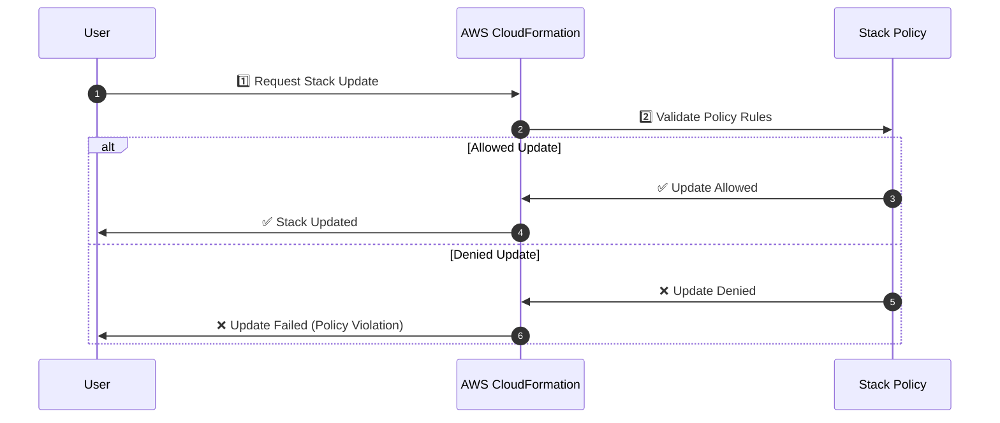

# **🔐 AWS CloudFormation Stack Policy: Protecting Stack Resources from Unintended Updates**

## **📌 Introduction**

An **AWS CloudFormation Stack Policy** is a JSON document that **restricts updates to stack resources**. It **prevents accidental modifications** to critical resources during updates, ensuring stability and security.

✅ **Prevents unintended updates to critical resources.**  
✅ **Allows fine-grained control over which resources can be modified.**  
✅ **Can be applied at stack creation or later using AWS CLI or API.**

---

## **1️⃣ What is a Stack Policy?**

A **Stack Policy** is a **JSON-based access control mechanism** applied to a **CloudFormation stack** to define which resources **can or cannot** be updated during a stack update.

- **Allows or denies updates based on resource conditions.**
- **Applied at the stack level**, affecting all its resources.
- **Works similarly to IAM policies but applies to CloudFormation updates.**

**Example Use Case:**

- **Prevent accidental deletion of a production database.**
- **Allow updates only to application servers but not networking components.**
- **Restrict modifications to IAM roles or security groups.**

---

## **2️⃣ How Stack Policy Works**

CloudFormation **evaluates the stack policy** before updating a resource:

1️⃣ User initiates a stack update (`aws cloudformation update-stack`).  
2️⃣ CloudFormation **checks the stack policy** to see if the update is allowed.  
3️⃣ If permitted, the update proceeds. If denied, CloudFormation returns an **error**.



✅ **Ensures only allowed changes are applied, protecting critical resources.**

---

## **3️⃣ Defining a Stack Policy**

A Stack Policy uses **explicit JSON statements** to **allow or deny updates** to specific resources.

### **🛠️ Example: Prevent Updates to a Database but Allow Other Changes**

```json
{
  "Statement": [
    {
      "Effect": "Deny",
      "Action": "Update:*",
      "Principal": "*",
      "Resource": "LogicalResourceId/MyRDSDatabase"
    }
  ]
}
```

✔ **Denies updates to `MyRDSDatabase`, preventing accidental modifications.**

---

### **🛠️ Example: Allow Updates Only to EC2 Instances**

```json
{
  "Statement": [
    {
      "Effect": "Allow",
      "Action": "Update:*",
      "Principal": "*",
      "Resource": "LogicalResourceId/AppServer"
    },
    {
      "Effect": "Deny",
      "Action": "Update:*",
      "Principal": "*",
      "Resource": "*"
    }
  ]
}
```

✔ **Allows updates only to `AppServer`, while blocking all other resources.**

---

### **🛠️ Example: Allow All Updates (Default Policy)**

```json
{
  "Statement": [
    {
      "Effect": "Allow",
      "Action": "Update:*",
      "Principal": "*",
      "Resource": "*"
    }
  ]
}
```

✔ **Permits all updates, effectively disabling stack policy restrictions.**

---

## **4️⃣ Applying a Stack Policy in AWS CloudFormation**

### **🛠️ Method 1: Apply a Stack Policy at Stack Creation**

```sh
aws cloudformation create-stack --stack-name MyStack \
  --template-body file://template.yaml \
  --stack-policy-body file://stack-policy.json
```

✔ **Defines the stack policy at creation time.**

---

### **🛠️ Method 2: Update a Stack Policy for an Existing Stack**

```sh
aws cloudformation set-stack-policy --stack-name MyStack \
  --stack-policy-body file://stack-policy.json
```

✔ **Modifies the stack policy without affecting resources.**

---

### **🛠️ Method 3: Retrieve the Current Stack Policy**

```sh
aws cloudformation get-stack-policy --stack-name MyStack
```

✔ **Fetches the current stack policy for review.**

---

### **🛠️ Method 4: Temporarily Override a Stack Policy**

If a stack policy blocks an update, you can **override it temporarily**:

```sh
aws cloudformation update-stack --stack-name MyStack \
  --template-body file://updated-template.yaml \
  --stack-policy-during-update-body file://temporary-policy.json
```

✔ **Applies a temporary stack policy only for the duration of the update.**

---

## **5️⃣ How to Prevent Unauthorized Changes to Stack Policies**

A **Stack Policy** only controls **CloudFormation updates**, but **it does not prevent a user from modifying or removing the policy itself** if they have **AWS permissions to modify the stack**.

✅ **Solution:** Use **IAM Policies & SCPs** to prevent unauthorized changes to Stack Policies and CloudFormation resources.

### **1️⃣ IAM Policy to Prevent Changes to Stack Policies**

#### **🛠️ Restrict Editing or Removing a Stack Policy**

To **prevent users from modifying or deleting Stack Policies**, create an **IAM Policy** that **denies access to `SetStackPolicy`** while allowing other CloudFormation actions.

```json
{
  "Version": "2012-10-17",
  "Statement": [
    {
      "Effect": "Deny",
      "Action": "cloudformation:SetStackPolicy",
      "Resource": "*"
    }
  ]
}
```

✔ **Prevents changes to stack policies while allowing users to perform other CloudFormation operations.**

---

#### **🛠️ Restrict Editing or Deleting Specific CloudFormation Stacks**

To **protect specific stacks**, add an IAM Policy that **denies stack updates or deletions for specific stacks** to users/groups/roles:

```json
{
  "Version": "2012-10-17",
  "Statement": [
    {
      "Effect": "Deny",
      "Action": ["cloudformation:UpdateStack", "cloudformation:DeleteStack"],
      "Resource": "arn:aws:cloudformation:us-east-1:123456789012:stack/ProductionStack/*"
    }
  ]
}
```

✔ **Prevents accidental deletion or modification of critical stacks.**

---

### **2️⃣ Service Control Policy (SCP) for AWS Organizations**

An **SCP (Service Control Policy)** can be applied at the **AWS Organization level** to **enforce security restrictions across all accounts**.

#### **🛠️ SCP to Block Stack Policy Changes in All AWS Accounts**

```json
{
  "Version": "2012-10-17",
  "Statement": [
    {
      "Effect": "Deny",
      "Action": "cloudformation:SetStackPolicy",
      "Resource": "*"
    }
  ]
}
```

✔ **Even an account administrator cannot override this restriction!**

---

## **6️⃣ Best Practices for Using Stack Policies**

✅ **Apply Stack Policies to Production Environments**  
✅ **Use Least Privilege Approach**  
✅ **Use Temporary Overrides for Maintenance**  
✅ **Review Stack Policies Regularly**  
✅ **Log and Monitor Policy Violations**

---

## **✅ Conclusion**

AWS CloudFormation **Stack Policies** protect resources from **accidental or unauthorized updates**, ensuring infrastructure stability and security.

💡 **Using Stack Policies with IAM controls ensures safer CloudFormation deployments!** 🚀
