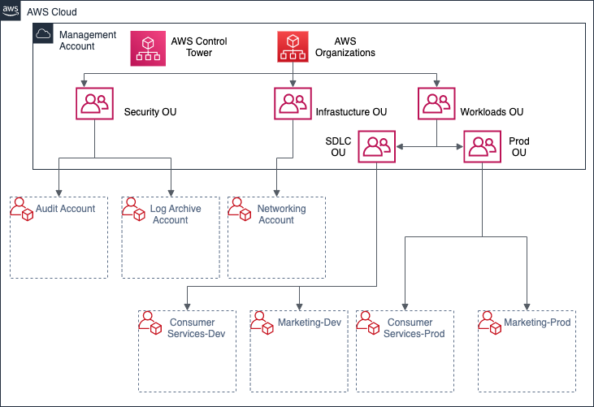
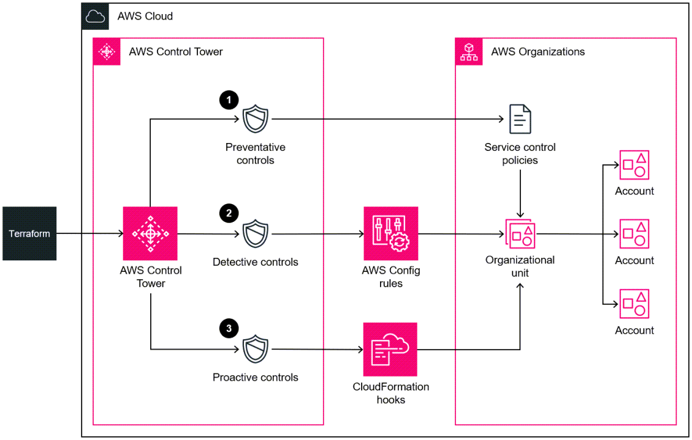
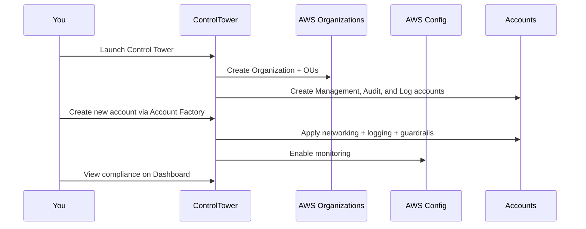
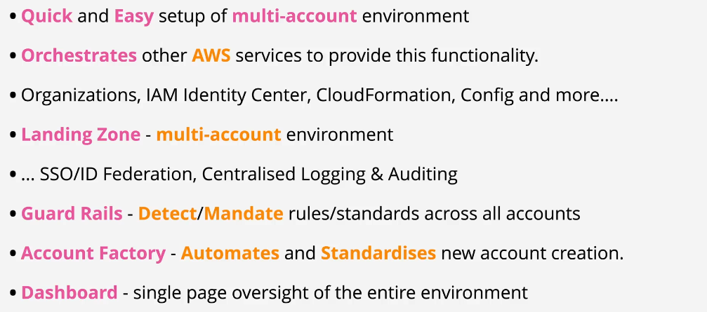
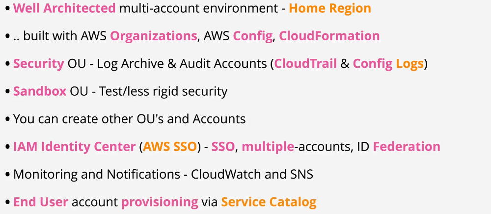
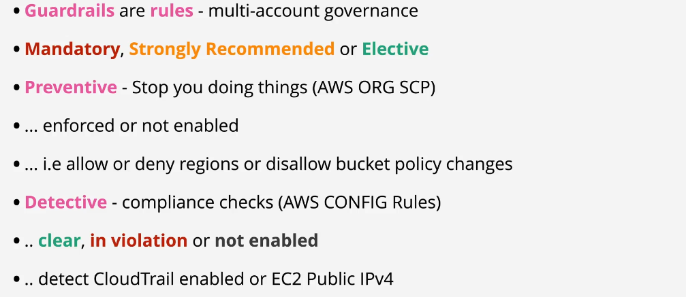
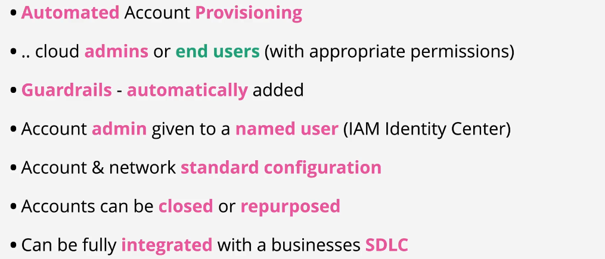

# 🏰 **AWS Control Tower: The Kingdom of Multi-Account Governance**

**AWS Control Tower** is a fully managed service that automates the setup and governance of a secure, compliant, and scalable **multi-account AWS environment** — all based on AWS **best practices**.

> Think of it as your **centralized control center** for managing AWS accounts like a pro.

---

  

---

  

---

## 🌟 **Why Use AWS Control Tower?**

Managing 1 or 2 AWS accounts might be simple. But when your organization grows, **account sprawl** becomes a nightmare.

AWS Control Tower provides:

| ✅ Feature                        | 💬 Description                                            |
| --------------------------------- | --------------------------------------------------------- |
| **Automated Multi-Account Setup** | Built-in templates for creating secure accounts           |
| **Guardrails**                    | Preconfigured rules for governance and compliance         |
| **Landing Zone**                  | A secure baseline multi-account architecture              |
| **Central Dashboard**             | View compliance, account status, and guardrail violations |
| **Account Factory**               | Automated account provisioning engine                     |

---

## 🔩 **Main Components of AWS Control Tower**

Let's explore each component in detail:

---

## 🛬 **1. Landing Zone (The Foundation)**

### 🧱 What’s a Landing Zone?

A **Landing Zone** is a well Architected, secure baseline, multi-account environment, it is automatically deployed by Control Tower, that includes:

- ✅ A **Management Account** (Root/Org master)
- ✅ **Shared Accounts**:
  - **Log Archive Account** (centralizes logs via CloudTrail/S3)
  - **Audit Account** (read-only access for security teams)
- ✅ **Organizational Units (OUs)** for grouping accounts

> Think of it as Control Tower’s secure "castle" layout where every room (account) has a role.

---

## 🛡️ **2. Guardrails (Policy Boundaries)**

### 🚫 What Are Guardrails?

Guardrails are **predefined policies** based on AWS best practices that **help enforce governance** across all accounts.

| 🛑 Type        | 🔍 Description                                        |
| -------------- | ----------------------------------------------------- |
| **Preventive** | Enforce restrictions (e.g., prevent public S3 access) |
| **Detective**  | Detect and report violations (e.g., unencrypted EBS)  |

### 🧠 Behind the Scenes

- Guardrails use **AWS Organizations** + **AWS Config** to monitor compliance.
- You can enable or disable them **per OU**.

### 🔧 Example

If a dev tries to open an S3 bucket to the public:

- **Preventive guardrail**: Blocks the action
- **Detective guardrail**: Flags the non-compliant resource in the dashboard

---

## 🏭 **3. Account Factory (Account Creation Engine)**

### 🧰 What It Does

- Automates provisioning of **new AWS accounts**.
- Pre-configures:
  - VPCs and networking
  - CloudTrail logging
  - IAM security controls
- Automatically associates accounts with OUs and guardrails.

> It's like a factory that spits out AWS accounts ready to go — no misconfigurations.

---

## 📊 **4. Dashboard (Mission Control)**

The **Control Tower Dashboard** is your **single pane of glass** for governance.

### What You Can Do

| 📌 Feature                  | ✅ Description                          |
| --------------------------- | --------------------------------------- |
| **Track Guardrail Status**  | View compliant/non-compliant accounts   |
| **Monitor Resources**       | Investigate misconfigured settings      |
| **Manage OUs and Accounts** | Add or remove accounts and organize OUs |

### 🔍 Example

- See if a production OU has an unencrypted RDS instance.
- Drill into non-compliance issues and take corrective action.

---

## ⚙️ **How AWS Control Tower Works (End-to-End Flow)**

---

## 🛠️ **Example: Setting Up a Landing Zone**

👨‍💼 **Scenario**: You're an IT manager in a company with two teams: Developers and Production Ops.

### Step-by-Step

1. **Launch Control Tower** in the AWS Console.
2. Create two OUs:
   - `DevOU` for development teams
   - `ProdOU` for production
3. Enable Guardrails:
   - DevOU → only detective rules
   - ProdOU → strict preventive rules (no public buckets, encryption required)
4. Use **Account Factory** to create accounts for each team.
5. Monitor everything via the dashboard.

---

## ✅ **Benefits of AWS Control Tower**

| ⭐ Benefit                | 💬 Description                                  |
| ------------------------- | ----------------------------------------------- |
| **Governance at Scale**   | Enforce org-wide policies without scripting     |
| **Security by Default**   | Auto-applies AWS security best practices        |
| **Faster Onboarding**     | Use Account Factory to launch new teams quickly |
| **Compliance Visibility** | Spot risky resources and fix them fast          |

---

## ⚠️ **Limitations of AWS Control Tower**

| 🚧 Limitation                   | 💬 Notes                                         |
| ------------------------------- | ------------------------------------------------ |
| **Region support is limited**   | Only available in specific AWS regions           |
| **Fixed Guardrails**            | You cannot create custom guardrails              |
| **Not for Single Account Use**  | Overkill for single-account setups               |
| **Not all services integrated** | Some AWS services aren't governed yet by default |

---

## 💼 **Use Cases**

### 🏢 **Enterprise Multi-Account Management**

- Organize business units under isolated accounts.
- Centralize governance with minimal effort.

### 🔐 **Security and Compliance**

- Meet regulatory standards (HIPAA, GDPR, PCI-DSS).
- Detect misconfigurations with detective guardrails.

### 🚀 **Scaling Projects and Teams**

- Use Account Factory to spin up isolated environments fast.
- Apply tailored governance per team (e.g., Dev vs. Prod).

---

## ⚖️ **AWS Control Tower vs. AWS Organizations**

| Feature               | AWS Control Tower                        | AWS Organizations             |
| --------------------- | ---------------------------------------- | ----------------------------- |
| Setup Style           | Automated with best practices            | Manual setup                  |
| Guardrails            | Predefined preventive & detective rules  | Custom SCPs only              |
| UI Dashboard          | Yes (centralized compliance view)        | No built-in dashboard         |
| Target Use Case       | Enterprise-scale governance              | Flexible multi-account setups |
| Account Creation      | Automated via Account Factory            | Manual or scripted            |
| Custom Policies (SCP) | Supported (but combined with Guardrails) | Fully manual                  |

> 🔑 **Use AWS Control Tower** if you want automated, secure, scalable multi-account environments.  
> Use **AWS Organizations alone** if you want full manual control or already have your own provisioning workflow.

---

## 💰 **Pricing Overview**

**AWS Control Tower is free.**  
But you **pay for the resources** (like CloudTrail, S3, Config, Lambda, etc.) it sets up.

---

## 🧠 **Summary**

AWS Control Tower gives you:

✅ A secure, pre-built **Landing Zone**  
✅ Enforced **Guardrails** for governance  
✅ A powerful **Account Factory** for onboarding  
✅ A centralized **Dashboard** for visibility  
✅ Seamless integration with **AWS Organizations**

It’s the **gold standard** for managing multi-account AWS environments securely and scalably.

## Notes

### Components

  

---

### LandZone

  

---

## Guardrails

  

---

## Account Factory

  

