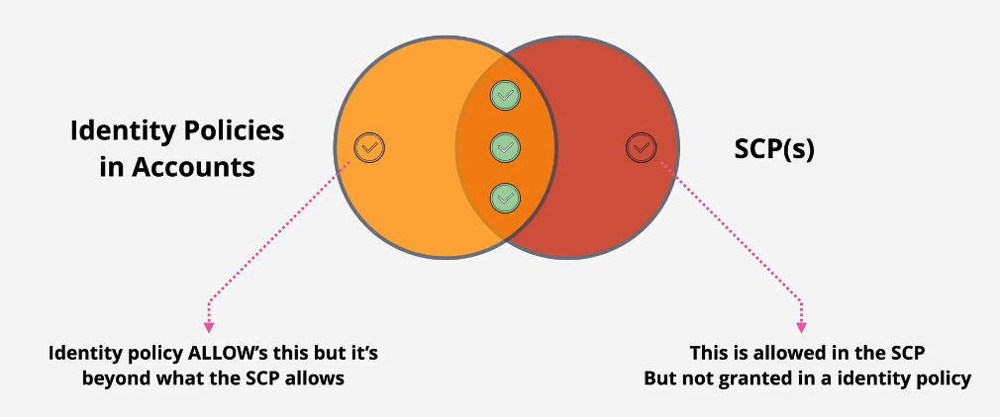
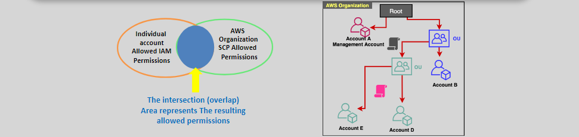

# 🛡️ **Service Control Policies (SCPs)**

**Service Control Policies (SCPs)** are a key feature of AWS Organizations, enabling administrators to set guardrails for what IAM users and roles within an organization can and cannot do.

> it is `multi-level hierarchy`

---

<div align="center">
  
</div>

---

## 🔑 **Key Features**

1. **Policy Definition**:

   - SCPs specify the AWS services and actions that are **allowed** or **denied** for users, groups, and roles.

2. **Policy Scope**:

   - SCPs can be applied at different levels:
     - **Root**: Organization-wide.
     - **Organizational Units (OUs)**: Target groups of accounts.
     - **Individual Accounts**: Apply policies to specific accounts.

3. **Non-Granting Nature**:
   - SCPs **do not grant permissions**. Instead, they set the **maximum allowed permissions**.
   - For an action to succeed, it must be allowed by both the SCP **and** the identity's permissions policy.

---

## 📌 **Important Considerations**

### **😈 Exclusions**

SCPs **do not affect** the following:

- The **management account** of the organization.
- **Resource-based policies**, such as S3 bucket policies.
- **Service-linked roles** required for AWS services.
- Users, groups, and roles **outside the organization**.

### **🧾 Default Policy**

- By default, AWS applies a `FullAWSAccess` SCP to all accounts, allowing all actions unless explicitly denied.

### **🎩 Blacklisting Over Whitelisting**

it is recommended to use blacklisting over whitelisting when deals with SCPs to decrease the overheads

> **Whitelisting**: Define a list of **allowed actions**, denying everything else by default.  
> **Blacklisting**: Define a list of **denied actions**, allowing everything else by default.

---

<div align="center">
  
</div>

## ✍️ **Example: Restrict Developers from IAM, Billing, and Critical Services**

### 🎯 **Goal (Realistic Scenario)**

You're managing a **Developer OU**, and you want to:

- ✅ Allow access to most AWS services for development (default: `FullAWSAccess`)
- ❌ Deny **sensitive services** like:
  - IAM (to prevent privilege escalation)
  - AWS Organizations (to protect org structure)
  - Billing (costs visibility)
  - CloudTrail (logs tampering)
  - Account Settings (root-level actions)

---

### 🧾 Step 1: Define the Deny-Based SCP

#### ✅ **Deny Critical Services SCP (Best Practice)**

```json
{
  "Version": "2012-10-17",
  "Statement": [
    {
      "Sid": "DenyIAMAccess",
      "Effect": "Deny",
      "Action": ["iam:*", "organizations:*", "account:*", "cloudtrail:*", "billing:*"],
      "Resource": "*"
    }
  ]
}
```

> 🔒 This SCP **denies only risky services**, while the **default `FullAWSAccess` policy** is still attached. That means devs can use most AWS services safely, but cannot access critical areas.

---

### 🛠️ Step 2: Create the SCP via AWS CLI

Save the policy to `deny-critical-services.json` and run:

```sh
aws organizations create-policy \
  --name "DenyCriticalServices" \
  --type "SERVICE_CONTROL_POLICY" \
  --description "Deny access to IAM, CloudTrail, Billing, etc. for developer OU" \
  --content file://deny-critical-services.json
```

---

### 🔗 Step 3: Attach the SCP to the Developer OU

#### 🔍 Find the OU ID

```sh
aws organizations list-organizational-units-for-parent \
  --parent-id <RootID>
```

#### 📎 Attach the SCP to the OU

```sh
aws organizations attach-policy \
  --policy-id <PolicyID> \
  --target-id <OU_ID>
```

- `PolicyID`: The ID returned when you created the SCP.
- `OU_ID`: The ID of the `DeveloperOU`.

---

### 🔍 Step 4: Test the SCP Safely

1. **Keep `FullAWSAccess` attached** so normal dev workflows aren't blocked.
2. **Test access**:
   - ❌ Try using `iam:CreateUser` or `billing:ViewBilling` → Should fail.
   - ✅ Use services like `s3`, `ec2`, `lambda`, `dynamodb` → Should succeed.
3. Use a test IAM user in a sandbox account under the same OU.

---

### 📊 Step 5: Track Changes and Logs

- Enable **AWS CloudTrail** to monitor:
  - SCP changes (`CreatePolicy`, `AttachPolicy`)
  - Denied events (`Deny` from SCPs appear in CloudTrail logs)

```bash
aws cloudtrail lookup-events \
  --lookup-attributes AttributeKey=EventName,AttributeValue=AttachPolicy
```

---

## **Best Practices for SCPs**

1. **1️⃣ Start with Defaults**:

   - Use the default `FullAWSAccess` SCP to prevent unintended restrictions during initial setup.

2. **2️⃣ Least Privilege**:

   - Gradually apply restrictive SCPs to ensure minimal access is granted.

3. **3️⃣ Test Policies**:

   - Always test new SCPs in a non-production environment before applying them broadly.

4. **4️⃣ Monitor SCP Changes**:
   - Use AWS CloudTrail to log changes to SCPs and track who modified policies.

---

## **Summary**

Service Control Policies (SCPs) are a powerful way to manage permissions across AWS accounts in an organization. By defining maximum allowed permissions, SCPs act as guardrails, ensuring compliance and security at scale. In the example, we demonstrated how to restrict developers to only use S3 and EC2 services, applying the SCP to an Organizational Unit (OU).
