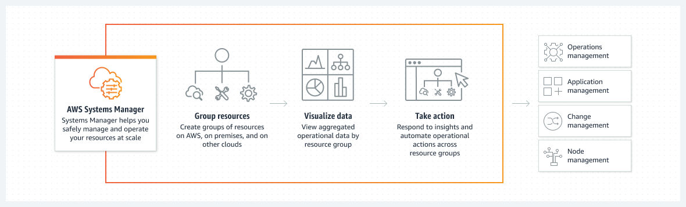
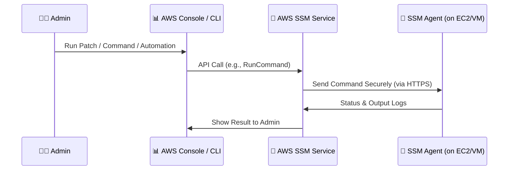
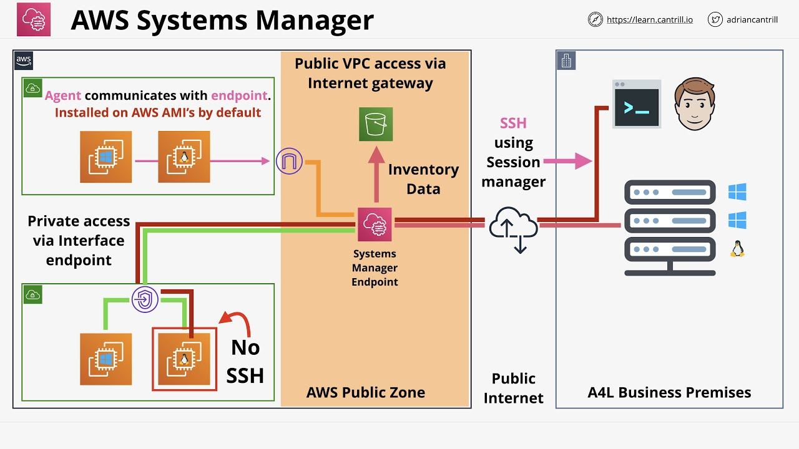
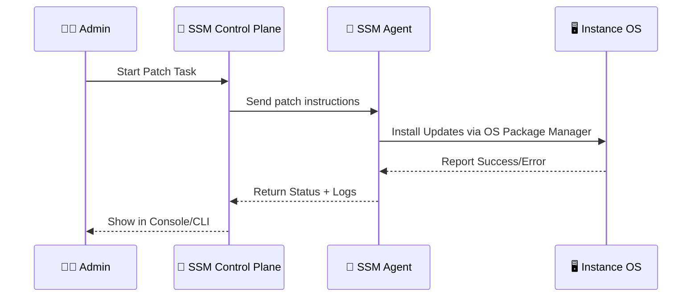

# 🛠️ **AWS Systems Manager (SSM) – Mastering the Heart of Infrastructure Ops**

<div align="center">
  
</div>

---

## 🌍 **What is AWS Systems Manager (SSM)?**

> **AWS Systems Manager** is a _unified management service_ that helps you **control**, **automate**, and **monitor** your infrastructure—across **AWS**, **on-premises**, and **hybrid** environments—_securely and at scale_.

Whether you’re patching EC2, managing app configs, executing shell commands, or controlling access to your servers — **SSM is your command center**.

---

## 🧪 **How Does AWS SSM Work?**

The core of SSM lies in its **agent-based** design. Let’s break it down 👇

### 🧩 **1. The SSM Agent**

- Pre-installed on recent **Amazon Linux** and **Windows AMIs**.
- For older/custom AMIs or on-prem machines: you must manually install it.
- Communicates **securely over HTTPS** with the **SSM endpoint**.

### 📡 **2. Communication Flow**



> 📌 **Note:** This flow applies whether the instance is **in a public or private subnet** — no need to open SSH ports or use a bastion server 🔐.

---

## ⚙️ **Key Internal Components of SSM**

| Component         | Description                                                         |
| ----------------- | ------------------------------------------------------------------- |
| **SSM Agent**     | Installed on managed nodes (EC2 or on-prem). Executes commands.     |
| **SSM Documents** | Define the actions SSM should perform. Written in JSON/YAML.        |
| **SSM Endpoints** | Regional APIs used by agents to receive commands.                   |
| **IAM Roles**     | Grant permissions for SSM to manage resources (e.g., EC2, logs).    |
| **Data Stores**   | Used to store configs (Parameter Store), inventory data, logs, etc. |

---

## 📦 **SSM Features Overview**

<div align="center">
  
</div>

SSM is not just one tool — it's an entire **suite** of 20+ tools grouped into **four categories**:

---

## 🧩 **1. Node Management Tools**

These are for **interacting with individual machines or entire fleets** — remotely, securely, and at scale.

- ✅ **Run Command**
- ✅ **Session Manager**
- ✅ **Inventory**
- ✅ **Patch Manager**
- ✅ **State Manager**
- ✅ **Fleet Manager**
- ✅ **Distributor**
- ✅ **Compliance**
- ✅ **Hybrid Activations**

---

## 🔄 **2. Change Management Tools**

These let you **automate changes**, track them, and **enforce governance**.

- 🤖 **Automation**
- 📅 **Change Calendar**
- 📋 **Change Manager**
- 🕓 **Maintenance Windows**
- ⚡ **Quick Setup**
- 📄 **SSM Documents (Runbooks)**

---

## 🧰 **3. Application Management Tools**

Focus on app-level settings, configs, and secrets:

- 🧪 **AppConfig**
- 🔍 **Application Manager**
- 🔐 **Parameter Store**

---

## 🛡️ **4. Operations Tools**

Track, respond to, and analyze issues in your infrastructure:

- 📊 **CloudWatch Dashboards**
- 🧭 **Explorer**
- 🚨 **Incident Manager**
- 🛠️ **OpsCenter**

---

## 🎯 **SSM Example Scenarios**

### 🔐 Secure Access to EC2 in Private Subnet

```bash
aws ssm start-session --target i-1234567890abcdef0
```

- No SSH
- No port 22
- Fully audited
- Works in VPC with no Internet Gateway

---

### 🧾 Store Configuration Secrets

```bash
aws ssm put-parameter \
  --name "/myapp/db/password" \
  --value "SuperSecret123!" \
  --type "SecureString" \
  --key-id "alias/aws/ssm"
```

---

### 🛠️ Enforce Desired State

- Use **State Manager** to keep firewall rules or packages in check.
- If drift occurs, SSM will **automatically correct it**.

---

### ⏰ Scheduled Patching

- Use **Patch Manager + Maintenance Window** to patch servers only on Sundays at 2AM.

---

## 💡 Why SSM Over Traditional Tools?

| Feature                 | SSM | Manual / SSH |
| ----------------------- | --- | ------------ |
| 🔐 Secure Remote Shell  | ✅  | ❌           |
| 📦 Patch Automation     | ✅  | ❌           |
| 📜 Config Inventory     | ✅  | ❌           |
| 🌍 Works on-prem too    | ✅  | ❌           |
| 📋 Centralized Audit    | ✅  | ❌           |
| 📅 Scheduled Operations | ✅  | ❌           |

---

## 📦 **How It Differs from Ansible**

| Feature                    | AWS SSM                                                  | Ansible                                              |
| -------------------------- | -------------------------------------------------------- | ---------------------------------------------------- |
| 🧠 **Architecture**        | **Agent-based**                                          | **Agentless (SSH-based)**                            |
| 🌐 **Connectivity**        | Uses **HTTPS over port 443** (no need to open SSH)       | Requires **SSH (port 22)**                           |
| 🔐 **Security**            | Fully integrated with **IAM + CloudTrail + KMS**         | SSH keys, vaults, and sudo needed                    |
| ☁️ **Execution Mode**      | Commands are **pushed from AWS to agent**, then executed | Commands are **pushed over SSH** from the controller |
| 🧾 **Task Definition**     | **SSM Documents (JSON/YAML)**                            | **Playbooks (YAML)**                                 |
| 🔄 **Audit & Logs**        | **Built-in via CloudWatch + S3 + CloudTrail**            | Must integrate external logging manually             |
| 🧰 **On-prem Support**     | Supported via **Hybrid Activations**                     | Yes, as long as SSH is available                     |
| 🛑 **No Need for Bastion** | ✅                                                       | ❌ Usually needed in private VPC                     |
| 🔁 **Session Management**  | Built-in browser shell, fully audited                    | Requires separate terminal (SSH)                     |

---

## 🧬 **Execution Lifecycle of a Run Command**

Here’s what happens when you use `RunCommand` or `Automation`:

1. **You initiate a command** (console, CLI, API).
2. SSM control plane:
   - Validates IAM permissions
   - Fetches the **SSM Document** (e.g., `AWS-RunShellScript`)
   - Determines the target(s) (EC2, tag, resource group).
3. The **SSM Agent** on the instance:
   - Polls the SSM endpoint for instructions.
   - Downloads the command payload.
   - Executes the script locally.
   - Streams or logs the output (CloudWatch Logs, S3, or API response).
4. You receive status reports and logs via the console, CLI, or CloudWatch.

> 🔐 _Because the agent **pulls** the command, it works even in a **private subnet** with no inbound traffic._

---

## 🧪 Example: Patch Manager Flow (SSM Automation)



---

## 🧠 Summary

> AWS Systems Manager is your **one-stop shop** for managing everything — from instances to apps to operations — **securely**, **centrally**, and **intelligently**.

In the next topics, we’ll go deep into each group of tools — like **Node Tools**, **Automation**, **Patch Management**, **Parameter Store**, and **AppConfig** — with practical walkthroughs and best practices 🚀

## 🔗 **References (with no summarizing)**

- 📘 [SSM Official Docs](https://docs.aws.amazon.com/systems-manager/latest/userguide/what-is-systems-manager.html)
- 📘 [SSM Agent Setup](https://docs.aws.amazon.com/systems-manager/latest/userguide/sysman-install-ssm-agent.html)
- 📘 [SSM Run Command](https://docs.aws.amazon.com/systems-manager/latest/userguide/run-command.html)
- 📘 [AppConfig](https://docs.aws.amazon.com/appconfig/latest/userguide/what-is-appconfig.html)
- 📘 [Automation](https://docs.aws.amazon.com/systems-manager/latest/userguide/systems-manager-automation.html)
- 📘 [Parameter Store](https://docs.aws.amazon.com/systems-manager/latest/userguide/systems-manager-parameter-store.html)
