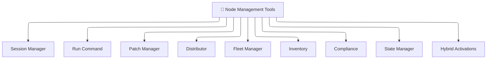
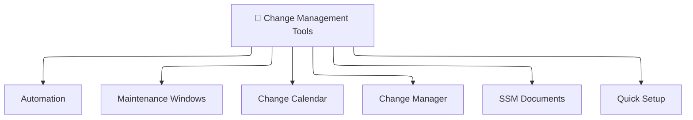
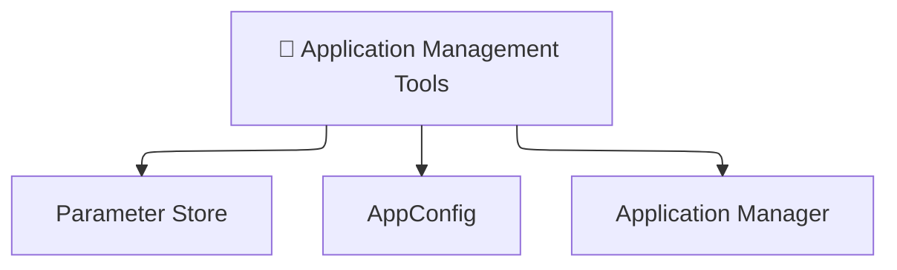
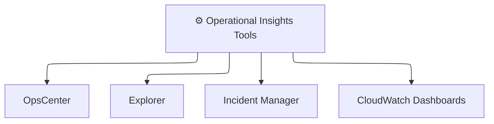
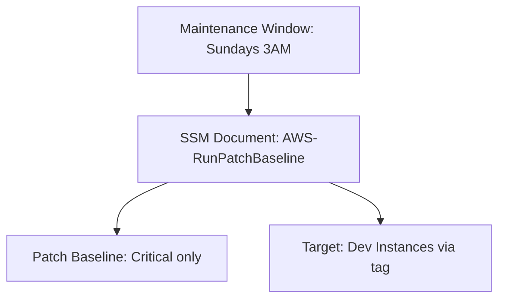

# 🧰 **Mastering AWS Systems Manager (SSM) Tools**

_Your all-in-one operations toolbox in the cloud!_

---

## 🧩 **1. Node Management Tools**

_"Manage your machines like a puppet master"_ 🎮

<div align="center">



</div>

---

### 🛠️ **Run Command**

Remotely execute shell commands on one or thousands of machines — no SSH needed.  
✅ Use: `aws ssm send-command`

🧪 Example: Restart Apache on all web servers:

```bash
aws ssm send-command \
  --document-name "AWS-RunShellScript" \
  --targets "Key=tag:Role,Values=WebServer" \
  --parameters 'commands=["sudo systemctl restart apache2"]'
```

---

### 🔐 **Session Manager**

Secure, auditable shell access **without opening ports**  
✅ Even works in **private VPC**  
✅ Works via browser or CLI

---

### 🩹 **Patch Manager**

Define patch baselines and apply patches to your OS instances.  
✅ Combine with Maintenance Windows for safe, scheduled patching

---

### 📂 **State Manager**

Keep instances in a "desired state" — like Ansible playbooks that auto-remediate.  
✅ Examples: Enforce firewall rules, ensure CloudWatch agent is always installed.

---

### 🔍 **Inventory**

Collect system metadata like:

- Installed apps
- Network configs
- OS versions
- Custom attributes

🧪 Great for: Auditing, compliance, reporting.

---

### 📋 **Compliance**

Track which instances are meeting SSM policies — e.g., patch level, config status.

---

### 🖥️ **Fleet Manager**

GUI for managing your EC2 fleet (file system, registry, running processes).  
✅ No SSH/RDP needed. Ideal for help desk + admins.

---

### 📦 **Distributor**

Distribute and install custom packages (your own `.zip`, `.rpm`, `.msi`, etc.)  
✅ Ideal for: In-house tools, monitoring agents.

---

### 🌐 **Hybrid Activations**

Manage **on-prem** or non-AWS VMs using SSM agent + activation code.  
✅ Brings your physical servers under the SSM umbrella ☁️🖥️

---

## 🔄 **2. Change Management Tools**

_"Govern and automate changes across your environment"_ 📋

<div align="center">



</div>

---

### 🤖 **Automation**

Define reusable workflows (aka runbooks) to automate multi-step operations.  
✅ Built-in + custom runbooks (e.g., `AWS-UpdateLinuxAmi`)

🧪 Use case:

- Snapshot → patch → reboot → verify → notify

---

### 📅 **Change Calendar**

Set **blackout periods** where no automation or updates are allowed.  
✅ E.g., block changes during holidays or sale seasons

---

### 📜 **Change Manager**

Track, approve, and audit operational changes.  
✅ Create change templates, assign approvers, track execution

---

### 🧾 **SSM Documents**

Core building block (like Ansible playbooks) written in **YAML/JSON**  
Used by:

- Run Command
- Automation
- State Manager

---

### 🕓 **Maintenance Windows**

Define **when** you want actions to happen  
🧪 E.g., Patch dev servers at 2AM every Sunday

---

### ⚡ **Quick Setup**

One-click enablement of SSM features: inventory, patching, monitoring, etc.

---

## 🧪 **3. Application Management Tools**

_"Handle app configs like a pro"_ ⚙️

<div align="center">



---

</div>

### 🔑 **Parameter Store**

Secure, versioned key-value store for configs + secrets  
✅ Encrypted with KMS  
✅ Supports JSON, SecureString

🧪 Example:  
Store API key and fetch in Lambda at runtime

---

### 🚦 **AppConfig**

Safely deploy and roll out **app configurations** (think: feature flags, JSON configs)  
✅ Built-in validators  
✅ Rollbacks on failure

---

### 🧭 **Application Manager**

View and manage your applications by tag or stack (e.g., CloudFormation).  
✅ Includes logs, monitoring, and compliance insights.

---

## ⚙️ **4. Operational Insights Tools**

_"See and fix what’s broken — before it becomes an incident"_ 🚨

<div align="center">



</div>

---

### 🛠️ **OpsCenter**

Central dashboard for all **operational issues**, integrated with CloudWatch alarms  
✅ Includes recommendations and automation suggestions.

---

### 📊 **CloudWatch Dashboards**

Visualize everything: patch compliance, inventory data, system metrics.

---

### 🧭 **Explorer**

Bird’s-eye view of your entire AWS environment.  
✅ Find out: Which instances aren’t patched? Which are missing agents?

---

### 🚨 **Incident Manager**

Automate response plans and alert the right team.  
✅ Integrates with OpsCenter, SNS, PagerDuty.

---

## 🧠 **SSM Best Practices**

- ✅ **Always use Session Manager** over SSH for better auditability and no exposed ports.
- ✅ **Use Parameter Store with KMS encryption** for secrets.
- ✅ **Tag everything** to leverage Fleet Manager, Patch Groups, and Explorer.
- ✅ **Schedule patching** using Patch Manager + Maintenance Windows + State Manager.
- ✅ **Audit actions** via AWS CloudTrail logs for every SSM interaction.

---

## 📸 **Sample Setup: Patch Dev Servers Every Sunday**

<div align="center">



</div>

---

## 📌 Summary

| Category          | Tools                                                            |
| ----------------- | ---------------------------------------------------------------- |
| Node Management   | Fleet Manager, Run Command, Session Manager, Patch Manager, etc. |
| Change Management | Automation, Change Calendar, Maintenance Windows                 |
| Application Tools | AppConfig, Parameter Store, Application Manager                  |
| Ops Tools         | Explorer, Incident Manager, OpsCenter, CW Dashboard              |

---

## 🔗 **References (with no summarizing)**

- 📘 [SSM Official Docs](https://docs.aws.amazon.com/systems-manager/latest/userguide/what-is-systems-manager.html)
- 📘 [SSM Agent Setup](https://docs.aws.amazon.com/systems-manager/latest/userguide/sysman-install-ssm-agent.html)
- 📘 [SSM Run Command](https://docs.aws.amazon.com/systems-manager/latest/userguide/run-command.html)
- 📘 [AppConfig](https://docs.aws.amazon.com/appconfig/latest/userguide/what-is-appconfig.html)
- 📘 [Automation](https://docs.aws.amazon.com/systems-manager/latest/userguide/systems-manager-automation.html)
- 📘 [Parameter Store](https://docs.aws.amazon.com/systems-manager/latest/userguide/systems-manager-parameter-store.html)
