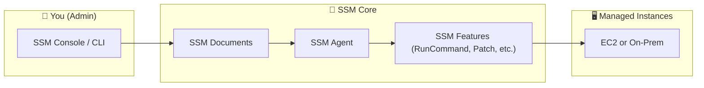
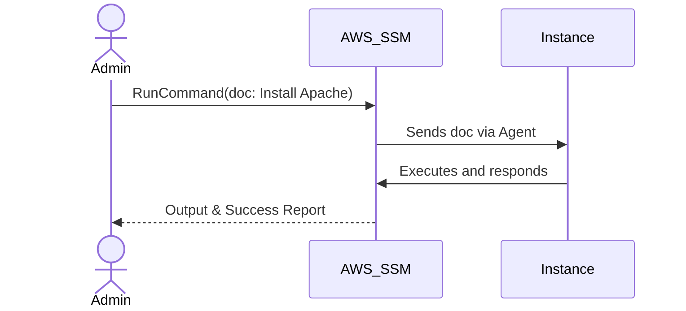
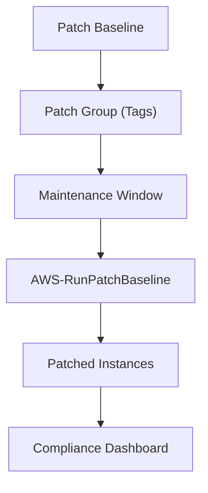

# 🌐 AWS Systems Manager (SSM) – Your Smart Admin Sidekick

**“No need to SSH. No need to panic. Just SSM it.”!**

AWS Systems Manager (SSM) is your all-in-one dashboard to control and automate EC2 and on-prem infrastructure like a boss — securely, scalably, and remotely.

> 📚 [Official Docs – SSM Home](https://docs.aws.amazon.com/systems-manager/)

---

## 📦 What SSM Actually Is

**Officially?**

> _AWS Systems Manager is a secure management service for compute resources in any environment._

**In Real Words?**  
It’s your remote control for all things EC2, on-prem, and hybrid cloud — with no more jumping around or logging into instances one-by-one.

**How It Works (Mini Map):**

**Core Perks:**

- Centralized control 🎛️
- No SSH or Bastion 🎯
- Secure logging 🔐
- Hybrid-ready 🌍

---

## 🧰 Run Command – Remote Control for Your Servers

> _“Need to install NGINX on 50 servers? One click. Boom.”_

📘 [AWS Docs – Run Command](https://docs.aws.amazon.com/systems-manager/latest/userguide/run-command.html)

**Why It Rocks:**

- Send commands without SSH or RDP 🧨
- Target by Instance ID, Tags, or Resource Groups 🎯
- Supports Linux + Windows
- Audit every execution

**Behind the Scenes:**

💡 Pro Tip: Want to restart a service on 100 boxes? Create a custom SSM Document with shell/PowerShell script.

---

## 🛡️ Patch Manager – Your Auto-Updating Robot Friend

📘 [AWS Docs – Patch Manager](https://docs.aws.amazon.com/systems-manager/latest/userguide/patch-manager.html)

> _“No more missed Windows updates. No more 3 AM patching panic.”_

**How It Works:**

1. Define Patch Baselines ✅  
   (Which patches get installed — e.g., only security, auto-approve critical after 7 days)

2. Tag Instances with Patch Groups 🏷️  
   (e.g., `PatchGroup=web-servers`)

3. Schedule Maintenance Windows ⏰  
   (e.g., Sundays 3AM)

4. Execute via `AWS-RunPatchBaseline` 🛠️  
   (SSM will apply updates during the window)

5. Monitor via Compliance Reports 📊

**Visual Flow:**

---

## 🔐 Parameter Store – Secure Key-Value Store for Your Apps

📘 [AWS Docs – Parameter Store](https://docs.aws.amazon.com/systems-manager/latest/userguide/systems-manager-parameter-store.html)

> _“Stop hardcoding passwords. Start using this.”_

**It’s like environment variables — but secure, managed, and versioned.**

**Use it for:**

- Database credentials
- App config (`MAX_USERS`, `API_URL`)
- Secrets (with optional KMS encryption)

**Key Features:**

- Hierarchical keys (`/prod/web/db-string`)
- History and rollback 🕰️
- Public, Encrypted, or Advanced 🔐
- Integration with Lambda, EC2, ECS, etc.

---

## 🖥️ Session Manager – SSH-less Remote Access

📘 [AWS Docs – Session Manager](https://docs.aws.amazon.com/systems-manager/latest/userguide/session-manager.html)

> _“It’s like teleporting into your EC2 box. Without keys or port 22.”_

**Benefits You’ll Love:**

- No open inbound ports 🚫
- No key pairs needed 🔑
- Auditable sessions (CloudTrail, CloudWatch, S3) 📜
- Port forwarding, file transfer (optional) 📂

**Bonus:**

- Works even if your EC2 has no public IP
- Easily integrated with IAM roles and policies

---

## 🎯 Real-World Use Cases

| Task                        | Feature         | Why SSM?                |
| --------------------------- | --------------- | ----------------------- |
| Install app on many servers | Run Command     | Scale + auditability    |
| Keep servers updated        | Patch Manager   | Scheduled, compliant    |
| Store config securely       | Parameter Store | Encrypted, versioned    |
| Access private EC2          | Session Manager | Secure, no SSH required |

---

## 🚀 Getting Started Tips

- ✅ Attach the `AmazonSSMManagedInstanceCore` IAM role to your instance.
- ✅ Ensure your EC2s can access SSM endpoints (VPC endpoints or internet).
- ✅ Use `aws ssm describe-instance-information` to check connection.
- ✅ Explore prebuilt SSM Documents like `AWS-UpdateLinuxAmi`, `AWS-RunShellScript`.

---

## 🔍 Want More?

- [SSM Automation](https://docs.aws.amazon.com/systems-manager/latest/userguide/systems-manager-automation.html) – Think: visual workflows for repeatable tasks.
- [Inventory](https://docs.aws.amazon.com/systems-manager/latest/userguide/systems-manager-inventory.html) – See what's installed on all your machines.
- [Compliance](https://docs.aws.amazon.com/systems-manager/latest/userguide/systems-manager-compliance.html) – Who’s out-of-date?

---

## 🎓 Final Words

SSM is like your invisible army of sysadmins. It can:

- Install stuff 🔧
- Update stuff 🛠️
- Watch stuff 👀
- Secure stuff 🔐
- Fix stuff (automatically!) 🤖

> “The only thing you’ll miss is typing `ssh ec2-user@...` over and over again.”
