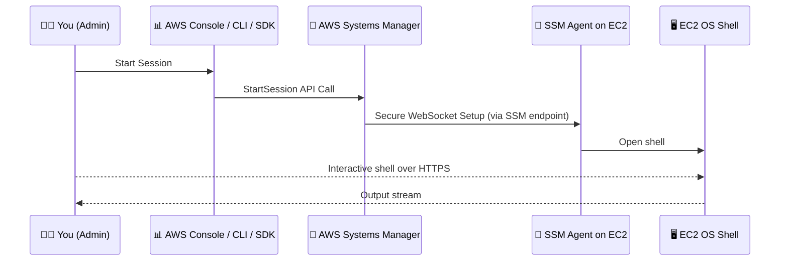

# 🔐 **AWS SSM Session Manager: Secure Shell Access Without SSH**

_The safest, most cloud-native way to connect to your EC2 and on-prem instances._

---

## 📘 **What Is Session Manager?**

> **Session Manager** is a feature of **AWS Systems Manager** that allows you to **securely connect** to **EC2 instances**, **on-prem servers**, and **hybrid environments** without using SSH, opening ports, or managing SSH keys.

It's like having a **built-in, fully audited terminal** for your instances. Yes, even the ones in a **private subnet**.

---

## 🔍 **Why Use Session Manager?**

| Feature                    | SSH                              | Session Manager                       |
| -------------------------- | -------------------------------- | ------------------------------------- |
| 🔐 Keyless & Portless      | ❌ Needs SSH keys & open port 22 | ✅ No keys, no open ports             |
| 📜 Audit Logging           | ❌ Manual setup                  | ✅ Built-in (CloudTrail & CloudWatch) |
| 🧠 IAM Integrated          | ❌ No                            | ✅ Yes                                |
| 🏞️ Works in Private Subnet | ❌ Needs bastion or NAT          | ✅ Yes                                |
| 🎯 Session Control         | ❌ Hard                          | ✅ Timeout, idle settings, logging    |
| 🌐 Browser Access          | ❌                               | ✅ Terminal in AWS Console            |

---

## 🧪 **How Session Manager Works Internally**



> 💡 **No inbound ports**, **no SSH Daemon**, just **SSM Agent + HTTPS**.

---

## 🧩 **Requirements & Setup**

### ✅ Prerequisites

1. ✅ EC2 instance must have the **SSM Agent installed and running**

   - Pre-installed on Amazon Linux 2, Ubuntu 20.04+, Windows Server 2016+
   - Can be installed manually on custom AMIs

2. ✅ Instance must have access to **SSM endpoints**

   - Via **Internet Gateway**, **NAT**, or **SSM VPC Endpoint**

3. ✅ Attached IAM Role must allow these actions:

   ```json
   {
     "Effect": "Allow",
     "Action": [
       "ssm:StartSession",
       "ssm:DescribeInstanceInformation",
       "ssm:SendCommand",
       "ssm:TerminateSession",
       "ssm:GetConnectionStatus"
     ],
     "Resource": "*"
   }
   ```

4. ✅ Instance Profile must include:

```json
{
  "Action": ["ssm:UpdateInstanceInformation", "ssmmessages:*", "ec2messages:*", "cloudwatch:PutMetricData", "logs:*"]
}
```

---

## 🚀 **How to Start a Session**

### 🔸 **Via Console:**

1. Go to **Systems Manager > Session Manager**
2. Click **Start Session**
3. Choose your EC2 instance
4. Get instant access to a browser-based terminal!

### 🔸 **Via AWS CLI:**

```bash
aws ssm start-session --target i-1234567890abcdef0
```

---

## 🗂️ **Optional Configurations**

### 📦 **Audit Logs (Enable Logging):**

You can log:

- Commands run during session
- Full shell output

To:

- 📄 **CloudWatch Logs**
- 📦 **S3**

```bash
aws ssm put-document \
  --name MySessionLogConfig \
  --content file://session-config.json \
  --document-type Session
```

### Example `session-config.json`

```json
{
  "schemaVersion": "1.0",
  "description": "Log all session activity",
  "sessionType": "Standard_Stream",
  "inputs": {
    "s3BucketName": "my-log-bucket",
    "cloudWatchLogGroupName": "ssm-session-logs"
  }
}
```

---

## 🧰 Use Cases

| Scenario                       | SSM Session Manager Benefit                |
| ------------------------------ | ------------------------------------------ |
| EC2 in Private Subnet          | No NAT or bastion needed                   |
| Remote Admin                   | Use browser from any machine               |
| Security-Hardened Environments | No SSH key exposure                        |
| Audit & Compliance             | Every session logged and traceable         |
| Incident Response              | Drop into machine ASAP from console or CLI |

---

## 🧠 Best Practices

- ✅ Always enable **CloudWatch or S3 logging** for auditability
- ✅ Apply **IAM condition policies** (e.g. only allow sessions to prod if MFA is used)
- ✅ Disable direct SSH and close port 22 completely!
- ✅ Tag sessions or log groups by user/instance environment

---

## 🚫 Common Pitfalls

| Issue                                 | Cause                                     | Fix                                          |
| ------------------------------------- | ----------------------------------------- | -------------------------------------------- |
| ❌ "Session cannot be started"        | SSM agent not installed or IAM missing    | Ensure agent runs and IAM is correct         |
| ❌ Session opens but no output        | Logging misconfigured or CW not permitted | Fix IAM for logs and verify log group exists |
| ❌ Can’t access EC2 in private subnet | No NAT or SSM VPC endpoint                | Add VPC endpoint or route through NAT        |

---

## 🔚 Summary

✅ **SSM Session Manager** gives you:

- Keyless, portless, secure shell access
- Fully auditable session history
- IAM-controlled and regionally available
- Works in **ANY VPC** — even isolated ones

---

## 🔗 References

- [📘 Official Docs](https://docs.aws.amazon.com/systems-manager/latest/userguide/session-manager.html)
- [📘 Start Session (CLI)](https://docs.aws.amazon.com/cli/latest/reference/ssm/start-session.html)
- [📘 IAM Policies for SSM Access](https://docs.aws.amazon.com/systems-manager/latest/userguide/session-manager-getting-started-instance-profile.html)
- [📘 Session Logging](https://docs.aws.amazon.com/systems-manager/latest/userguide/session-manager-logging.html)
