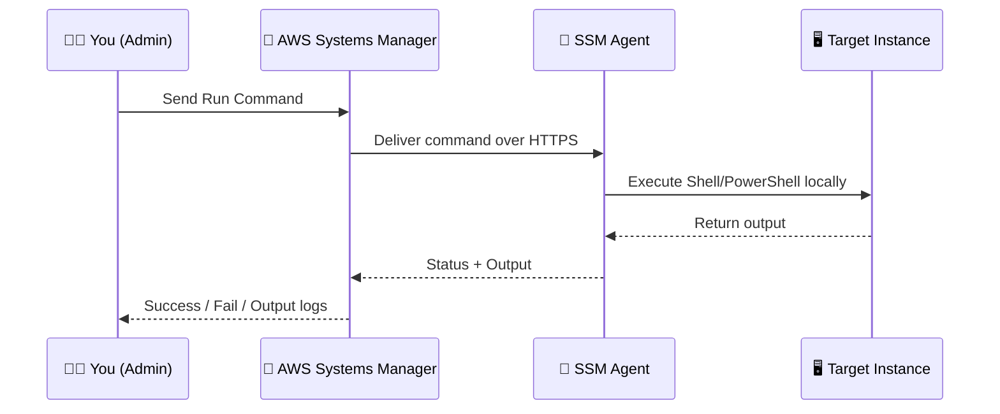

# ⚙️ **AWS SSM Run Command**

_“Run commands on thousands of machines — without ever touching SSH.”!_

---

## 🔍 **What Is Run Command?**

> **Run Command** is a core feature of AWS Systems Manager that lets you **remotely and securely execute scripts/commands** on **EC2 instances**, **on-prem servers**, and **hybrid machines** — at scale and **without opening ports or using SSH/RDP**.

---

## 🧠 **How It Works Internally**



✅ **No inbound access** required  
✅ The agent **pulls the command** via **SSM endpoint (HTTPS)**

---

## 📄 **What Powers the Run Command?**

Run Command uses **SSM Documents (SSM Docs)**

- Format: **YAML or JSON**
- Type: `Command`
- Example: `AWS-RunShellScript`, `AWS-RunPowerShellScript`
- Can include:
  - Parameters
  - Pre/post logic
  - Logging destinations

---

## ✨ **Top Features**

| Feature               | Description                                                |
| --------------------- | ---------------------------------------------------------- |
| 🧠 No SSH/RDP         | Communicates securely via **SSM Agent over HTTPS**         |
| 🎯 Targeting          | By **Instance ID**, **Tags**, or **Resource Groups**       |
| 🧾 Reusable Documents | Parameterized, versioned, and shareable                    |
| ⏱️ Rate Control       | Control **Concurrency** and **Error Threshold**            |
| 📤 Output Handling    | Store in **S3**, notify via **SNS**, log to **CloudWatch** |
| 🔁 Event-Driven       | Can be used as **EventBridge Target** for automation       |

---

## 🧪 **Example Commands**

### 📦 **Run Shell Script (Linux)**

```bash
aws ssm send-command \
  --document-name "AWS-RunShellScript" \
  --targets "Key=tag:Role,Values=WebServer" \
  --parameters 'commands=["df -h"]' \
  --comment "Disk usage check"
```

### 🪟 **Run PowerShell Script (Windows)**

```bash
aws ssm send-command \
  --document-name "AWS-RunPowerShellScript" \
  --targets "Key=InstanceIds,Values=i-1234567890abcdef0" \
  --parameters 'commands=["Get-Service"]'
```

---

## 📦 **Output Storage & Logging**

You can direct command output to:

- 📦 **Amazon S3**
- 📊 **CloudWatch Logs**
- 🔔 **Amazon SNS Notifications**

Example:

```bash
--output-s3-bucket-name my-patch-results \
--cloud-watch-output-config CloudWatchLogGroupName=MySSMLogs,CloudWatchOutputEnabled=true
```

---

## ⚖️ **Concurrency & Error Thresholds**

Set **safe limits** for large-scale execution:

- `MaxConcurrency`: e.g. "10" or "10%" (how many instances at once)
- `MaxErrors`: e.g. "2" or "5%" (abort if this many fail)

```bash
--max-concurrency "10" \
--max-errors "1"
```

---

## 🧠 Use Cases

| Use Case          | Command                            |
| ----------------- | ---------------------------------- |
| Install software  | `"yum install -y nginx"`           |
| Patch scanning    | `AWS-RunPatchBaseline`             |
| Restart service   | `"sudo systemctl restart apache2"` |
| Clean logs        | `"rm -rf /var/log/*.gz"`           |
| Compliance checks | `"check firewall rules"`           |

---

## 🧱 Security Model

- ✅ IAM-based permissions (you define who can run what commands on which instances)
- ✅ Uses **SSM Agent + HTTPS** (no SSH ports exposed)
- ✅ Fully auditable via **CloudTrail**

---

## 🚫 Common Pitfalls

| Problem                      | Solution                                   |
| ---------------------------- | ------------------------------------------ |
| ❌ “Command failed silently” | Check instance has SSM Agent + IAM role    |
| ❌ “Target not found”        | Check target tag key/value or instance ID  |
| ❌ “Not authorized”          | Verify IAM policy allows `ssm:SendCommand` |

---

## 📎 Summary

| Topic                 | Key Info                                        |
| --------------------- | ----------------------------------------------- |
| What is it?           | Remote shell command execution via SSM          |
| Agent Required?       | ✅ Yes                                          |
| No SSH needed?        | ✅ Yes                                          |
| Works on Private VPC? | ✅ Yes                                          |
| Docs Format           | YAML or JSON                                    |
| Common Docs           | `AWS-RunShellScript`, `AWS-RunPowerShellScript` |
| Logs to S3 / CW       | ✅ Optional                                     |
| IAM Controlled        | ✅ Granular permissions supported               |

---

## 📘 References

- [📄 AWS Run Command Docs](https://docs.aws.amazon.com/systems-manager/latest/userguide/run-command.html)
- [📄 SSM Documents Guide](https://docs.aws.amazon.com/systems-manager/latest/userguide/documents.html)
- [📘 AWS CLI – send-command](https://docs.aws.amazon.com/cli/latest/reference/ssm/send-command.html)
