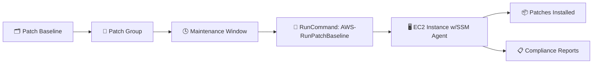
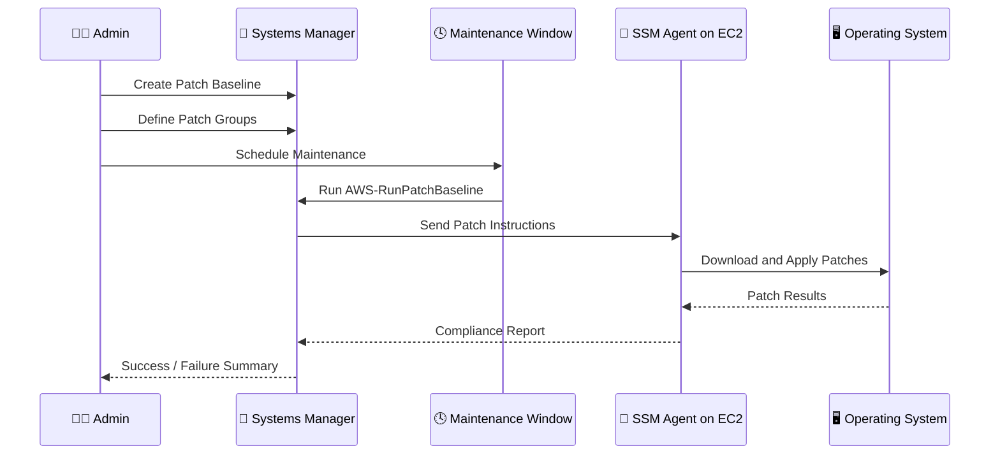

# 🩹 **AWS Systems Manager Patch Manager**

_“Automated, secure patching — the DevOps way.”!_

---

## 🧠 **What Is Patch Manager?**

> **Patch Manager** is a feature of AWS Systems Manager (SSM) that **automates the patching of operating systems** and **applications** on your managed instances across **EC2** and **on-premises** servers.

It helps you keep systems **up-to-date**, **secure**, and **compliant** without having to log in to each server.

---

## 🔍 **Why Use Patch Manager?**

| Feature                | Manual Patching  | Patch Manager              |
| ---------------------- | ---------------- | -------------------------- |
| 🔧 Automation          | ❌ No            | ✅ Yes                     |
| 🕓 Scheduled           | ❌ Manual Cron   | ✅ Maintenance Windows     |
| 📋 Compliance Tracking | ❌ None          | ✅ Built-in                |
| 🎯 Targeting           | ❌ SSH per host  | ✅ Tag-based groups        |
| 🔐 Auditable           | ❌ Hard to track | ✅ CloudWatch + CloudTrail |

---

## 🧩 **Key Components of Patch Manager**



Let’s break each of these down:

---

### 1️⃣ **Patch Baseline**

> _"What should be patched?"_

- A **collection of rules** that determine which patches are approved/denied.
- Define OS-specific baseline (e.g., AmazonLinux, Ubuntu, Windows).
- Options:
  - Auto-approve security patches after N days
  - Manually approve KBs or CVEs
  - Add **custom patch exceptions**

✅ You can use **default AWS baselines** or create **custom baselines**.

---

### 2️⃣ **Patch Groups**

> _"Which instances should follow which baseline?"_

- Logical grouping of instances based on tags.
- Instances with tag: `Patch Group = WebServers` will be associated with the baseline assigned to that group.

✅ You can assign different baselines to different patch groups (e.g., prod vs dev).

---

### 3️⃣ **Maintenance Windows**

> _"When should patching happen?"_

- Define **start time**, **duration**, and **frequency** (e.g., Sundays 2 AM UTC).
- You assign a **Patch Task** as a registered task in the window.
- Can include **targets**, **concurrency**, and **error thresholds**.

✅ Best for **non-disruptive patching** in production environments.

---

### 4️⃣ **Run Command (`AWS-RunPatchBaseline`)**

> _"How is the patching actually triggered?"_

- This built-in **SSM Document** tells the agent to:
  - Scan OR
  - Scan & Install
- You can run it **manually**, through **CLI**, or **attach it to maintenance windows**.

```bash
aws ssm send-command \
  --document-name "AWS-RunPatchBaseline" \
  --targets "Key=tag:PatchGroup,Values=WebServers" \
  --parameters 'Operation=Install'
```

---

### 5️⃣ **Concurrency & Error Thresholds**

> _"How many at a time? When to stop?"_

- Limit the number of instances patched at once (e.g., 10 at a time).
- Abort if too many errors (e.g., fail if 30% of patches fail).
- Set in **Maintenance Window Task config**.

---

### 6️⃣ **Compliance Reporting**

> _"How do I know if patching succeeded?"_

- Patch compliance is stored in **SSM Inventory**.
- You can view:
  - ❌ Missing patches
  - ✅ Installed patches
  - 📅 Patch history
- Viewable in:
  - SSM Console
  - AWS CLI
  - AWS Explorer dashboard

---

## 🏗️ **Patch Manager Architecture: Behind the Scenes**



---


---


---

## 🧪 **Real Example**

### 🎯 Goal: Patch all dev servers every Sunday at 3AM

1. ✅ Create Patch Baseline `MyDevBaseline`
2. ✅ Tag instances with `PatchGroup = DevGroup`
3. ✅ Create Maintenance Window: Sunday 3AM
4. ✅ Register task to run `AWS-RunPatchBaseline` on `DevGroup`
5. ✅ Monitor compliance via Explorer or CloudWatch Logs

---

## 🧠 Best Practices

- 🔒 Use separate **patch groups** for prod/dev
- 🧪 Run patch tasks in **scan-only** mode before production rollout
- 🧭 Schedule patching during off-peak hours using **Maintenance Windows**
- 🔄 Enable **SSM Inventory** and **Explorer** to view compliance
- 🧱 Use **CloudWatch Alarms** to notify on patch failure

---

## ⚠️ Common Pitfalls

| Issue                 | Solution                                                       |
| --------------------- | -------------------------------------------------------------- |
| ❌ Nothing patched    | Ensure patch baseline isn’t empty or incorrectly filtered      |
| ❌ Instance skipped   | Ensure tag name is `Patch Group` (not `PatchGroup`)            |
| ❌ Not installed      | Check if `AWS-RunPatchBaseline` used `Install` not just `Scan` |
| ❌ No compliance data | Make sure SSM Inventory plugin is enabled                      |

---

## 📌 Summary

| Component                  | Role                     |
| -------------------------- | ------------------------ |
| **Patch Baseline**         | Defines what to install  |
| **Patch Group**            | Defines who gets patched |
| **Maintenance Window**     | Defines when             |
| **Run Command**            | Executes patching        |
| **Inventory + Compliance** | Reports patch status     |

---

## 📎 References

- [📘 Patch Manager Docs](https://docs.aws.amazon.com/systems-manager/latest/userguide/systems-manager-patch.html)
- [📘 RunPatchBaseline Document](https://docs.aws.amazon.com/systems-manager/latest/userguide/patch-manager-about-aws-runpatchbaseline.html)
- [📘 Patch Baselines](https://docs.aws.amazon.com/systems-manager/latest/userguide/sysman-patch-patchgroups.html)

---

## 🧠 **Patch Manager – Key Concepts (Exam Ready)**

- 🔧 **Predefined Patch Baselines**: AWS provides default baselines per OS — but you can create **custom ones**.
- 🐧 **Linux**:
  - `AWS-AmazonLinux2DefaultPatchBaseline`
  - `AWS-UbuntuDefaultPatchBaseline`  
    (_Security & critical updates only_)
- 🪟 **Windows**:
  - `AWS-DefaultPatchBaseline` = OS-level patches (Critical/Security)
  - `AWS-WindowsPredefinedPatchBaseline-OS` = Same as above (clearer name)
  - `AWS-WindowsPredefinedPatchBaseline-OS-Applications` = Includes **MS App updates** (e.g., Office)
- ✅ Attach patch baselines to **Patch Groups** using instance tags.

> 🧠 _Tip: Only the "Applications" baseline includes Microsoft Office and app updates._
