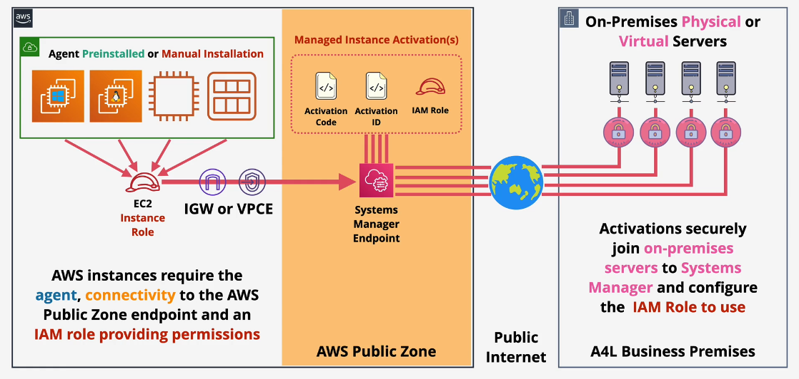

# AWS SSM

---

- it is a service that let you Manage and control AWS and on-premisses infrastructure.
- it is agent based - agents communicates with the systems manager service endpoint.
- agents is installed by default on **Windows** or **Linux AWS** AMI's ( old ones needs manual installation and custom configurations).

- SSM provides a number of key bits of functionality

  1. it manages inventory for any managed instances.
     - it can collect inventory information such as ( apps installs, network configurations, os patches and hotfix, instance hardware details, running services, custom things).
  2. Run commands
  3. Manage Desired State.

     - such as you need certain ports to be blocks in certain instance firewalls, and SSM will manage that state so if anyone open those ports, then SSM will close them again.
     - so it will do whatever to move instance from current state to desire state.

  4. Parameter Store:

     - it is store configuration information about applications and secrets (it is secure but secret manager is more recommended for very sensitive secret as it supported key rotation but is paid)

  5. Session Manager:
     - it is allow you to securely connect to ec2 instance even they are in private vpc.

