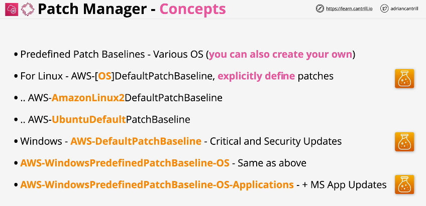

# SSM Patch Manager

How to Work behind the scene?

## Patch Manager Components

### 1. Path Baseline

### 2. Patch Groups

### 3. Maintenance Windows

### 4. Run Command

### 5. Concurrency & Error Threshold

### 6. Compliance

## Path Manager Concepts

these are keywords you need to remember for the exams

## Patching Architecture

---

---

1️⃣ Define 1+ Patch Baselines: to define what gets installed
2️⃣ Create Patch Groups: which act as targets for patch tasks
3️⃣ Create Maintenance Windows: to schedule patch tasks
4️⃣ Run `AWS-RunPatchbaseline` Command: used to execute patch tasks
5️⃣ System Manager Inventory: to collect information about your systems
