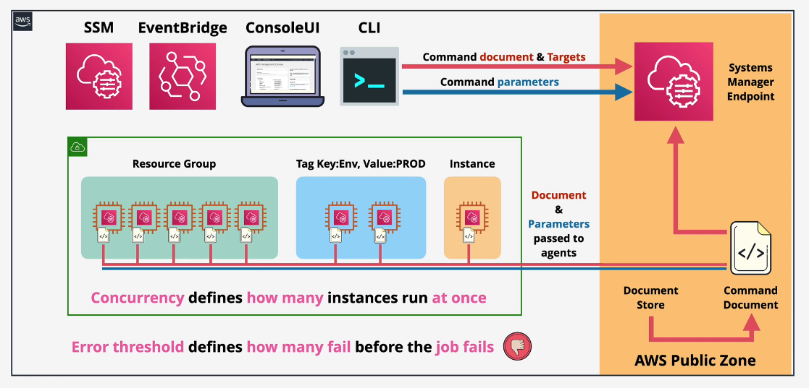

# Run Command

---

Systems Manager Run Command is a foundational feature of Systems manager which allows for commands to be executed on managed instances at scale

It uses command [AWS Systems Manager Documents](https://docs.aws.amazon.com/systems-manager/latest/userguide/documents.html) which define what is executed on managed instances

## Command documents Features

- `No SSH/RDP` Access Required

- it can be executed on individual instances based on Tags or Resource Groups
- it can be reused and can have parameters
- you can control (Concurrency & Error Threshold) of executed commands via Rate Control.
- the Output of command can be sent to S3 or notified by SNS
- the best cool feature is that you can have a Command Document as a EventBridge Target.

## - chatgpt => explain How No SSH/RDP` Access Required it do that internally please
