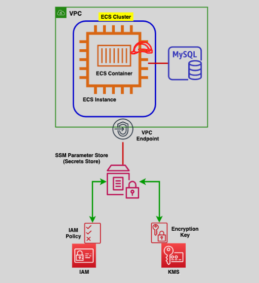

# AWS Systems Manager: Simplifying Infrastructure Management 🛠️

AWS Systems Manager (SSM) is a robust service designed to centralize the **configuration**, **management**, and **monitoring** of AWS resources and on-premises servers. By streamlining routine operational tasks, it empowers teams to focus on innovation rather than infrastructure.

---

## 🌟 **What is AWS Systems Manager?**

AWS Systems Manager provides a unified interface to manage resources across AWS and on-premises environments securely and efficiently.

<div align="center">
  
</div>

### **Key Features**

- Simplifies management of **EC2 instances**, **on-premises servers**, and **virtual machines**.
- Automates operational tasks like patch management and compliance audits.
- Compatible with multiple platforms: **Linux**, **Windows**, and **Raspbian**.
- Enhances scalability with **resource groups** for large-scale resource management.
- Integrates with key AWS services like **IAM**, **CloudTrail**, **CloudWatch**, and **SNS**.

---

## 🔄 **Core Categories of Capabilities**

AWS Systems Manager organizes its features into six primary categories:

1. **Application Manager** 🛠️  
   Investigate and resolve issues with AWS resources.

2. **Change Manager** 🔄  
   Securely manage operational changes and requests.

3. **Node Manager** 🖥️  
   Manage EC2 instances, on-premises servers, and virtual machines.

4. **Operations Manager** 🚨  
   Recover from operational incidents and improve system resilience.

5. **Quick Setup** ⚡  
   Streamline configuration for commonly used AWS services.

6. **Shared Resources** 📦  
   Access shared tools such as runbooks, documents, and **Parameter Store**.

---

## 📋 **Key Features and Benefits**

### 1️⃣ **Secure and Flexible Access**

- SSM supports both **public endpoints** and **VPC endpoints** for private communication.
- Eliminates the need for SSH or RDP by securely managing instances via the **SSM Agent**.

### 2️⃣ **Automation and Operational Efficiency**

- Automate recurring tasks such as patch management, compliance checks, and state management for improved productivity.

---

## 🔑 **AWS Systems Manager Parameter Store**

The **Parameter Store** is a secure, serverless, and hierarchical storage solution for managing configuration data.

<div align="center">
  
</div>

### **Use Cases**

- Store and retrieve configuration data such as **AMI IDs**, **database connection strings**, and **license codes**.
- Organize parameters hierarchically by environment or application (e.g., `/Prod/DBServer/MySQL/db-string`).

### **Best Practices for Secrets**

- While **Parameter Store** can store secrets, it is **recommended to use AWS Secrets Manager** for managing sensitive data like passwords and API keys.
- **Secrets Manager Benefits**:
  - **Key Rotation**: Automatically rotate keys for enhanced security.
  - **Fine-Grained Access Control**: Advanced IAM policies for managing access.
  - **Enhanced Monitoring**: Seamless integration with CloudWatch and EventBridge for event-driven actions.

### **CLI Commands for Parameter Store**

```bash
# Get Parameters:
aws ssm get-parameter --name <parameter-name> --with-decryption

# Reference a Secret through Parameter Store:
aws ssm get-parameter --name /aws/reference/secretsmanager/<secret-name> --with-decryption
```

---

## 🔗 **Integration with Other AWS Services**

AWS Systems Manager integrates seamlessly with:

- **IAM**: Fine-grained access control for resources.
- **SNS**: Notify users of system or parameter changes.
- **CloudTrail**: Audit changes for compliance.
- **CloudWatch**: Monitor system health and logs.
- **EventBridge**: Automate responses to operational events.

---

## 🤔 **When to Use AWS Systems Manager**

### Ideal Scenarios:

- Centralizing configuration and management for large-scale environments.
- Automating routine tasks like patching or compliance audits.
- Managing **configuration data** with **Parameter Store**.
- Storing secrets and enabling features like **key rotation** with **AWS Secrets Manager**.

---

## ✅ **Conclusion**

AWS Systems Manager is a versatile and essential tool for managing infrastructure at scale. While **Parameter Store** excels in managing configuration data, **AWS Secrets Manager** is the preferred solution for sensitive information due to its advanced features like key rotation and monitoring. Together, they offer a secure and efficient approach to infrastructure management and configuration.
