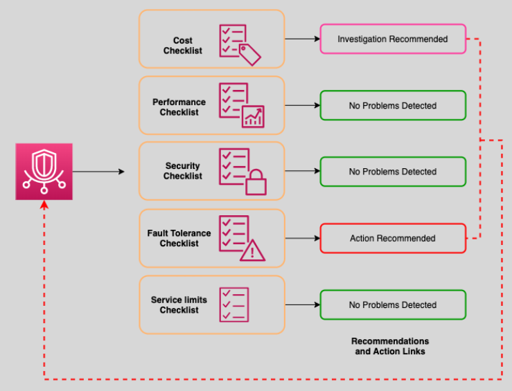

# AWS Trusted Advisor 🧙‍♂️

AWS Trusted Advisor is an **online tool** designed to help you follow AWS best practices by analyzing your environment and providing **actionable recommendations**. These recommendations span cost savings, performance improvements, security enhancements, fault tolerance, and service limits.

  

---

## 🌟 **What is AWS Trusted Advisor?**

AWS Trusted Advisor inspects your AWS environment and provides real-time guidance to:

- Optimize **cost** by identifying unused or underutilized resources.
- Enhance **performance** for workloads.
- Close **security gaps** to protect sensitive data.
- Improve **fault tolerance** to increase application reliability.
- Ensure **service limits** are not exceeded to avoid resource provisioning issues.

---

## 🔄 **Key Features**

1. **Comprehensive Recommendations**  
   Trusted Advisor provides insights and suggested actions for:

   1. **Cost Optimization 💰**

      - Identify unused resources like idle EC2 instances or underutilized EBS volumes.
      - Highlight savings opportunities by choosing reserved instances or savings plans.

   2. **Performance Optimization ⚡**

      - Detect potential performance bottlenecks in EC2, RDS, or other services.
      - Recommend improvements to resource configurations for better efficiency.

   3. **Security Best Practices 🔒**

      - Flag overly permissive IAM roles or unencrypted S3 buckets.
      - Highlight compliance risks and suggest remediation steps.

   4. **Fault Tolerance 🌐**

      - Identify areas to improve system reliability, like enabling Multi-AZ for databases.
      - Highlight redundant resource configurations to avoid single points of failure.

   5. **Service Limits Monitoring 📈**

      - Monitor usage of service limits to avoid disruptions in resource provisioning.
      - Provide alerts when nearing limits for EC2 instances, Elastic IPs, or other services.

2. **Integration with CloudWatch**
   - **Monitor Trusted Advisor Checks**: Use **CloudWatch Events** to track changes in check status.
   - **Set Alarms**: Configure **CloudWatch Alarms** to alert you based on Trusted Advisor metrics.

---

## 💡 **Support Plan Access**

Access to AWS Trusted Advisor checks depends on your **AWS Support Plan**:

- **Basic**: Service limit checks and 6 security category checks.
- **Developer**: Full access to all Trusted Advisor checks.
- **Business**: Full access to all Trusted Advisor checks.
- **Enterprise**: Full access to all Trusted Advisor checks.
