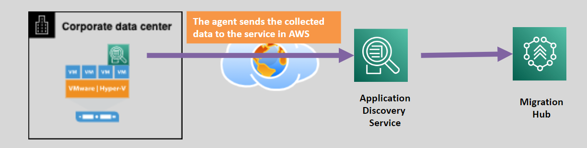
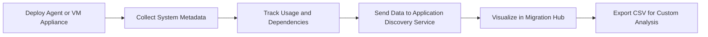

# 🧭 **AWS Application Discovery Service (ADS): Plan Your Migration with Confidence**

> Migrating workloads to the cloud isn't just about "moving stuff" — it's about **understanding what you have first**. That's where **AWS Application Discovery Service (ADS)** shines.

ADS helps you **discover**, **analyze**, and **plan** your migration from on-premises environments to AWS by collecting **detailed data** about your servers, applications, and their **interdependencies**.

---

  

---

## 🔍 **What is AWS Application Discovery Service?**

> **Official Definition:**  
> AWS Application Discovery Service **collects on-premises server metadata** (e.g., configuration, usage, performance) and **maps dependencies** to support accurate and informed migration decisions.

It’s your **pre-migration X-ray** that helps you understand:

- What is running?
- How busy is it?
- How are the servers connected?

---

## 🌟 **Key Features at a Glance**

| Feature                          | Description                                                           |
| -------------------------------- | --------------------------------------------------------------------- |
| 🛠️ **Deep Data Collection**      | Gathers CPU, memory, disk, network, process list, and dependency info |
| 🔁 **Flexible Modes**            | Choose between **agent-based** or **agentless** discovery             |
| 📊 **Migration Hub Integration** | Syncs data with **AWS Migration Hub** for centralized planning        |
| 🔐 **Secure by Design**          | TLS in transit, encrypted storage, exportable reports                 |

---

## 🔄 **Discovery Modes Explained**

### 🧬 **1. Agent-Based Discovery**

- ✅ **Best For:** Detailed data and application-level visibility
- 🔧 **How:** Install lightweight agent on each server
- 📈 **Collects:** CPU, RAM, disk, process list, TCP connections, dependencies

### ☁️ **2. Agentless Discovery**

- ✅ **Best For:** Fast scanning without touching servers
- 🖥️ **How:** Deploy a preconfigured **VM appliance** on-prem
- 📈 **Collects:** Server metadata (hostname, IP, OS, etc.)

---

## 🎯 **Top Use Cases**

### 1️⃣ **Migration Planning**

- Group servers and apps that should move together (dependency mapping)
- Prioritize workloads based on utilization and complexity

### 2️⃣ **Cost Estimation**

- Estimate **EC2 instance types**, EBS volumes, or RDS specs needed
- Predict **cloud cost** vs. on-prem usage

### 3️⃣ **Compliance & Documentation**

- Export discovery reports for stakeholders
- Document baselines for audits or long-term governance

---

## 🛠️ **How It Works: Step-by-Step**

### 🔍 Detailed Breakdown

| Step                    | Description                                                                |
| ----------------------- | -------------------------------------------------------------------------- |
| 🧩 **Deploy Agents/VM** | Use EC2-compatible agents or on-prem VM appliance                          |
| 📦 **Collect Data**     | Discover CPU, memory, disk, network, OS, installed apps, running processes |
| 🔁 **Map Dependencies** | Understand how apps talk to each other via port/protocol/TCP connection    |
| 🧠 **Analyze Insights** | Determine what to rehost, refactor, or retire                              |
| 📊 **Export**           | Download reports in CSV format for team reviews or AWS support integration |

---

## 🧠 **Why It Matters**

| Benefit                            | What It Means for You                                                   |
| ---------------------------------- | ----------------------------------------------------------------------- |
| ⏱️ **Save Time**                   | Avoid manual inventory work                                             |
| 🧠 **Make Informed Decisions**     | Know what resources you need before the move                            |
| 📈 **Optimize Migration Strategy** | Match each app to the right **7 R’s** strategy (Rehost, Refactor, etc.) |
| 🔐 **Security Built-in**           | Data is encrypted, scoped, and only viewable by authorized users        |

---

## 🚀 **Works Best With…**

- 🧭 **AWS Migration Hub** – visualize server groups, track migration status
- 🔄 **AWS Server Migration Service (SMS)** – lift and shift VMs into EC2
- 🛠️ **AWS Application Migration Service (MGN)** – replicate your servers into the cloud

---

## 📦 **Output Example: Exported CSV Format**

| Hostname | IP Address   | CPU % | RAM GB | Disk Used | OS Type | Connections |
| -------- | ------------ | ----- | ------ | --------- | ------- | ----------- |
| `srv-01` | 192.168.1.10 | 75%   | 16 GB  | 200 GB    | Linux   | 12 active   |
| `sql-02` | 192.168.1.15 | 60%   | 32 GB  | 1.2 TB    | Windows | 27 active   |

This type of data helps architects decide **which workloads go to EC2**, **which ones can use RDS**, or **which ones should be retired**.

---

## 🏁 **Conclusion**

**AWS Application Discovery Service** is your **starting point for cloud migration**. It reduces guesswork by giving you an **X-ray of your infrastructure**, helping you:

- 📊 Understand performance & dependencies
- 📦 Group workloads intelligently
- 💸 Estimate costs accurately
- 🧩 Choose the right migration strategy per workload

🎯 **Plan smart, migrate confidently.**
