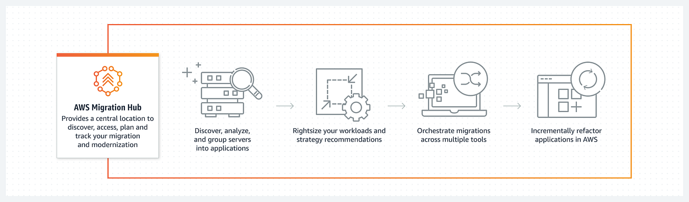
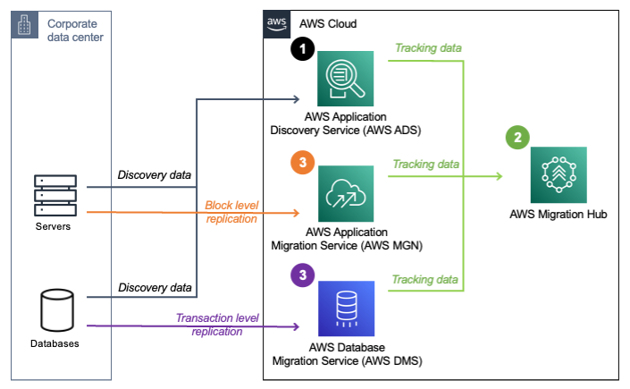
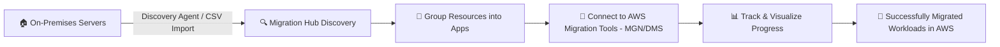

# 🌐 **AWS Migration Hub: Your Central Command for Cloud Migrations**

**AWS Migration Hub** is a **centralized dashboard** that helps you **discover**, **plan**, **execute**, and **track** your application and infrastructure migrations to AWS. It acts as your mission control, giving visibility into every stage of the migration—whether you're using AWS-native tools or trusted third-party solutions.

  

---

## 🔍 **What Is AWS Migration Hub?**

AWS Migration Hub is a **free service** that provides a single place to:

- Discover on-prem resources (servers, databases, applications).
- Group them logically.
- Track migration status across AWS migration services like **MGN**, **DMS**, and third-party tools.
- Visualize and monitor progress **in one unified view**.

---

## 🌟 **Key Features at a Glance**

### 🧠 **1. Smart Discovery**

- ✅ Automatically **collect data** from on-prem servers using:
  - **AWS Discovery Agent** (for deep insights).
  - **Agentless Collector** (VMware-based environments).
- ✅ Or **import CSV** data manually for quick start.
- ✅ Visualize system **configurations**, **dependencies**, and **performance metrics**.
- ✅ Group resources into **applications** to migrate them as logical units.

---

### 🔧 **2. Unified Migration Tool Integration**

Use your preferred AWS or third-party migration services—all within Migration Hub:

| **Integrated Tools**     | **Purpose**                            |
| ------------------------ | -------------------------------------- |
| 🛠️ **AWS MGN**           | Lift-and-shift server migration        |
| 💾 **AWS DMS**           | Database migration                     |
| ⛔ **(Legacy) AWS SMS**  | Virtual machine migration (deprecated) |
| 🔗 **Third-Party Tools** | e.g., ATAData, CloudEndure, etc.       |

No need to juggle dashboards. Migration Hub syncs everything in one place.

---

### 📊 **3. Real-Time Tracking Dashboard**

- 🎯 Monitor migration status **by server or application group**.
- 🔄 See progress stages: **discovered**, **in progress**, **completed**, or **failed**.
- 📈 Gain migration health insights and timelines for better planning.
- 🔔 Alerts and notifications for critical migration tasks.

---

## 🛠️ **How Migration Hub Works** (Simplified Flow)

  

---

---

## 💼 **Top Use Cases**

### ✅ 1. **Data Center Migration**

Group 500+ servers into applications and monitor their move to AWS using MGN and DMS.

### ✅ 2. **Cloud Modernization Planning**

Use dependency mapping from discovery to decide which apps to **rehost**, **refactor**, or **retain**.

### ✅ 3. **Cross-Region Tracking**

Manage migrations to **multiple AWS regions** under one dashboard.

---

## 🎯 **Why Choose AWS Migration Hub?**

| Benefit                    | Description                                                             |
| -------------------------- | ----------------------------------------------------------------------- |
| 🧩 **Centralized Control** | One interface to rule them all—no tab-hopping.                          |
| 🔍 **Enhanced Visibility** | Clear insights into discovery, migration, and post-migration health.    |
| 🤖 **Automation-Ready**    | Works seamlessly with AWS CLI, SDKs, and APIs.                          |
| 🌎 **Hybrid Friendly**     | Supports both cloud and **on-premises** workloads.                      |
| 💸 **Free Service**        | No cost for using Migration Hub itself—pay only for connected services. |

---

## ✅ **Best Practices**

- Use **Discovery Agent** for the most detailed performance and dependency insights.
- Group related servers into **logical applications** before migrating.
- Monitor all migrations through the **AWS Migration Hub console**—don’t rely solely on tool-specific logs.
- Consider **AWS Migration Hub Strategy Recommendations** for AI-powered modernization plans.

---

## 🧠 Final Thoughts

> AWS Migration Hub is like your **migration mission control tower**—offering you a clear line of sight across your entire migration fleet.

Whether you're lifting-and-shifting legacy workloads or planning a multi-region enterprise migration, **Migration Hub makes the process smoother, smarter, and more transparent**. It's the best way to **migrate with clarity and confidence**.
